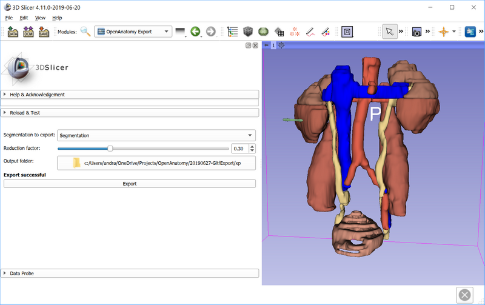
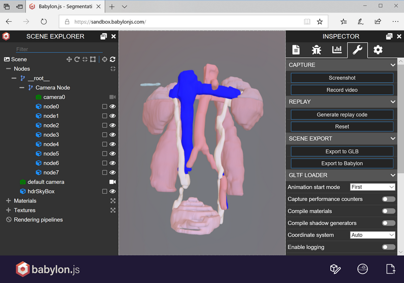
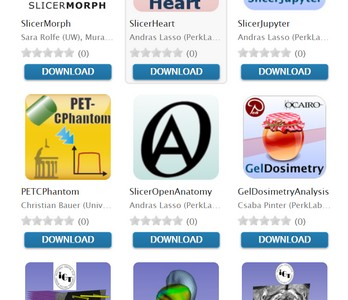

Back to [Projects List](../../README.md#ProjectsList)

# Export models to glTF file

## Key Investigators

- [Andras Lasso](http://perk.cs.queensu.ca/users/lasso) (Queen's University, Canada)
- [Csaba Pinter](http://perk.cs.queensu.ca/users/pinter) (Queen's University, Canada)
- Michael Halle (Brigham and Women’s Hospital and Harvard Medical School)

## Project Description

[OpenAnatomy](https://www.openanatomy.org/) is an initiative to change the anatomy atlas through open data, community-based collaborative development, and free distribution of medical knowledge. In the first phase of the project a few existing atlases were converted into a common format and made publicly accessible via a simple web application. The project is starting its next phase, which aims to design a storage format that is suitable for storing anatomical images, shapes, and descriptive information, and develop tools for viewing, creating, and editing these atlases.

3D Slicer supports importing, visualizing, and annotating medical images and export the resulting data in a variety of formats. Therefore, 3D Slicer could serve as a basis of an OpenAnatomy authoring tool.

OpenAnatomy project needs an authoring tool and 3D Slicer almost fulfills all the needs except specific import/export features and some improvements in data annotation capabilities.

## Objectives

Improve 3D Slicer’s existing features to support glTF file format export/import and allow defining hierarchies and standard terminology for segmented structures. Tasks are shared between experienced Slicer core developers and junior software developers, and directed by OpenAnatomy experts.

## Approach and Plan

1. Implement glTF exporter module that allows writing segmentations or model hierarchies as glTF files.
1. Test and optimize workflow based on converting and editing existing anatomical atlases.

## Progress and Next Steps

1. Made available recent VTK glTF import/export methods in Slicer
1. Implemented module for one-click export of segmentation to glTF
1. Made available these modules in OpenAnatomy extension for preview releases.

Segmentation in Slicer:

Segmentation in a web viewer:

Available in extension manager!

Next step is implementing metadata export: writing terminology and links to gltf file to json file.

## Background and References

- [SLicer OpenAnatomy extension](https://github.com/PerkLab/SlicerOpenAnatomy)
- [Open Anatomy Browser](https://www.openanatomy.org/)
- [SlicerWeb glTF v1.0 exporter implementation](https://github.com/pieper/SlicerWeb/blob/0952659e38dd6b0a7511242235f3919ee7e09048/WebServer/WebServer.py#L37-L533)
