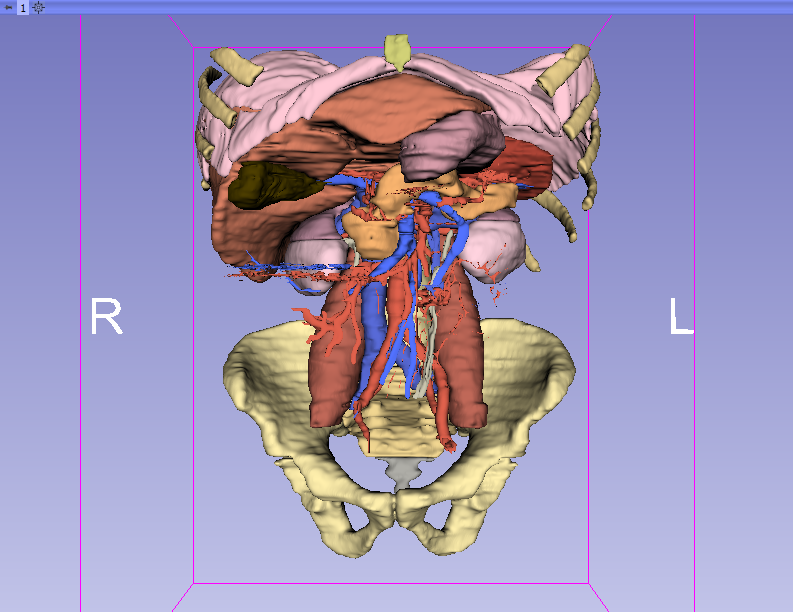
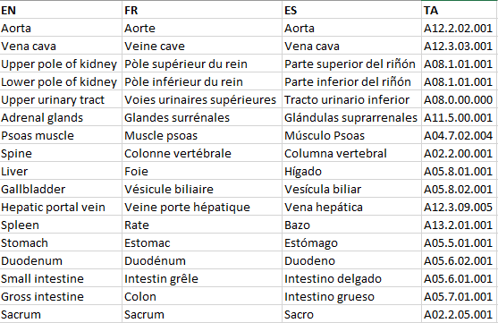

Back to [Projects List](../../README.md#ProjectsList)

# Abdomen and male pelvis atlas

## Key Investigators

- Babacar Diao (Ecole Militaire de Santé Dakar - Senegal)
- Michael Halle (Brigham and Women's Hospital)
- Nayra Pumar (ULPGC – GTMA-IUIBS - MACbioIDi)
- Juan Ruiz-Alzola (ULPGC - GTMA-IUIBS - MACbioIDi)

## Project Description

This project focuses on the development of an anatomical atlas of the abdomen and male urinary system, along with an improved version of the male pelvic atlas.

## Objectives

1.	To segment the anatomical models using 3D Slicer (images provided by Dr. Babacar Diao).
1.	To update the current segmentation of the male pelvic anatomy using 3D Slicer (images provided by Dr. Babacar Diao).
1.	To export the vtk models obtained from the segmentation into the openanatomy structure using the web atlas editor.
1.	To export the vtk models obtained from the segmentation to .obj format, and assemble them into an Open Anatomy atlas using the Atlas aSsembly Tool (AST)

## Approach and Plan

1.	Training using the 3D Slicer segment editor
1.	Image study and selection
1.	Use the export tools in 3D Slicer

## Progress and Next Steps

1. Abdomen segmentation has been already completed, covering from pelvis to diaphragm
2. Element names have been translated to english, french and spanish. Added the anatomical term ID for each
3. In the coming days the atlas, in the three languages, will be uploaded to the server
4. VR version is already exported in gltf format

## Illustrations

Final version of the segmentation

Language trasnlation and TA termn

## Background and References
