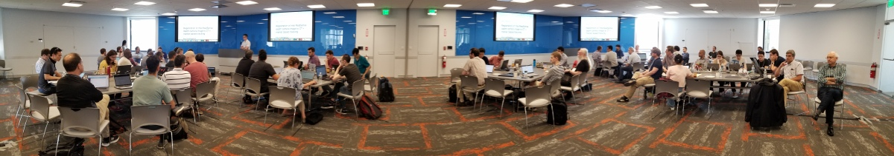

# Welcome to the web page for the 31st Project Week!

The 31st NA-MIC Project Week will be held during the week of June 24-28, 2019 at MIT, Boston USA.

Please read about our experience in running these events since 2005: [Increasing the Impact of Medical Image Computing Using
Community-Based Open-Access Hackathons: the NA-MIC and 3D Slicer Experience](http://www.spl.harvard.edu/publications/item/view/3004).

View this page on [https://projectweek.na-mic.org/PW31_2019_Boston/](https://projectweek.na-mic.org/PW31_2019_Boston/)

## Logistics
- **Dates:** June 24-28, 2019
- **Location:** MIT Bldg. 34, room numbers 401A&B (Grier conference room), 50 Vassar Street, Cambridge MA
- **Hotels:** No rooms are reserved.  Please ask on [discourse forum](https://discourse.slicer.org/c/community/project-week) if you have questions.
- **Registration**: Fee is USD 350.  Register using [this link](https://www.regonline.com/registration/Checkin.aspx?EventID=2555870).
- [Frequently Asked Questions](https://projectweek.na-mic.org/#frequently-asked-quesions)
- **Slack Channel:** [Invite Link](https://join.slack.com/t/namic-projectweek/shared_invite/enQtNjY5MDEwMDMxMDcyLTkyNjA4MmQxMjFkZWNmMTMwNjliYzk5ZGExZTdiNmJlZWFjNzE0MWRiMmYzMTIzNzk0NDVkNWM3MGIzMDlkMTU)

## Projects [(How to add a new project?)](Projects/README.md)
<a name="ProjectsList"/>

### Segmentation

- [Neuroanatomical segmentation](Projects/NeuroSegmentation/README.md) (Sylvain Bouix, Jarett Rushmore, Kyle Sunderland, Andras Lasso)
- [Touch and pen interactions](Projects/TouchAndPenInteractions/README.md) (Kyle Sunderland, Jarett Rushmore)
- [PolySeg in the browser](Projects/PolySeg4Web/README.md) (Steve, Erik, Jc, Csaba Pinter)
- [OHIF Viewer: Extension and module support, with example contour/segmentation extension](Projects/OHIFPluginArchitecture/README.md) (Danny, James, Erik, Steve, Mete)
- [OHIF GLSL Plugins](Projects/OHIFGLSLPlugins/README.md) using WebGL / GLSL shaders to make tools for segmentation in the browser (GrowCut) (Steve, James, Danny, Erik, Mete)
- [Whole heart segmentation for congenital heart disease](Projects/chdseg/README.md) (Danielle Pace)
- [Multi time point cardiac sequence segmentation](Projects/MultiTimePointCardiacSegmentation/README.md) (Sarv, Andras)
- [Segmentation based statistics/visualization of 1H Time resolved Functional Magnetic Resonance Spectroscopy with quantification of metabolites](Projects/SegmentationStatisticsSpectroscopy/README.md) (Francisco Marcano, José Luis González Mora, Juan Ruiz-Alzola)
- [Segmentation overlay for prostatecancer.ai](Projects/SegOverlay_ProstateCancerAI/README.md) (Omar, James, Steve, Erik, Anneke, Alireza, Danny, Parvin)
- [BabySteps: 3D Printing Using Slicer for creating clubfoot casts](Projects/ClubfootCasts/README.md) (Hadi Fooladi, Pooneh Roshanitabrizi, Steve Pieper, Kevin Cleary)
- [Outlining and level-tracing filters for VTK.js](Projects/VTK_Js_OutlineFilter/README.md) (Andrzej, Alfredo, Charles)

### Registration

- [Placenta flattening and visualization in Slicer](Projects/Placenta-Flattening/README.md) (Maz Abulnaga, Steve Pieper, Polina Golland)
- [Registration of Intel RealSense depth camera image to CT + marker based tracking](Projects/RealSensePatientRegistration/README.md) (Colton Barr, Andras Lasso, Steve Pieper)
- [Establishing Feature Correspondences between ultrasound images acquired at different time points during brain tumor resection](Projects/UltrasoundFeatureCorrespondence/README.md) (Nick Jowkar, Clement Mirabel, Sarah Frisken, Tina Kapur)
- [Bronchoscope Localization From Depth Map](Projects/BronchoscopeLocalizationFromDepthMaps/README.md) (Shelly Liu, Jonah Berg, Franklin King)

### Open Anatomy

- [Export OpenAnatomy models to glTF file](Projects/glTFExport/README.md) (Andras Lasso, Csaba Pinter, Mike Halle)
- [Abdomen and male pelvis atlas](Projects/kidneyAtlas/README.md) (Babacar Diao, Nayra Pumar, Mike Halle)

### Simulation

- [Interactive medical simulation toolkit (IMSTK) integration](Projects/SlicerIMSTK/README.md) (Sam Horvath, Andras Lasso, Tina Kapur)
- [Virtual reality interactions](Projects/VirtualRealityInteractions/README.md) (Csaba Pinter, Nayra Pumar, Clement Mirabel)
- [Cardiac device placement/deformation simulation](Projects/cardiacdeviceplacementsimulation/README.md) (Sarv, Andras, Sam, Christian)
- [Virtual reality interface improvements](Projects/Virtualrealityinterfaceimprovement/README.md) (Sarv, Csaba)
- [FEniCS integration](Projects/SlicerFEniCS/README.md) (Ben Zwick, Sam Horvath, Jc, Andras Lasso)

### Analysis

- [Quantitative Analysis of Human Orbitofrontal-subgenual Circuitry](Projects/QuantitativeAnalysisofHumanOrbitofrontal-subgenualCircuitry/README.md) (Peter Wilson-Braun, Senthil Palanivelu, Lipeng Ning, Yogesh Rathi, Nikos Makris, Nayra Pumar Carreras, Juan Ruiz-Alzola, Juan Andres Ramirez Gonzalez)
- [Clinical trajectory visualization based on edema quantification from chest x-ray](Projects/EdemaQuantification/README.md) )(Not around on Friday) (Ray Liao, Steve Pieper, Polina Golland)
- [Quantitative Analysis of QUTE-CE-MRI cerebrovascular data](Projects/QUTE-CE-MRI/README.md) (Liam Timms, Tianyi Zhou, Srinivas Sridhar)

### Diffusion MRI

- [SlicerDMRI: Coding and Documentation](Projects/SlicerDMRI/README.md) (Fan Zhang, Mengying Zhang, Laura Leung, Lauren J O'Donnell)
- [WMA: fiber clustering pipeline documentation](Projects/WMA/README.md) (Fan Zhang, Mengying Zhang, Banu Ahtam, Parikshit Juvekar, Lauren J O'Donnell)
- [Joint dMRI and fMRI analysis: fMRI data curation](Projects/dMRfMRI/README.md) (Laura Leung, Fan Zhang, Lauren J O'Donnell)
- [White Matter Analysis in the Aging Human Brain](Projects/WMAAging/README.md) (Andrei Irimia, Fan Zhang, Lauren J O'Donnell)

### DICOM

- [Improve DICOM import for 1H Time resolved Functional Magnetic Resonance Spectroscopy with quantification of metabolites](Projects/DICOMImportSpectroscopy/README.md) (Francisco Marcano, José Luis González Mora, Juan Ruiz-Alzola, Steve Pieper)
- [Create DICOM object for 3D volume to represent clinical target volume](Projects/DICOM_object_for_3D_structures/README.md) (Nadya Shusharina, Csaba Pinter)

### Infrastructure

- [VTK filters running on GPU](Projects/GLSLShaders/README.md) (Kyle Sunderland, Steve Pieper)
- [Improved volume rendering](Projects/VolumeRenderingImprovements/README.md) (Andras, Kyle, Steve, Matt, Christian)
- [Globalization in 3D Slicer and OHIF](Projects/Globalization3DSlicer_OHIF/README.md) (José-Carlos Ruiz-Luque, Jc, Erik, Juan Ruiz-Alzola)
- [Connect SPINE and XNAT](Projects/Connect_SPINE_and_XNAT/README.md) (Alfredo, Andrzej, Andras, Charles)
- [Python Package Management](Projects/PythonPackages/README.md) (Sam Horvath, Jc F-R , Steve Pieper, Andras Lasso)
- [OpenIGTLinkIO Development](Projects/OpenIGTLinkIODevelopment/README.md) (Ole Vegard, Janne, Kyle Sunderland)
- [Implementing support for running inference engines in CustusX](Projects/InferenceEnginesInCustusX/README.md) (Ole Vegard, Janne)
- [SlicerCIP migration](Projects/SlicerCIP/README.md) (Jorge Onieva, Pietro Nardelli, Raúl San José)
- [Conversations with attendees](Projects/PetesConversationsWithAttendees/README.md) (Peter Traneus Anderson)
- [Platform for Medical Robotics Research Based on ROS and 3D Slicer](Projects/ROS-MED/README.md) (Junichi Tokuda)
- [Slicer extensions with CUDA](Projects/ExtensionsWithCUDA/README.md) (Greg Sharp, Jc)
- [Transition to GitHub as authoritative version control system](Projects/GithubAsAuthoritativeVersionControlSystem/README.md) (Jc F-R, Andras, Steve)
- [Slicer on GCP](Projects/SlicerGCP/README.md) (Steve, Christian)
- [OpenJPEG-js cross compilation](Projects/OpenJPEG-JS/README.md) (Forrest, Erik, Danny, James, Steve)
- [Confocal Microscopy in Slicer](Projects/ConfocalMicroscpy/README.md) (Steve, Brad, Andrey)

### Breakout Sessions

Use [template](Breakouts/Template.md):
- Breakout Session 1:
  - An introduction to OHIF 2.0, a pluggable framework for web based imaging viewing and annotation (Danny, James)
  - Monday 24th, 3pm to 4pm
- Breakout Session 2:
  - [High resolution, comprehensive atlases of the human brain morphology](Breakouts/HumanBrainAtlas) (Sylvain Bouix)
  - Tuesday 25th, 9am to 12pm
- Breakout Session 3:
  - Python usage in modern Slicer (Sam Horvath, Jc, Andras Lasso)
  - Wednesday 26th, 3pm to 4pm
- Breakout Session 4:
  - [Infrastructure Brainstorming](Breakouts/Infrastructure): Large Volume Support, Key frame animation (Steve Pieper, Andras Lasso, Jc)
  - Wednesday 26th, 4pm to 5pm
- Breakout Session 5:
  - [Data Management](Breakouts/DataManagement): Girder, XNAT, DICOMweb (Andras Lasso, Steve Pieper)
  - Thursday 27th, 10:30am to 11:30am

## Program Calendar

<iframe src="https://calendar.google.com/calendar/embed?mode=WEEK&dates=20190624%2F20190628&src=kitware.com_sb07i171olac9aavh46ir495c4%40group.calendar.google.com&ctz=America%2FNew_York" style="border: 0" width="800" height="600" frameborder="0" scrolling="no"></iframe>

[How to add this calendar to your own?](../common/Calendar.md)

## Registrants

Do not add your name to this list below. It is maintained by the organizers based on your paid registration. [Click here to register.](https://www.regonline.com/registration/Checkin.aspx?EventID=2555870))

List of registered participants so far (names will be added here after processing registrations):

1. PETER ANDERSON	,	RETIRED
1. COLTON BARR	,	PERK LAB, Queens, Canada
1. OLE VEGARD SOLBERG	,	SINTEF, Trondheim, Norway
1. JANNE BEATE BAKENG	,	SINTEF, Trondheim, Norway
1. POLINA GOLLAND	,	MIT
1. MAZDAK ABULNAGA	,	MIT
1. RUIZHI LIAO	,	MIT
1. DANIEL BROWN	,	RADICAL IMAGING
1. JAMES PETTS	,	THE INSTITUTE OF CANCER  RESEARCH, LONDON
1. GREGORY SHARP	,	MASSACHUSETTS GENERAL HOSPITAL
1. ANDREI IRIMIA	,	UNIVERSITY OF SOUTHERN CALIFORNIA
1. SAMANTHA HORVATH	,	KITWARE INC.
1. SARV PRIYA	,	UNIVERSITY OF IOWA HOSPITALS & CLINICS
1. CHRISTIAN HERZ	,	CHILDREN'S HOSPITAL OF PHILADELPHIA
1. STEVE PIEPER	,	ISOMICS, INC.
1. OMAR TOUTOUNJI	,	MED-I-LAB, Queens, Canada
1. SYLVAIN BOUIX	,	BRIGHAM AND WOMEN'S HOSPITAL
1. DANIELLE PACE	,	MIT
1. JARRETT RUSHMORE	,	BOSTON UNIVERSITY SCHOOL OF MEDICINE
1. BENJAMIN ZWICK	,	INTELLIGENT SYSTEM FOR MEDICINE LABORATORY, THE UNIVERSITY OF WESTERN AUSTRALIA
1. ADAM WITTEK	,	INTELLIGENT SYSTEM FOR MEDICINE LABORATORY, THE UNIVERSITY OF WESTERN AUSTRALIA
1. XENOPHON PAPADEMETRIS	,	YALE SCHOOL OF MEDICINE
1. ZACH SALTZMAN	,	YALE SCHOOL OF MEDICINE
1. FRANCISCO JOSE MARCANO SERRANO	,	UNIVERSIDAD DE LA LAGUNA
1. RON KIKINIS	,	BRIGHAM AND WOMEN'S HOSPITAL
1. AHMED HOSNY	,	DANA FARBER CANCER INSTITUTE
1. NIKOLAOS MAKRIS	,	MASSACHUSETTS GENERAL HOSPITAL
1. HADI FOOLADI TALARI	,	CHILDREN'S NATIONAL MEDICAL CENTER
1. POONEH ROSHANITABRIZI	,	CHILDREN'S NATIONAL MEDICAL CENTER
1. JEAN-CHRISTOPHE FILLION-ROBIN 	,	KITWARE INC.
1. BRADLEY LOWEKAMP	,	MEDICAL SCIENCE AND COMPUTING - NATIONAL INSTITUTE OF ALLERGY AND INFECTIOUS DISEASES
1. CSABA PINTER	,	PERK LAB, QUEEN'S UNIVERSITY
1. KYLE SUNDERLAND	,	PERK LAB, QUEEN'S UNIVERSITY
1. ANDRAS LASSO	,	PERK LAB, QUEEN'S UNIVERSITY
1. MOHAMMAD HAFT-JAVAHERIAN	,	MASSACHUSETTS GENERAL HOSPITAL
1. JOSE-CARLOS RUIZ-LUQUE	,	AUDIOVISUAL AND MEDICAL TECHNOLOGY, INSTITUTE IN BIOMEDICAL AND HEALTH SCIENCES, UNIVERSIDAD DE LAS PALMAS DE GRAN CANARIA
1. MARIA NAYRA PUMAR CARRERAS	,	UNIVERSIDAD DE LAS PALMAS DE GRAN CANARIA
1. KATIE MASTROGIACOMO	,	BRIGHAM AND WOMEN'S HOSPITAL
1. ANDREY FEDOROV	,	BRIGHAM AND WOMEN'S HOSPITAL (Wed AM, Thu and Fri only)
1. FORREST LI	,	KITWARE, INC.
1.	NADYA SHUSHARINA	,	MASSACHUSETTS GENERAL HOSPITAL
1.	JUAN RUIZ-ALZOLA	,	UNIVERSIDAD DE LAS PALMAS DE GRAN CANARIA
1.	DANIEL HAEHN	,	UNIVERSITY OF MASSACHUSETTS BOSTON
1.	MICHAEL HALLE	,	BRIGHAM AND WOMEN'S HOSPITAL
1.	TINA KAPUR	,	BRIGHAM AND WOMEN'S HOSPITAL
1.	METE AKDOGAN	,	STANFORD UNIVERSITY
1.	PETER WILSON-BRAUN	,	MASSACHUSETTS GENERAL HOSPITAL
1.	CLEMENT MIRABEL	,	BRIGHAM AND WOMEN'S HOSPITAL
1.	NICK JOWKAR	,	BRIGHAM AND WOMEN'S HOSPITAL
1.	JOHN ONOFREY	,	YALE UNIVERSITY
1.	FRANKLIN KING	,	BRIGHAM AND WOMEN'S HOSPITAL
1.	ALFREDO MORALES PINZON	,	BRIGHAM AND WOMEN'S HOSPITAL
1.	ANDRZEJ MARCINIAK	,	BRIGHAM AND WOMEN'S HOSPITAL
1.	GHULAM MUBASHAR HASSAN	,	UNIVERSITY OF WESTERN AUSTRALIA
1.	BABACAR DIAO	,	UNIVERSITY CHEIKH ANTA DIOP AND THE MEDICINE MILITARY SCHOOL
1.	MAREK KUBICKI	,	BRIGHAM AND WOMEN'S HOSPITAL
1.	YOGESH RATHI	,	BRIGHAM AND WOMEN'S HOSPITAL
1.	LAUREN O'DONNELL	,	BRIGHAM AND WOMEN'S HOSPITAL
1.	FAN ZHANG	,	BRIGHAM AND WOMEN'S HOSPITAL
1.	MENGYING ZHANG	,	BRIGHAM AND WOMEN'S HOSPITAL
1.	LAURA LEUNG	,	BRIGHAM AND WOMEN'S HOSPITAL
1.	RAUL SAN JOSE ESTEPAR	,	BRIGHAM AND WOMEN'S HOSPITAL
1.	JORGE ONIEVA ONIEVA	,	BRIGHAM AND WOMEN'S HOSPITAL
1.	SENTHIL PALANIVELU	,	MASSACHUSETTS GENERAL HOSPITAL
1.	DI FAN	,	UNIVERSITY OF SOUTHERN CALIFORNIA
1. JONAH BERG,	BRIGHAM AND WOMEN'S HOSPITAL
1. SHELLY LIU,	BRIGHAM AND WOMEN'S HOSPITAL
1. Randy Gollub, MASSACHUSETTS GENERAL HOSPITAL
1. Mike Levine, MASSACHUSETTS GENERAL HOSPITAL
1. Jan Iyer, MASSACHUSETTS GENERAL HOSPITAL
1. SONIA PUJOL,	BRIGHAM AND WOMEN'S HOSPITAL
1. MATT JOLLEY,	CHILDREN'S HOSPITAL OF PHILADELPHIA
1. RUDOLPH PIENAAR,	BOSTON CHILDREN'S HOSPITAL
1. JUNICHI TOKUDA, BRIGHAM AND WOMEN'S HOSPITAL
1. TIANYI ZHOU,	NORTHEASTERN UNIVERSITY
1. LIAM TIMMS,	NORTHEASTERN UNIVERSITY
1. SARAH FRISKEN,	BRIGHAM AND WOMEN'S HOSPITAL
1. SRINIVAS SRIDHAR,	NORTHEASTERN UNIVERSITY
<!-- ORGANIZERS: please edit REGISTRANTS.md -->
