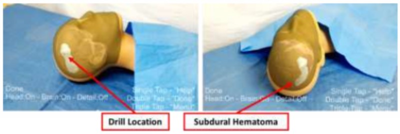

Back to [Projects List](../../README.md#ProjectsList)

## Write full project title here

## Key Investigators
- Andras Lasso (PerkLab, Queen's)
- Adam Rankin (Robarts)

# Project Description

We would like to use Microsoft Hololens as an augmented reality viewer/controller and run most of the software stack in 3D Slicer. We need a way to communicate between 3D Slicer and Hololens. Since Slicer can already send/receive most data types via OpenIGTLink protocol, it could be used as communication protocol with Hololens. Hololens application development is quite easy in Unity, so we would need a solution that works in this environment.

## Objective

1. Send/receive transforms, images, and models between Slicer and a Unity application running on Hololens

## Approach and Plan

1. Try existing OpenIGTLink UWP implementation that can run on Hololens (https://github.com/IGSIO/UWPOpenIGTLink)
1. Try to use OpenIGTLink UWP in Unity

## Progress and Next Steps

- Development environment has been set up

# Illustrations

# Background and References

<!--Use this space for information that may help people better understand your project, like links to papers, source code, or data.-->

- Source code: https://github.com/lassoan
<!-- - Documentation: https://link.to.docs -->
<!-- - Test data: https://link.to.test.data -->
- Related paper: http://perk.cs.queensu.ca/contents/neurosurgical-burr-hole-placement-using-microsoft-hololens
