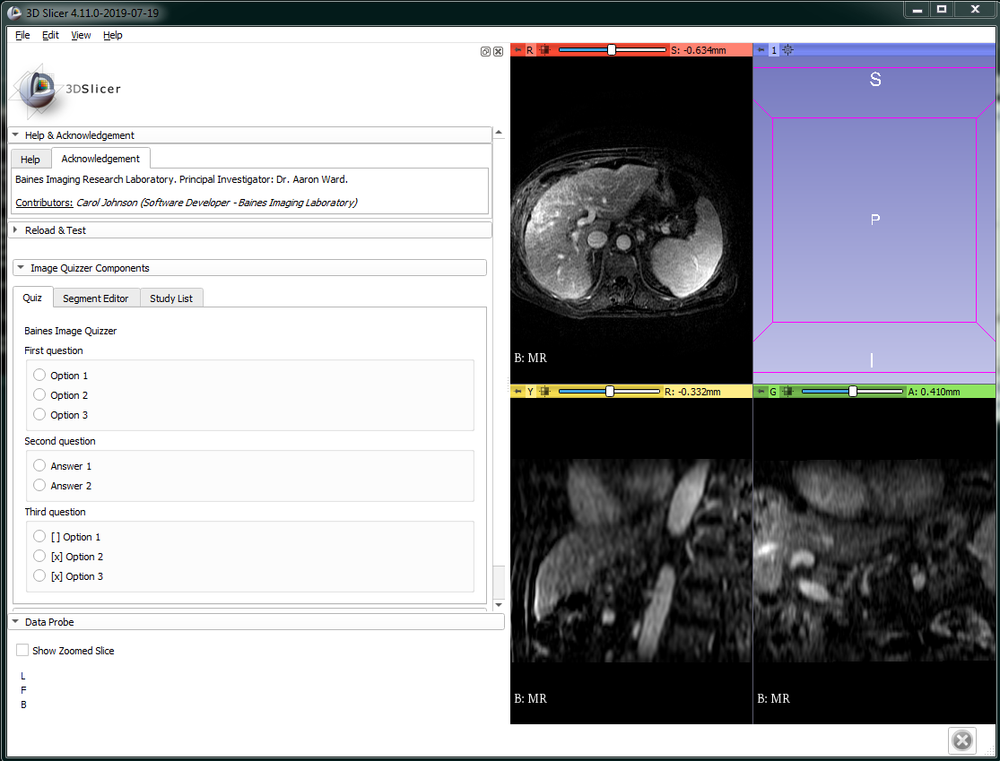
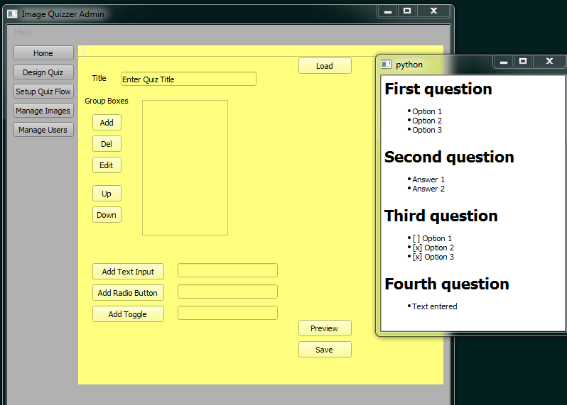
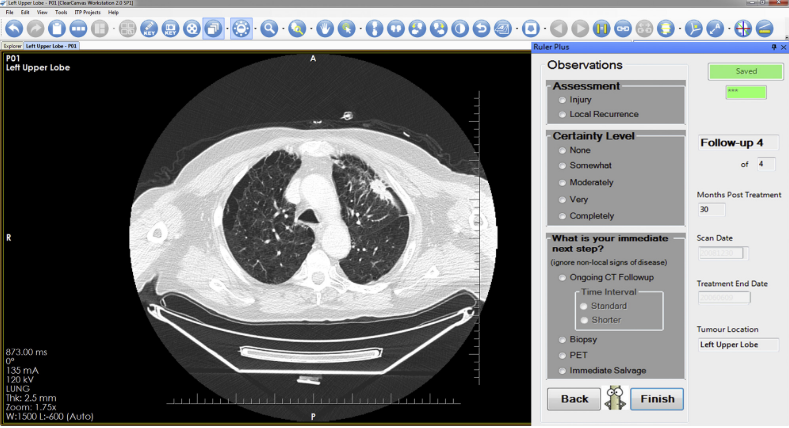
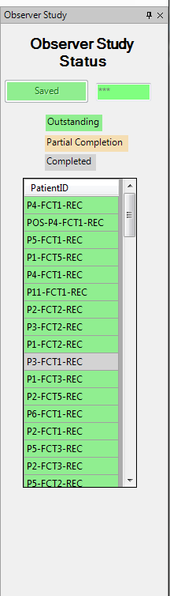

ImageQuizzerProject
## Image Quizzer

## Key Investigators
- Carol Johnson (Baines Imaging Research Laboratory)

# Project Description

The goal of this project is to develop a versatile clinical teaching tool which will present patient images with an associated questionnaire and capture user assessment for offline analysis. The content of the questionnaire will be customizable using the designer component of the application thereby providing a means to create a variety of educational/research resources.

Online documentation can be found here: <https://baines-imaging-research-laboratory.github.io/ImageQuizzerDocumentation/>

## Objective

To learn the concepts that are needed to develop the three components of the project.
+ Image Quizzer Designer
   - Create a slicelet where a user is able to dynamically customize the questionnaire to suit the teaching application.
+ Image Quizzer Study Browser
   - Develop an application that will organize the patient images to be used by the Image Quizzer and maintain the status of the study progress.
+ Image Quizzer
   - Create a slicelet that will present to the user a series of images with an associated questionnaire.
   - User responses to the questionnaire will be captured for analysis.

## Approach and Plan

+ Image Quizzer Designer
   - Allow user to add group boxes to a list and within each group box, quiz items can be added (radio buttons, toggle switches, edit lines etc.)
   - Present the designed quiz in a preview button.
   - A Save button will create a basic xml document (.ui file) which can be ported to the Image Quizzer application.
   - TODO:
      - Fix the preview window to remain in scope until the user closes it.
      - Confirm the correct library to import to allow for creation of the xml file (.ui).
      - Flesh out the code to coordinate adding quiz items to the previously added group boxes (a table of quiz items connected to the group box table item.)

+ Image Quizzer
   - Import a .ui file created by the Designer module.
   - Load a group of images that can be displayed one at a time, allowing the user access to some basic viewing tools.
   - Control the display of the series of patient images with Next and Back buttons.
   - Capture the user responses to the quiz in an excel formatted file.
   - TODO:
      - Learn how to capture quiz resposnes, updating the user's xml file.
      - Work with the study to load the next series for the patient or the next patient.
      - Learn how to add image viewer functionality to the application.
      - Learn how to capture contours or fiducial points, for future projects.

+ Image Quizzer Study Browser
   - To develop an application that will organize the patient images to be used by the Image Quizzer and maintain the status of the study progress.
   - TODO:
      - Learn how to work with the Slicer data module to organize and group patient images.
      - Design how to coordinate this for a user study, showing progress of completed or partially completed patients, potentially using an xml file to manage this.
      - Learn how to call one slicelet from another (a possible solution to coordinating the study browser with the Image Quizzer components)

## Progress and Next Steps

+ THE PLAN CHANGED:
   - instead of using a .ui file to load a quiz I am using a markdown file which is much more readable and easier to work with
   - instead of using slicelets, the Slicer main window will be used, but unnecessary modules will be hidden

+ PROGRESS:
   - I have created a .md quiz file which has been loaded as a module in Slicer
      - Qt groups boxes and radio buttons were created dynamically from the coded md file
   - I can load images for the quiz from the study browser .md file.
   - Python code to coordinate moving through the assigned images still to be coded

# Illustrations

<!--Add pictures and links to videos that demonstrate what has been accomplished.-->

<!--Archive old images

-->

# Background and References

<!--Use this space for information that may help people better understand your project, like links to papers, source code, or data.-->

A similar project was designed for the ClearCanvas 2.0 workstation.
 Following is a link to the publication to show how it was used.
https://www.sciencedirect.com/science/article/pii/S0360301615272239?via%3Dihub
