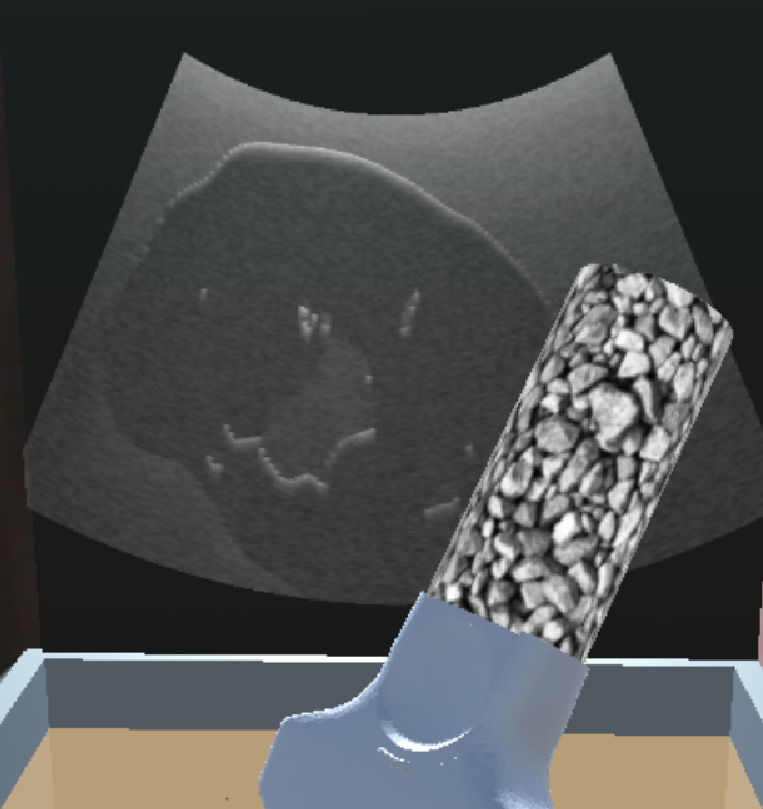

Back to [Projects List](../../README.md#ProjectsList)

## Plus ultrasound simulation using kidney models

## Key Investigators
- Lyla Mu (Western University)

# Project Description
<!-- Segment kidney, calyx, pyramid, blood vessels and other abdominal organs. Create 3D mesh models for ultrasound simulation using PLUS -->

## Objective
1. Segment kidney, calyx, pyramid and blood vessels.
2. Create 3D mesh models
3. Assign acoustic properties for ultrasound simulation in PLUS configuration

## Progress and Next Steps

<!--Describe progress and next steps in a few bullet points as you are making progress.-->

# Illustrations

<!--Add pictures and links to videos that demonstrate what has been accomplished.-->

<!---->

# Background and References

<!--Use this space for information that may help people better understand your project, like links to papers, source code, or data.-->

- Source code: https://github.com/Lyla-M/UnityOpenIGTLink
- Test data: Kidney CT https://github.com/neheller/kits19/tree/master/data/case_00000
