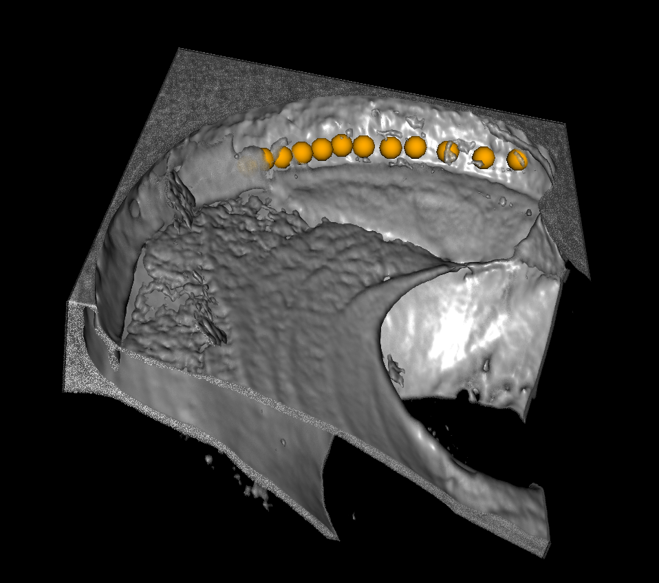
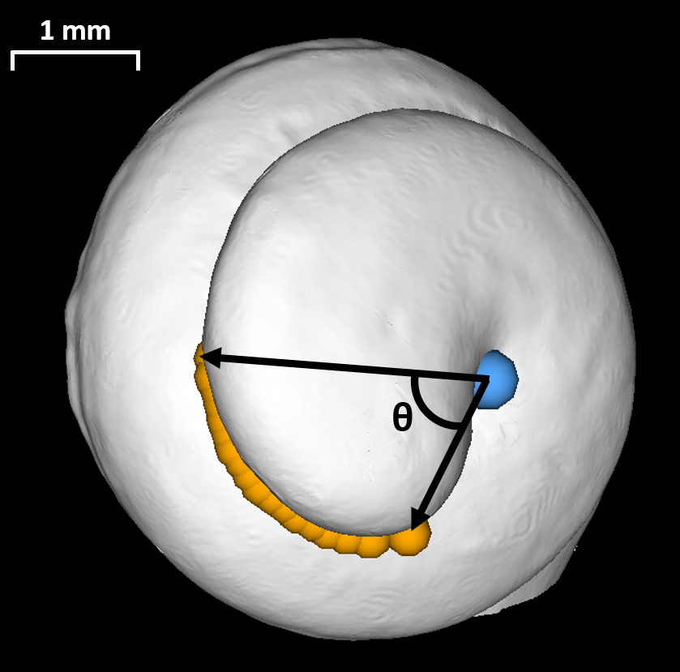

Back to [Projects List](../../README.md#ProjectsList)

## Write full project title here

## Key Investigators
- Hanif Ladak
- Sumit Agrawal

# Project Description
Model and measure the helicotrema (tip) of the human cochlea using 3D Slicer

## Objective
Measure the helicotrema region of the cochlea using 3D Slicer.

## Approach and Plan

1. Visualize synchtron radiation phase-contrast imaging volume in 3D Slicer
2. Place fiducials tracing helicotrema region
3. Volume render to visualize both both and soft-tissue simultaneously
4. Export Slicer .mrb file to share volume, fiducials, and renderings with collaborators

## Progress and Next Steps

Had preliminary work completed coming in to Slicer week. Measuremnts were completed, and volume renderings were improved significantly. Files were exported succesfully for seamless sharing.

# Illustrations

