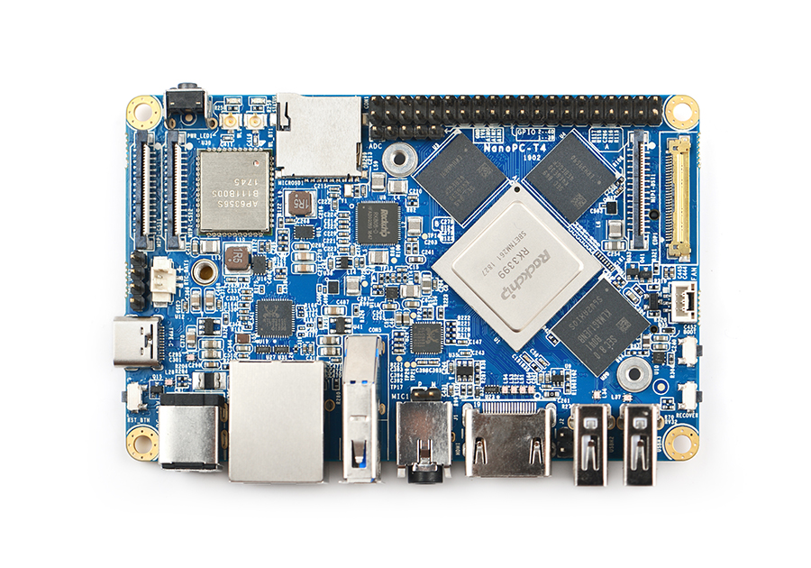

Back to [Projects List](../../README.md#ProjectsList)

## 3D Slicer on ARM64 (with GPU support!)

## Key Investigators
- Adam Rankin (Robarts Research Institute)

# Project Description
Compile and run Slicer on a [NanoPC-T4 SBC](http://wiki.friendlyarm.com/wiki/index.php/NanoPC-T4) with OpenGL ES support compiled and working.

## Objective
1. Compile 3D Slicer
1. Run with correct OpenGL ES settings

## Approach and Plan

1. Compile with OpenGL emulation, fix errors as they appear
1. Run with OpenGL emulation, see if it works (poor performance expected)
1. Compile with Open GLES, fix errors/add features as needed

## Progress and Next Steps

- CTKAPPLAUNCHER binary format issue resolved, new repo for aarch64 releases [here](https://github.com/Slicer/AppLauncher)
- Thead from workaround attempt is described [here](https://discourse.slicer.org/t/slicer-for-ubuntu-arm64/) for OpenGLES first try

# Illustrations

# Background and References

- Linux graphic stack [overview](https://studiopixl.com/2017-05-13/linux-graphic-stack-an-overview)
- Linux graphic stack [lecture](https://www.youtube.com/watch?v=k9mobviOpFQ)
