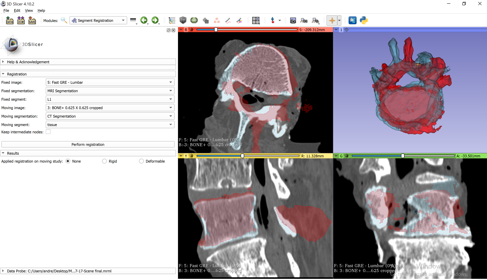
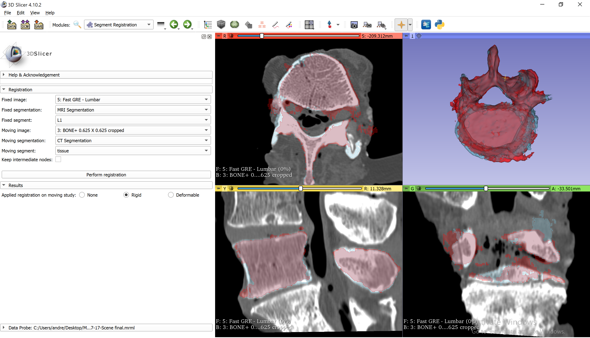

Back to [Projects List](../../README.md#ProjectsList)

## MRI based 3D spine models

## Key Investigators
- Andrew Kanawati
- Parham Rasoulinejad
- Andras Lasso (PerkLab, Queen's)

# Project Description

Determine if accurate spine models can be created from MRI.

## Objective

- Use Segment Editor to segment vertebrae on MRI and CT
- Create patient-specific 3D-printed tool guide based on MRI
- Compute difference between CT and MRI segmentation

## Approach and Plan

- Use Segment Editor module for segmentation
- Use Segment Registration module (in Segment Registration extension) for aligning CT and MRI segmentation for each vertebra. Compute Hausdorff distance using Segment Comparison module. Compute error on the surface using Model to model distance module (in Model to model distance extension)

## Progress and Next Steps

<!--Describe progress and next steps in a few bullet points as you are making progress.-->

# Illustrations

<!--Add pictures and links to videos that demonstrate what has been accomplished.-->

# Background and References

<!--Use this space for information that may help people better understand your project, like links to papers, source code, or data.

- Source code: https://github.com/YourUser/YourRepository
- Documentation: https://link.to.docs
- Test data: https://link.to.test.data

-->
