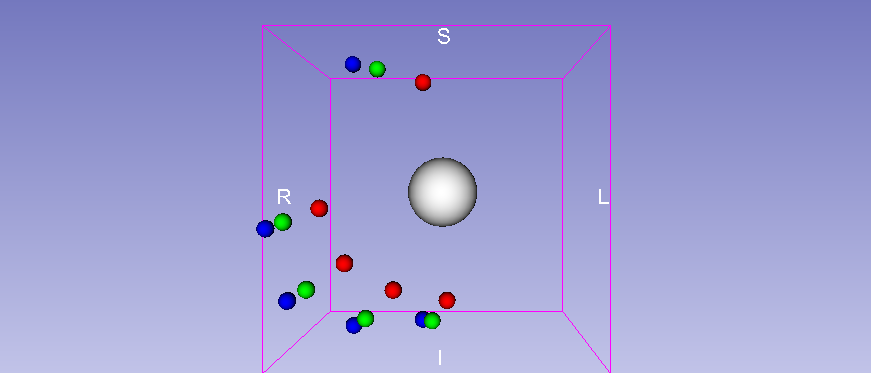

Back to [Projects List](../../README.md#ProjectsList)

## LeapMotion Hands in Slicer

## Key Investigators
- Leah Groves
- Daniel Allen
- Adam Rankin

# Project Description
Module to integrate hand models into Slicer that are paired with tracking from LeapMotion

## Objective
1. Stream data from leap motion into Slicer
1. Pair tracking with models to represent hands
1. Make hands user specfic through scaling models accordingly and allow user input

## Approach and Plan

1. Use PlusServer to stream data into 3D Slicer
1. Pair cylinder and sphere models with tracking information
1. Make module adpatable to width and length of digits

## Progress and Next Steps
1. Transforms representing joints are streamed into 3D Slicer
1. On connecting sphere models are generated and paired with appropriate transforms

Future work:
1. Positions cylinders according to joints
1. Stream in finger dimensions and have model sizes adapt to user
1. Check update rate when calibrated into the VIVE
<!--Describe progress and next steps in a few bullet points as you are making progress.-->

# Illustrations

<!--Add pictures and links to videos that demonstrate what has been accomplished.-->

# Background and References

<!--Use this space for information that may help people better understand your project, like links to papers, source code, or data.-->

- Source code: https://github.com/YourUser/YourRepository
- Documentation: https://link.to.docs
- Test data: https://link.to.test.data
