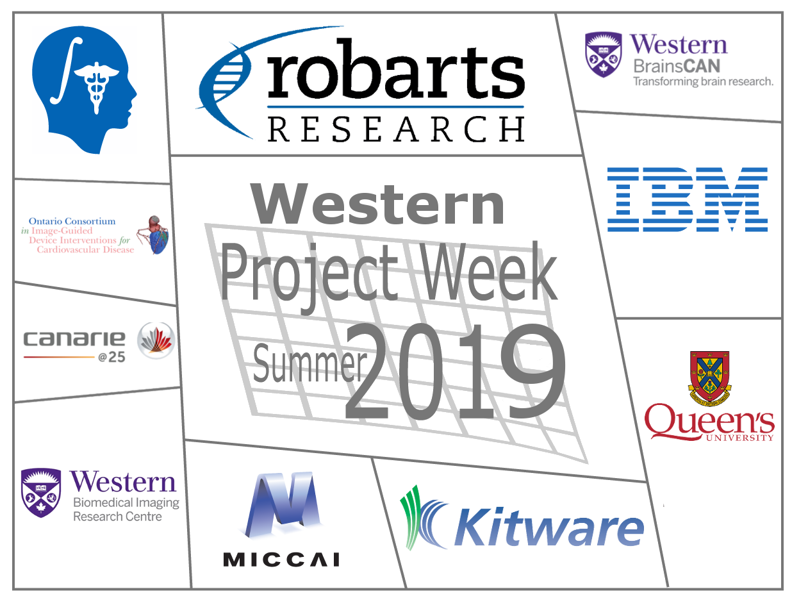

## Welcome to the web page for the 32nd Project Week!
The 32nd NA-MIC Project Week will be held during the week of July 15-19, 2019 at the [Robarts Research Institute](http://www.robarts.ca/), Western University.

Please read about our experience in running these events since 2005: [Increasing the Impact of Medical Image Computing Using
Community-Based Open-Access Hackathons: the NA-MIC and 3D Slicer Experience](http://www.spl.harvard.edu/publications/item/view/3004).

## Photo Album
The 32nd NA-MIC PW [Event album]().

## Logistics
To receive information and announcements about the events please join the [Slack group](https://join.slack.com/t/spww/shared_invite/enQtNjcxMTc3MTQyMjU5LTlhZDJmODVmMDgyNWNiZjQ5MDU2OWM5OWE3NTFiZGRlZDRiYzdiNzU2YTQwZjk5NDI2NzNiYjc5Zjc3M2U2MmU) (for questions dedicated to this event).

+ **Dates:** July 15-19, 2019.
+ **Location:** [Robarts Research Institute](https://www.google.ca/maps/@43.0113638,-81.2738561,3a,75y,340.63h,93.84t/data=!3m6!1e1!3m4!1sqB04BofO2fkNxgxlzynSRA!2e0!7i13312!8i6656)
+ **REGISTRATION:** [https://event-wizard.com/Slicer2019/0/register/](https://event-wizard.com/Slicer2019/0/register/)
+ **Hotel:** No formal arrangement has been made, but some options are:
  + Close, \$, wide range of room styles: [http://guesthouseonthemount.ca/](http://guesthouseonthemount.ca/)
  + Close, \$\$, balanced offering: [https://windermeremanor.com/](https://windermeremanor.com/)
  + Downtown, \$\$/\$\$\$, nice character, good location to explore London, [http://www.deltahotellondon.com/](http://www.deltahotellondon.com/)
+ **Parking:** Visitor parking is available at $12/day (sorry!) in the nearby [hospital visitor parking garage](https://www.google.ca/maps/@43.0142363,-81.2750746,3a,75y,186.07h,100.01t/data=!3m5!1e1!3m3!1sVo_3mg5ibFW_kPnYjVOrPQ!2e0!6s%2F%2Fgeo0.ggpht.com%2Fcbk%3Fpanoid%3DVo_3mg5ibFW_kPnYjVOrPQ%26output%3Dthumbnail%26cb_client%3Dmaps_sv.tactile.gps%26thumb%3D2%26w%3D203%26h%3D100%26yaw%3D62.77921%26pitch%3D0%26thumbfov%3D100). University of Western Ontario parking information is available [here](https://www.uwo.ca/parking/find/visitor/index.html)

## Local Organizing Committee
- Host: [Terry Peters](http://www.robarts.ca/terry-peters), Robarts Scientist; Professor Medical Imaging; Medical Biophysics; Biomedical Engineering

- Email Local Organizing Committee:
  - [Adam Rankin, Terry Peters, Jackie Williams](mailto:arankin@robarts.ca,tpeters@robarts.ca,jwilliams@robarts.ca?cc=tkapur@bwh.harvard.edu&subject=ProjectWeek29)

## Frequently Asked Questions
+ [What?](../README.md#what)
+ [When, where, how much?](./README.md#logistics)
+ [How does it work?](../README.md#how-does-it-work)
+ [Who can attend?](../README.md#who-can-attend)
+ [Who should attend?](../README.md#who-should-attend)
+ [What else?](../README.md#what-else)
+ [Who to contact?](./README.md#local-organizing-committee)

## Program Calendar
<iframe src="https://calendar.google.com/calendar/embed?src=kitware.com_sb07i171olac9aavh46ir495c4%40group.calendar.google.com&ctz=America%2FToronto&dates=20190715%2F20190719&hours=0800%2F2000&mode=WEEK" style="border: 0" width="800" height="600" frameborder="0" scrolling="no"></iframe>

## Projects <a name="ProjectsList"/>

Please [follow these instructions](./Projects/README.md) to create a project page. For those new to Git who are daunted by this, you can email your project details to [Adam Rankin](mailto:arankin@robarts.ca) and he will add a project page for you.

### Clinical
+ [Image Quizzer Project](./Projects/ImageQuizzerProject/README.md)

### Deep Learning
+ [NiftyNet Alive Demo](./Projects/NiftyNet-Alive-demo/README.md)
+ [Vertebral Segmentation 3D U-Net](./VertebralSegmentation3DUNet/README.md)

### Registration
+ [Bronchoscope Localization from Depth Maps](./Projects/BronchoscopeLocalizationFromDepthMaps/README.md)
+ [Principal Axis Transformation for Orientation Mismatch Correction](./Projects/PAxisTransform/README.md)
+ [Bullseye - Computer Vision for Intraoperative Validation of Glenoid Component Placement in Total Shoulder Arthroplasty](./Projects/bullseye/README.md)

### IGT
+ [OpenIGTLink connection between Slicer and Hololens Unity applications](./Projects/HololensOpenIGTLink/README.md)

### Simulation
+ [Interactive medical simulation toolkit (IMSTK) integration](../PW31_2019_Boston/Projects/SlicerIMSTK/README.md)

### Core infrastructure
+ [Slicer for ARM64](./Projects/Slicer_ARM64/README.md)

## Registrants
1. Daniel Allen (Robarts Research Institute)
1. Patrick Carnahan (Robarts Research Institute)
1. Elvis Chen (Robarts Research Institute)
1. Adamo Donovan (McGill University (Respiratory Epidemiology and Clinical Research Unit/RECRU))
1. Roy Eagleson (Western University)
1. Greydon Gilmore (London Health Sciences )
1. Leah Groves (Robarts Research Institute )
1. Amir HaghighatiMaleki (University of Western Ontario)
1. Nobuhiko Hata (Brigham and Women's Hospital)
1. Luke Helpard (Western University)
1. Samantha Horvath (Kitware Inc)
1. Carol Johnson (Baines Imaging Research Laboratory)
1. Andrew Kanawati (Department of Orthopaedics)
1. Franklin King (Brigham and Women's Hospital)
1. Geoff Klein (University of Toronto)
1. Andras Lasso (PerkLab, Queen's University)
1. Alex Levine (Western University)
1. Jielin Lu (Schulich School of Medicine and Dentistry)
1. Ying Li Lu (Robarts Research Institute)
1. Maryam Mozaffari (Robarts Researh Innstitute)
1. Lyla Mu (Robarts Research Institue, Western University)
1. Farah Mushtaha (Robarts Research Institue )
1. Samuel Newhook (Sunnybrook Health Sciences Center - Orthopaedic Biomechanics Laboratory)
1. Chloë Nicholson-Smith (London Health Sciences Centre)
1. Hareem Nisar (Robarts Research Institute)
1. Roberta Piazza (Robarts Research Institute)
1. Meiwen Qiu (Western University)
1. Adam Rankin (Robarts Research Institute)
1. Puneet Ranota (Western University of Ontario)
1. Arshin Rezazadeh (University of Western Ontario)
1. Mohsen Shirpour (University of Western Ontario)
1. Wafiq Syed (London Health Sciences Centre)
1. Blake VanBerlo (Robarts Research Institute)
1. Tina Wu (Sunnybrook Health Science Centre - Orthopaedic Biomechanics Lab)
1. Wenyao Xia (Western University)
1. Yiming Xiao (Western University)
1. Danny Yang (Robarts Research Institutes )
1. Mohamed Yousif (Robarts Research Institute)

Do not add your name to this list - it is maintained by the organizers based on your paid registration.
