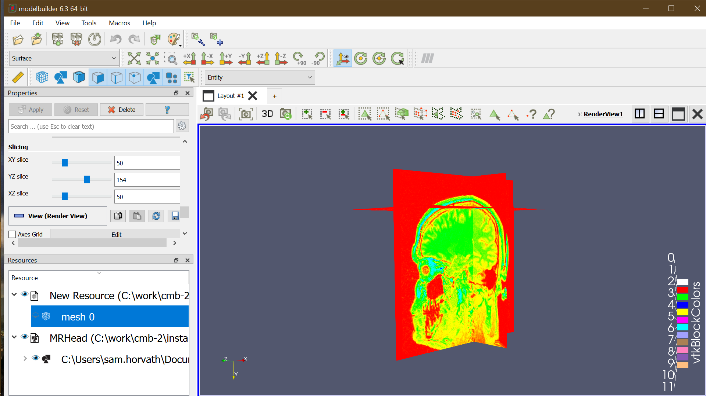
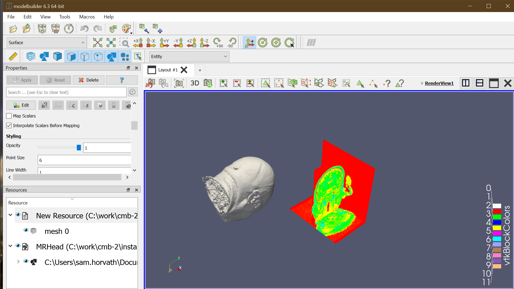
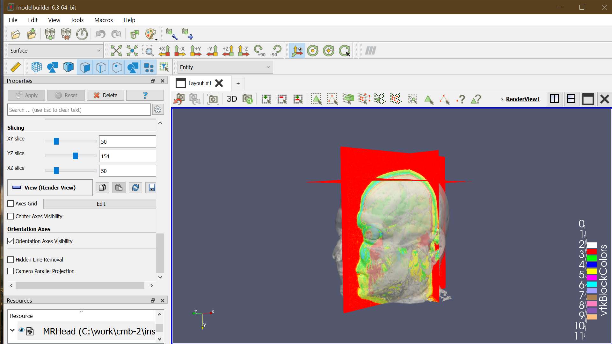
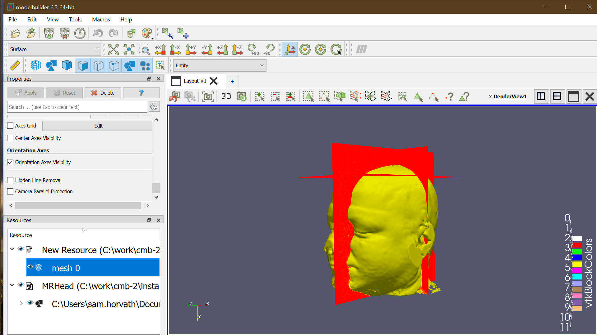

Back to [Projects List](../../README.md#ProjectsList)

# Software for Annotation and Anatomy (AEVA)

## Key Investigators

- Sam Horvath (Kitware, Inc)

# Project Description

<!-- Add a short paragraph describing the project. -->

THe goal of this project is to introduce the 3D Slicer community to the [Computational Model Builder](https://www.computationalmodelbuilder.org/overview/), and our new efforts to extend its functionality in the medical image domain

CMB is an open source platform for creating and running simulations based on 3D mesh models.  It provides many powerful tools for mesh annotation (terminology, cell selection, etc).  However, it currently does not have support for reading image data or generating meshes directly from images.  We are currently working on adding that support, with the goal of making the CMB framework usabe in medical image contexts.

## Objective

<!-- Describe here WHAT you would like to achieve (what you will have as end result). -->

1. Introduce the 3D Slicer community to the possible usefulness of CMB
2. Implement image data reading, display, and basic segmentation (thresholding, etc)

## Approach and Plan

<!-- Describe here HOW you would like to achieve the objectives stated above. -->

1. Discuss / demo the CMB platform
2. Integrate ITK into the CMB plaform
3. Integrate display of oriented image data in VTK
4. Basic thresholding

## Progress and Next Steps

<!-- Update this section as you make progress, describing of what you have ACTUALLY DONE. If there are specific steps that you could not complete then you can describe them here, too. -->

1. Integrated ITK image reader
2. Integrated 3D Slicer display - no orientation yet
3. Some productive discussion about Paraview vs. Slicer

# Illustrations

<!-- Add pictures and links to videos that demonstrate what has been accomplished.

-->
Slices displayed in cmb

Current orienation state - incorrect

Example of what correct orientation would look like

Example of what correct orientation would look like

# Background and References

<!-- If you developed any software, include link to the source code repository. If possible, also add links to sample data, and to any relevant publications. -->
