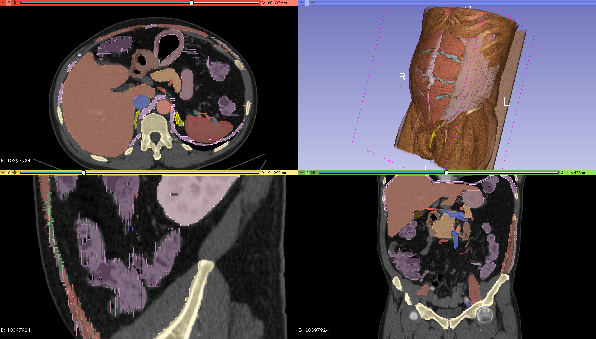
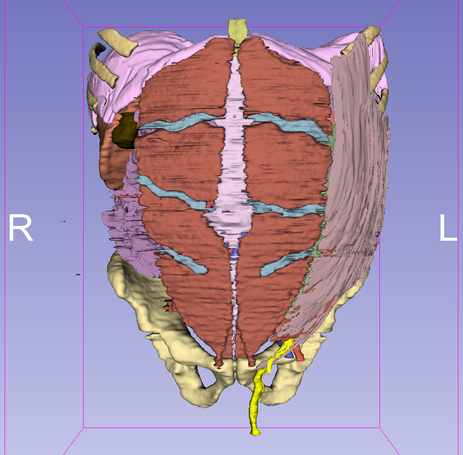
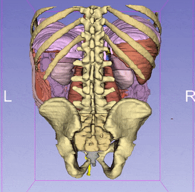

Back to [Projects List](../../README.md#ProjectsList)

# Anatomical Atlases Senegal.

## Key Investigators

- Babacar Diao (Ecole Militaire de Santé Dakar)
- Ainina Ndiaye (Université Cheikh Anta Diop)
- MOROCCO
- Siham Alaoui (University Abdelmalek Essaâdi)
- Mouhcine Madani (University Abdelmalek Essaâdi)
- Otman Aghzout (University Abdelmalek Essaâdi)
- Badiaa Ait Ahmed (University Abdelmalek Essaâdi)
- SPAIN
- Nayra Pumar (ULPGC – GTMA-IUIBS - MACbioIDi)
- Juan Ruiz Alzola (ULPGC – GTMA-IUIBS - MACbioIDi)

# Project Description

This project focuses on the development of different anatomical atlases for educational purposes.
These atlases and their creation process will be used as training material in the 3DSlicer training programs project.

## Objectives

1. The creation of anatomical atlases as new elements for educational purposes.
1. The introduction of African professionals in the creation of these atlases using 3D Slicer.
1. The discussion of new projects that could arise

## Approach and Plan

1. Training using the 3D Slicer segment editor
1. Image study and selection: Male and Female Pelvis

## Progress and Next Steps

1. Training session Slicer101: an introduction to 3DSlicer from the user point of view.
1. Training session Advanced Segmentation: Where questions about special segmentation needs where answered.
1. Refined segmentation of the male abdomen atlas: includes the muscles and tendons

# Illustrations

# Background and References

- [Pelvis Atlas project](https://projectweek.na-mic.org/PW30_2019_GranCanaria/Projects/PelvicAnatomyAtlases/)
- [Atlas Development For Education project](https://projectweek.na-mic.org/PW28_2018_GranCanaria/Projects/AtlasDevelopmentForEducation/)
