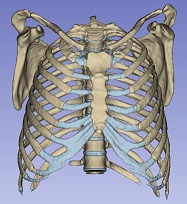
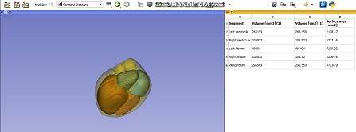

Back to [Projects List](../../README.md#ProjectsList)

# Anatomical Atlases Mauritania.

## Key Investigators

-	Dada Lebchir (Université de Nouakchott Al Aasriya - Faculté de Médecine)
-	Ahmedou Moulaye Idriss (Université de Nouakchott Al Aasriya - Faculté de Médecine)
-	Yahya Tfeil (Université de Nouakchott Al Aasriya - Faculté de Médecine)
-	Mohamed Septy (Université de Nouakchott Al Aasriya - Faculté de Médecine)
- Haythem Guermazi (undergraduate, FM- UNA)
- Oubeida Aryan (undergraduate, FM- UNA)
- Raia Sidi Aly (undergraduate, FM- UNA)
- Mohamed Bamba (undergraduate, FM- UNA)
- Yahya Abatna (undergraduate, FM- UNA)
- Mariem Isselmou (undergraduate, FM- UNA)
- Mohamed Aly Dedew (undergraduate, FM- UNA)
- MOROCCO
- Siham Alaoui (University Abdelmalek Essaâdi)
- Mouhcine Madani (University Abdelmalek Essaâdi)
- Otman Aghzout (University Abdelmalek Essaâdi)
- Badiaa Ait Ahmed (University Abdelmalek Essaâdi)
- SPAIN
- Marilola Afonso (ULPGC – GTMA-IUIBS - MACbioIDi)
- Asmaa Skareb (ULPGC – GTMA-IUIBS - MACbioIDi)
- Juan Ruiz Alzola (ULPGC – GTMA-IUIBS - MACbioIDi)

# Project Description

This project focuses on the development of different anatomical atlases for educational purposes.
These atlases and their creation process will be used as training material in the 3DSlicer training programs project.

## Objectives

1. The creation of anatomical atlases as new elements for educational purposes.
1. The introduction of African professionals in the creation of these atlases using 3D Slicer.
1. The discussion of new projects that could arise

## Approach and Plan

1. Training using the 3D Slicer segment editor
1. Image study and selection: Thorax, Abdomen, Head (adult & infant models), pelvis, upper and lower limbs

## Progress and Next Steps

1. Atlases created for testing are already finished
1. The Mauritanian team is creating new atlases
1. Files to be uploaded to our server with the open anatomy browser are to be created
1. It is a challenge to gather quality images to be segmented, so a main interest point for us is to gather these images for different parts of the body normal and with some kind of pathology to be segmented

# Illustrations / Videos

# Background and References

- [Pelvis Atlas project](https://projectweek.na-mic.org/PW30_2019_GranCanaria/Projects/PelvicAnatomyAtlases/)
- [Atlas Development For Education project](https://projectweek.na-mic.org/PW28_2018_GranCanaria/Projects/AtlasDevelopmentForEducation/)
