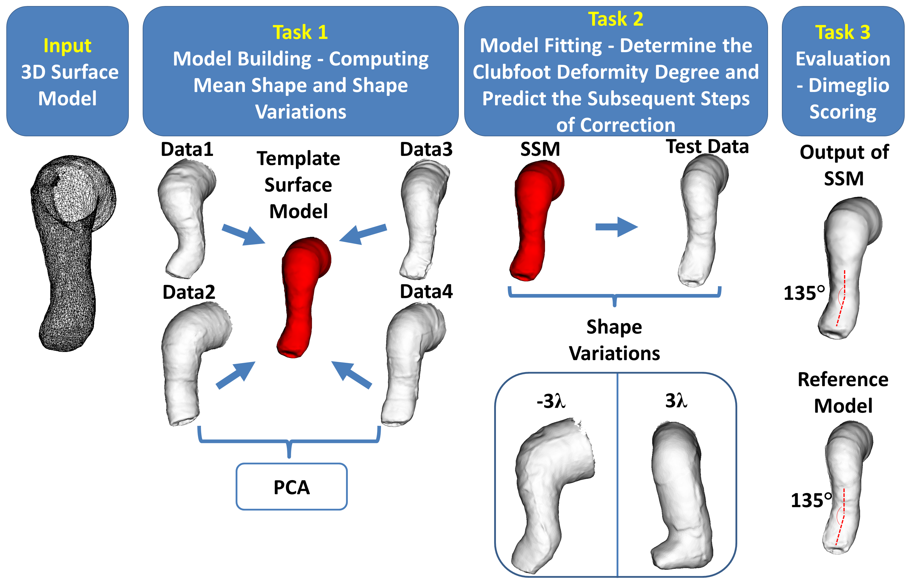
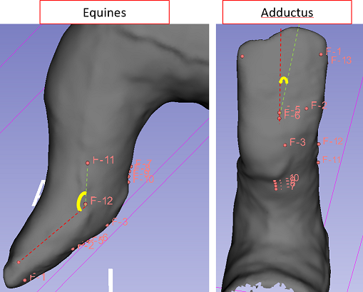
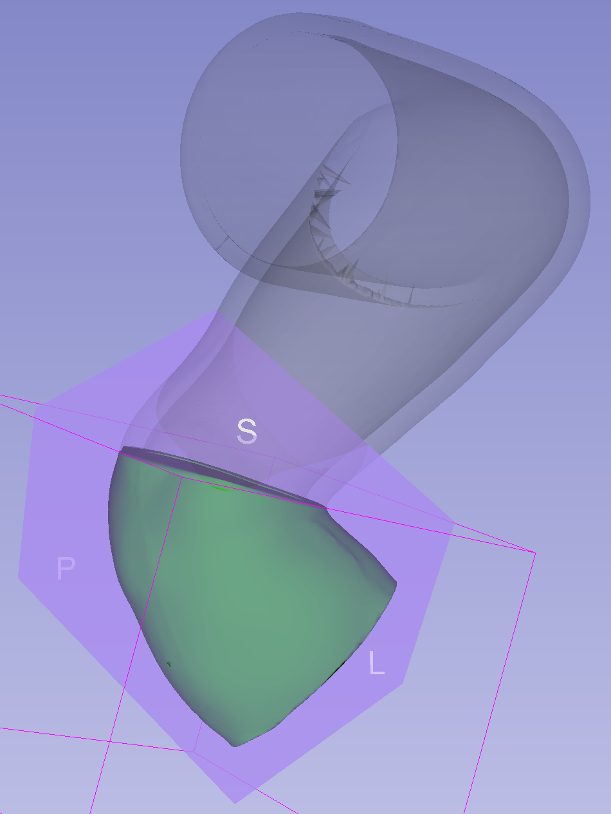
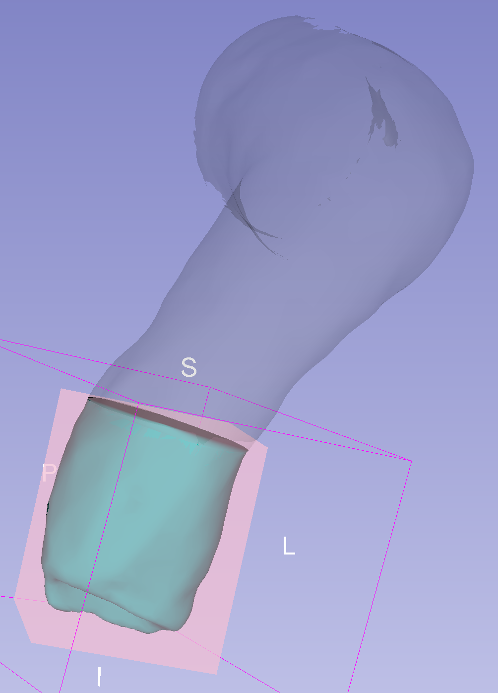
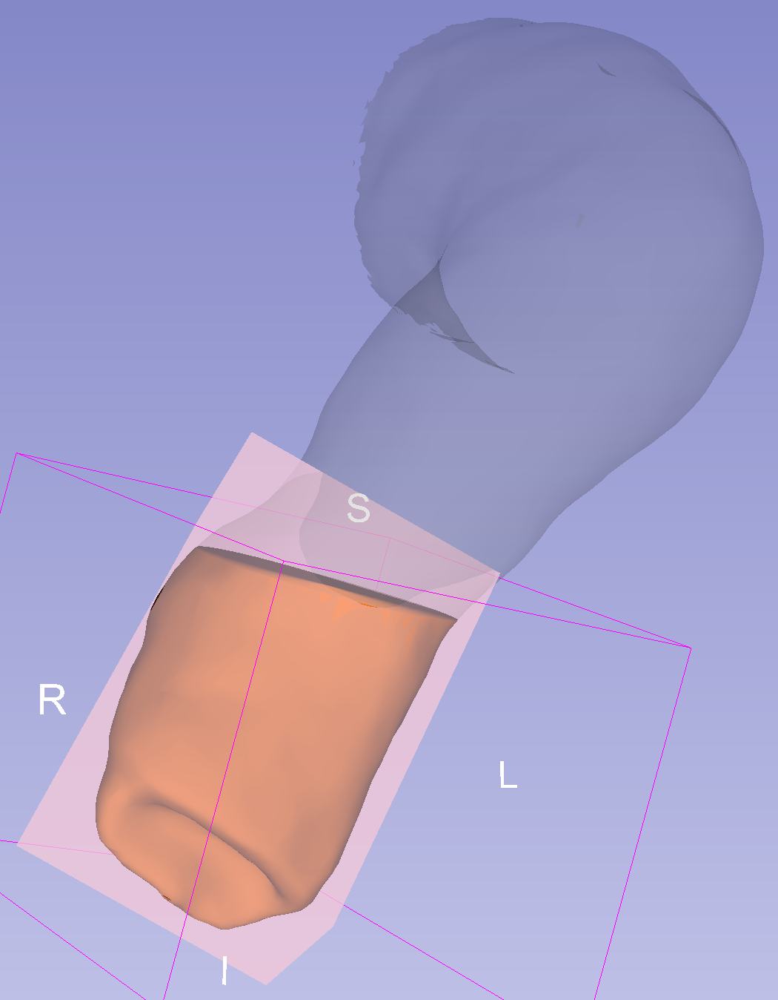
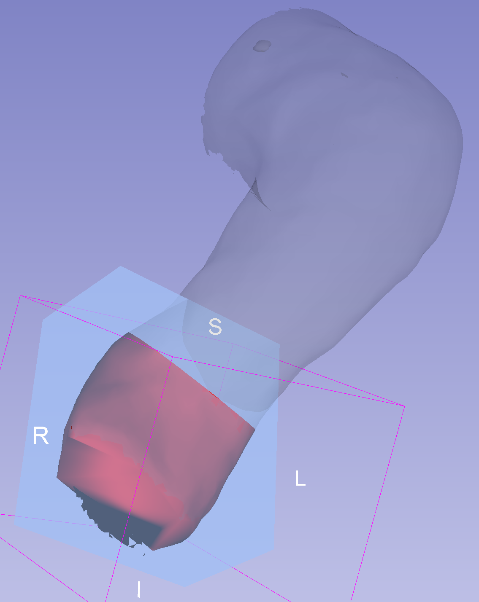
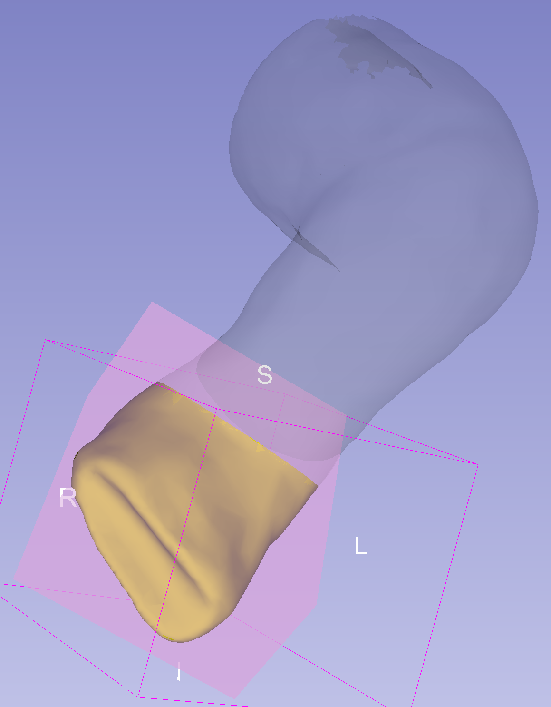
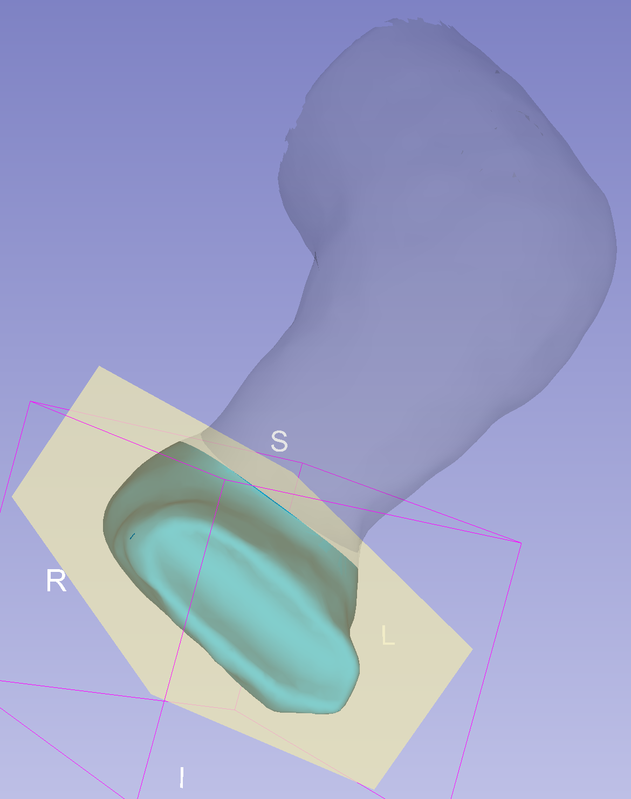
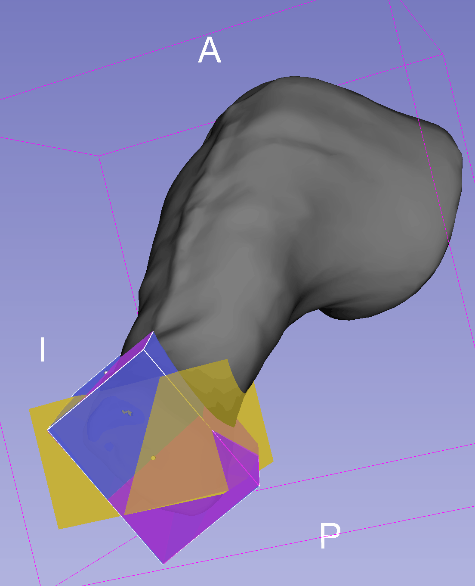

Back to [Projects List](../../README.md#ProjectsList)

# BabySteps: 3D Printing Using Slicer for creating clubfoot casts

## Key Investigators

- Pooneh Roshanitabrizi, Children's National
- Hadi Fooladi, Children's National
- Steve Pieper, Isomics, Inc.
- Kevin Cleary, Children's National
- Anuradha Dayal, Children's National

# Project Description

About 1-2 in every 1000 babies are born with what's called clubfoot, the most common skeletal deformity in children.

Clubfoot is well treated using a plaster casting method developed in the 1960s, but there is a potential to use
3D scanning and printing techniques to make the process more efficient and cost-effective.  Also easier activities of 
daily living for families with plastic instead of plaster casts.

## Objective

1. Ideal system would take a surface scan of baby's foot, either with phone or custom camera
1. Computer would generate sequence of cast shapes customized to baby
1. 3D printing models would be exported (STL) for generating custom casts

## Approach and Plan

1. 3D Scanning of the clubfoot cast
1. Loading the 3D model into Slicer
1. Selecting anatomical landmark points on the 3D model
1. Deforming the clubfoot 3D model through provided controls and widgets for printing next cast
1. 3D printing the deformed clubfoot model
1. Repeating the process until printing the normal cast

 

## Method (SSM)

## Evaluation

## Progress and Next Steps

### Approach #1: SSM

- #### Task #1: Model Building  
  - Using SlicerSALT 'ShapeVariationAnalyzer' module

- #### Task #2: Model Fitting
  - Implementing a new module to change shape modes

- #### Task #3: Evaluation

### Approach #2: Trajectory of foot correction

- #### Normalizing cast models in respect to shin
- #### Cropping the foot section
- #### Finding oriented bounding box and transformation matrix
  - Using 'vtkOBBTree.ComputeOBB'

| Stage 0 | Stage 1 | Stage 2 | Stage 3 | Stage 4 | Stage 5 |
|:-------:|:-------:|:-------:|:-------:|:-------:|:-------:|
|  |  |  |  |  |  |

- #### Transformation interpolation to get new models
  

# Illustrations

# Background and References
