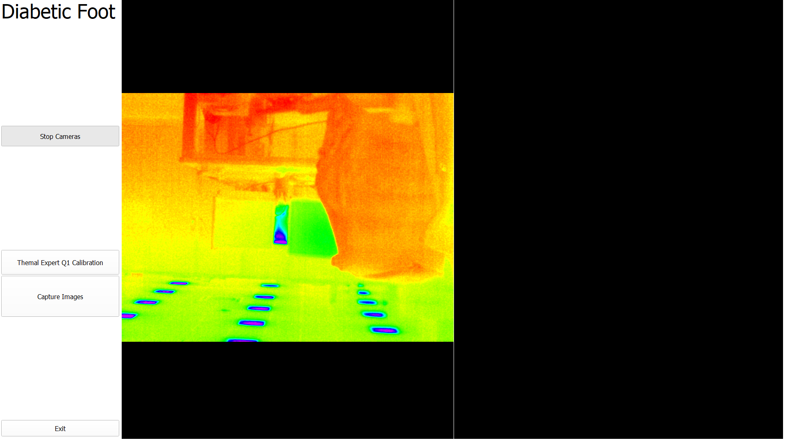
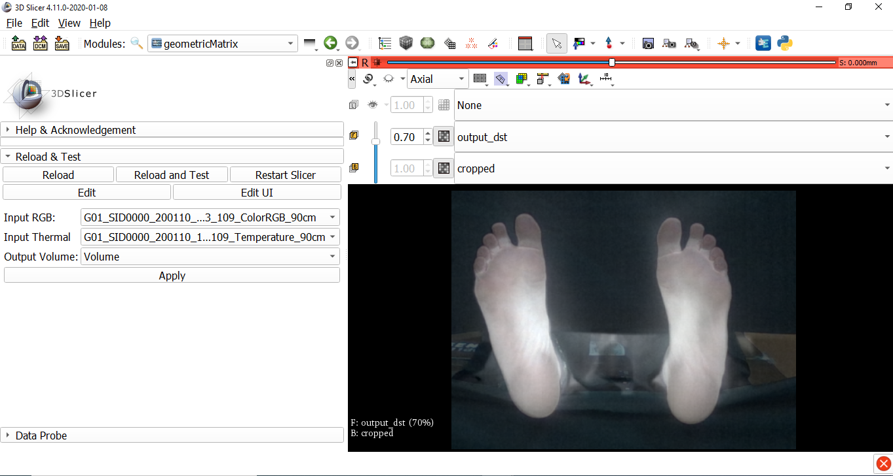
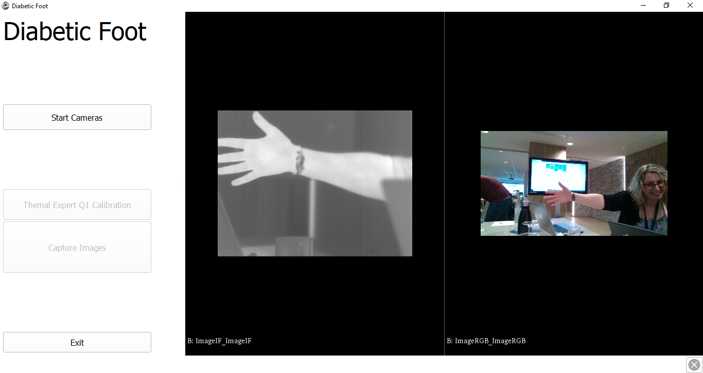

Back to [Projects List](../../README.md#ProjectsList)

# Customized Interface for diabetic foot extension

## Key Investigators

- José-Carlos Ruiz-Luque (Instituto Astrofísico de Canarias, Spain)
- Sara González (Instituto Astrofísico de Canarias, Spain)
- Juan Ruiz-Alzola (University of Las Palmas de Gran Canaria, Spain)

# Project Description

This project is the next step  in the project [Medical Infrared Imaging with 3DSlicer](https://projectweek.na-mic.org/PW28_2018_GranCanaria/Projects/MedicalInfraredImagingWithSlicer/) presented during 28th PW NA-MIC. This research is the result of a collaboration between the IAC and the University of Las Palmas de Gran Canaria. The main objective is to develop a multichannel sensor prototype that runs in Slicer through PLUS Toolkit. This sensor is being designed to be used by the clinic staff in particular for medical diagnosis (at this time we are focused on foot ulcers in diabetic patients).

The aim is to create a friendly customized interface for monitoring the foot ulcers in diabetic patients.
 <!-- Moreover, the interface invokes the different steps for the diagnosis Thinking more lines-->

## Objective

<!-- Describe here WHAT you would like to achieve (what you will have as end result). -->
1. Refactoring some modules in the Medical infrared imaging extension.
1. Customized interface based on Slicelet.
1. Integration of the cameras in Plus toolkit or 3d Slicer module.
1. Face some challenges:
   1. Performance relation with 3D Slicer and Plus toolkit in real time
   1. Running and stopping Plus server from 3D Slicer
   1. The image definition is not adjustable
   1. The error when the Slicelet-based aplication is closed
   1. Saving the images (orientation) in several format files (PNG, TIFF, DICOM)
   1. Combined images in different layers and using sliders to change layer transparency

## Approach and Plan

<!-- Describe here HOW you would like to achieve the objectives stated above. -->

1. Updating the current modules for python 3
1. Updating the current camera codes in the Plus toolkit.
1. Designing the customized interface.
1. Designing the common interfaces for different modules, algorithms, and so on
1. Evaluate SlicerCAT to implement the customized interface

## Progress and Next Steps

<!-- Update this section as you make progress, describing of what you have ACTUALLY DONE. If there are specific steps that you could not complete then you can describe them here, too. -->

We addressed our challenges with 3D Slicer and Plus community. The collaboration with the community, along this week has been quite succesfull and our project has achieve several goals.
1. We have resolved our running and stopping problem with the Plus server thanks to Kyle.
1. The leak issue when the customized application is closed was disccussed with Jean. He recommended following the current slicelet web page because the current implentation is old-fashion. (Figure 3)
1. We talked with several colleages about the image orientation when the image is serializated in 3D slicer. Finally, we resolved this issue taking into account the image orientation generated in Plus toolkit.
1. The perfomannce was analyzed with the community but the final solution need further discution so it will be a goal for the next project week. We decided to use low frame rate to reduce the CPU utilization.
1. We need to evaluate the solution (combined images in different layers) that we found in the slicer script repository.
1. The window/level volume is not updated in real-time, so it should be analyzed. We discussed several solutions with the community.

# Illustrations

<!-- Add pictures and links to videos that demonstrate what has been accomplished.

-->

Figure 1. The current Silelet-based GUI

Figure2. Thermal and visible volumen

Figure 3. The new GUI

# Background and References

<!-- If you developed any software, include link to the source code repository. If possible, also add links to sample data, and to any relevant publications. -->

- [Slicelet documentation](https://www.slicer.org/wiki/Documentation/Nightly/Developers/Slicelets)
- [Guidelet documentation](http://www.slicerigt.org/wp/developer-tutorial/)
- [Multi-language GUI](https://github.com/mt4sd/UltrasoundTrainingSystem/tree/i18n_l10n)
- [Guidelet-based GUI](https://github.com/mt4sd/UltrasoundTrainingSystem/tree/master)
- [Medical Infrared Imaging with 3DSlicer](https://projectweek.na-mic.org/PW28_2018_GranCanaria/Projects/MedicalInfraredImagingWithSlicer/)
- [SlicerCAT: Creating custom applications based on 3D Slicer](https://blog.kitware.com/slicercat-creating-custom-applications-based-on-3d-slicer/)
