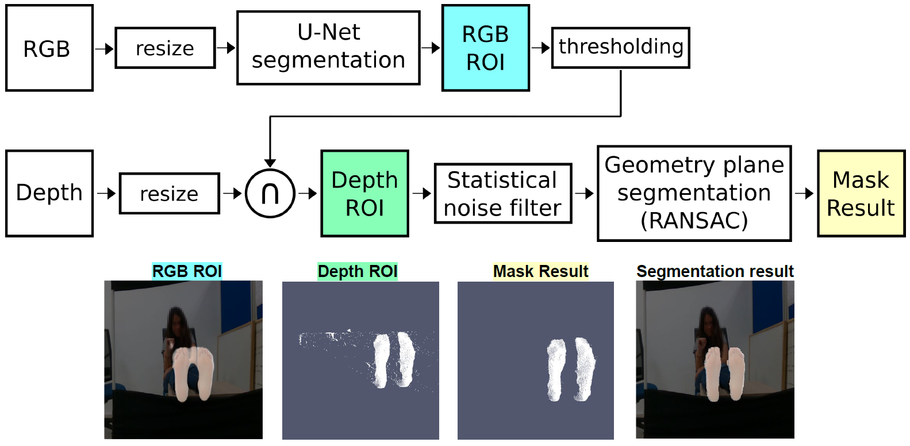
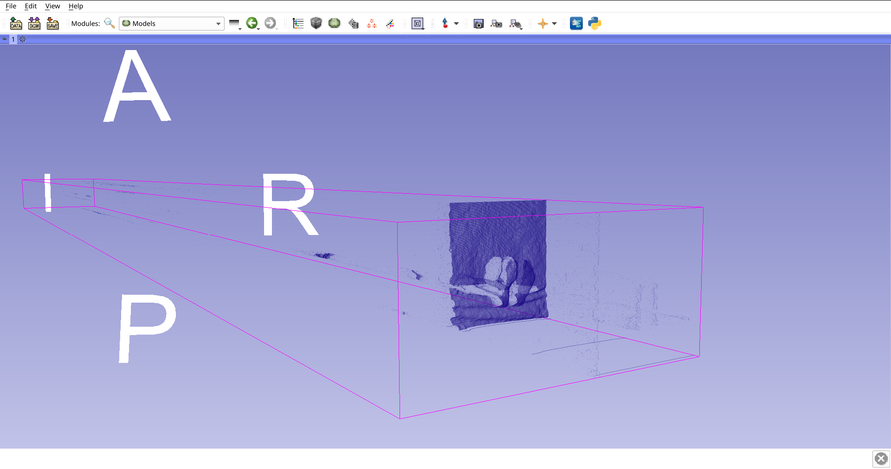
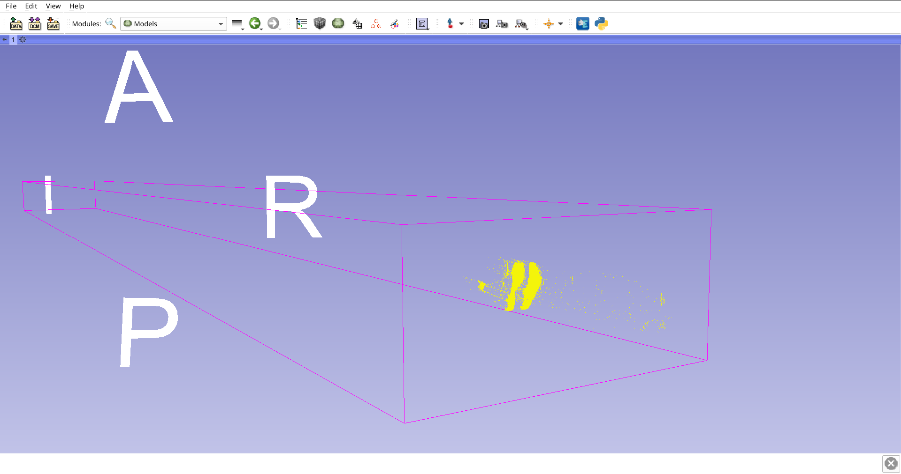
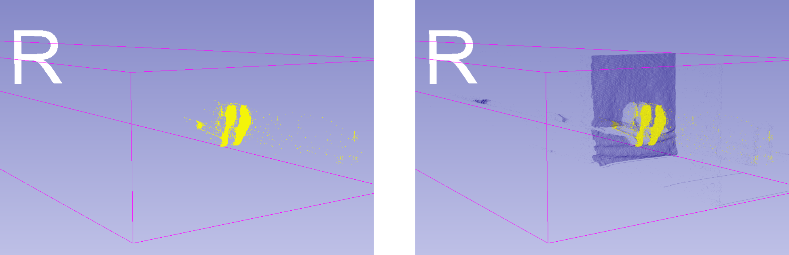
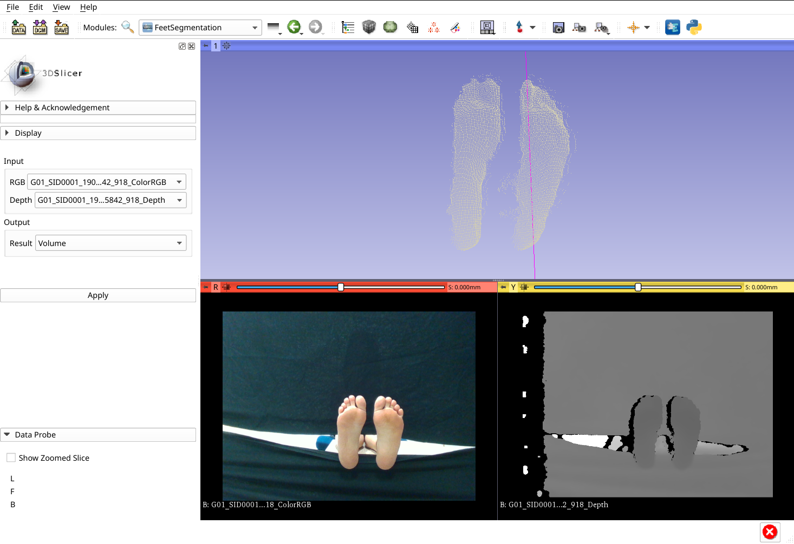

Back to [Projects List](../../README.md#ProjectsList)

# Integration of Diabetic Foot Segmentation Algorithm based on Deep Learning

## Key Investigators

- Abián Hernández Guedes(University of Las Palmas de Gran Canaria, Spain)
- José-Carlos Ruiz-Luque (Instituto Astrofísico de Canarias, Spain)
- Juan Ruiz-Alzola (University of Las Palmas de Gran Canaria, Spain)

# Project Description

This project is the follow-up of the development of a module to use InfraRed (IR) sensors in 3D Slicer for medical diagnosis, intended to use for monitoring of foot ulcers in diabetic patients, presented on the 28thPW NA-MIC. This project is proposed as a new stage in the diabetic foot assessment previously worked.

The aim is to integrate an algorithm, which is based on Deep Learning, for foot segmentation using multimodal images (visible and depth-map images). The resulting mask will be applied on thermal images in order to analyze the temperature pattern and detect possible foot ulcers.

## Objective

1. Update the "Diabetic Foot" extension created on the 28thPW NA-MIC.
1. Integrate the foot segmentation algorithm presented on the paper [1].

## Approach and Plan

1. Integrate TorchScript models, an intermediate representation of a PyTorch model
1. Include a point cloud processing library
1. Implementing the foot segmentation algorithm
1. *(Optional)* Visualization of point cloud using VTK

## Progress and Next Steps
* [x]  **Integrate dependencies**
  * [x] Libtorch (Pytorch C++ API)
  * [x] PCL (Point Cloud Library)
  * [x] SuperBuild option
* [x]  **PyTorch modules to TorchScript**
  * [x] Convert PyTorch modules to TorchScript
  * [x] Load a TorchScript model in the extension
* [ ]  **Feet segmentation algorithm**
  * [x] Deep Learning segmentation
    * [x]  *Convert VTK images to tensor*
    * [x]  *Prepare Torch dataset*
    * [x]  *Apply segmentation and get mask result*
  * [x] Point Cloud processing
    * [x]  *Statistical Noise Filter*
    * [x]  *Geometry plane segmentation*
    * [x]  *Improve Deep Learning results*
  * [ ] Apply the resulting mask

  ### To do:
  *  Fixes an error when returning the point cloud data to a VTK Image
  *  Include Windows support in SuperBuild option
  *  Test strategies based on point cloud processing in VTK in order to remove PCL dependency

# Illustrations

Proposed workflow for feet segmentation where the images are represented as squares
and the operations as rectangles.The network prediction is used to set the ROI on the depth
image, the point cloud, and then a second segmentation was applied to extract geometry models,
specifically planes.

## Progress

***Original depth map. This point cloud is dense populated and contains several noisy points.***
 
 
 
 
 

***Region of interest obtained from the segmentation of Deep Learning in the RGB image. The number of points has been reduced, but still contains noise points.***
 
 
 
 
 

***Comparison between the two images mentioned above.***
 
 
 
 
 

***Feet Segmentation module result. The point cloud visualization is just representative and that result has to be represented as image*** (Work in Progress) ***to be used as a mask in the thermal image.***

# Background and References

[1] Hernández, A., Arteaga-Marrero, N., Villa, E., Fabelo, H., Callicó, G. M., & Ruiz-Alzola, J. (2019, September). Automatic Segmentation Based on Deep Learning Techniques for Diabetic Foot Monitoring Through Multimodal Images. In International Conference on Image Analysis and Processing (pp. 414-424). Springer, Cham. Avalible from: [https://link.springer.com/chapter/10.1007%2F978-3-030-30645-8_38](https://link.springer.com/chapter/10.1007%2F978-3-030-30645-8_38)

[2] [TorchScript tutorial](https://pytorch.org/tutorials/beginner/Intro_to_TorchScript_tutorial.html)

[3] [Diabetic Foot Extension](https://github.com/SolidusAbi/DiabeticFootExtension). Repository with the extension that includes the "SuperBuild" option and the developed module.
