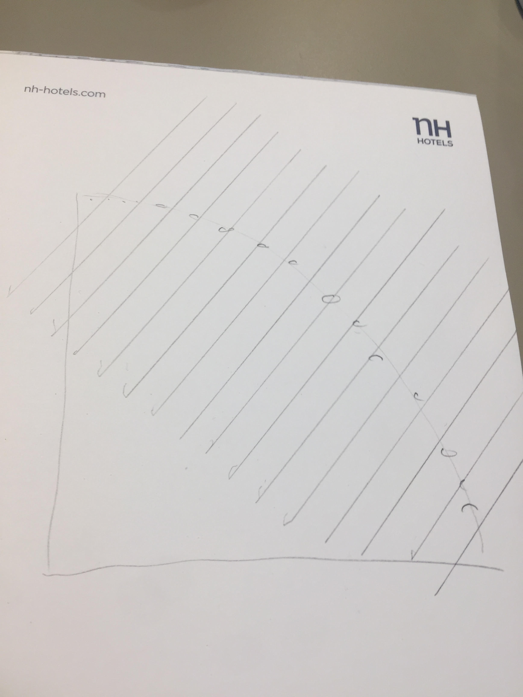

Back to [Projects List](../../README.md#ProjectsList)

# Location Sensitive Hashing for Web-Scale Medical Image Indexing

## Key Investigators

- Sandy Wells (BWH (NAC), USA)
- Steve Pieper (Isomics (NAC), USA)

# Project Description

<!-- Add a short paragraph describing the project. -->

A hash of data is a short description that is unique to that data, but most hashes are essentially random mappings.
A Location Sensitive Hash (LSH) is one where the hash keys preserve some meaning, such that similar hashes
indicate meaningful relationships among the original data elements.

In this work we hope to show that hashes based on image features can be used to group images in useful ways.
In particular, we'd like to show that the hashes can be used to determine human assigned labels of images.

We will test this on large public data sets.

## Objective

<!-- Describe here WHAT you would like to achieve (what you will have as end result). -->

1. Develop hashing scheme based on SIFT-RANK features
1. Apply technique to sample datasets from [TCIA](cancerimagearchive.org)
1. Test ability to predict labels based on feature based hashes
1. Evaluate approach in the context of content based image retrieval

## Approach and Plan

<!-- Describe here HOW you would like to achieve the objectives stated above. -->

1. Write python code to implement LSH-SIFT-RANK
1. Test on subset of labeled TCIA datasets from 5 collections (Anti-PD-1_Lung, CPTAC-PDA, CPTAC-UCEC, NSCLC Radiogenomics, TCGA-UCEC)
1. Develop plans for larger TCIA dataset (17,000+ volumes from 78 labeled collections)
1. Explore other variables that could be correlated with these hashes

## Progress and Next Steps

<!-- Update this section as you make progress, describing of what you have ACTUALLY DONE. If there are specific steps that you could not complete then you can describe them here, too. -->

1. SIFT RANK descriptors: 64 dimensions, same length, positive orthant
1. Strategy: use Euclidean LSH in subspace orthogonal to : [1,1,1.....]
1. Initial Python implementation of Euclidean LSH [1] for 3D SIFT RANK
1. Initial evaluation on 400K features from 250 3D Scans from TCIA
1. Approximate Nearest Neighhbor working, retrieved .2% percentile closest (0 would be perfect)
1. [1] Datar M, Immorlica N, Indyk P, Mirrokni VS. Locality-sensitive hashing scheme based on p-stable distributions. InProceedings of the twentieth annual symposium on Computational geometry 2004 Jun 8 (pp. 253-262)

# Illustrations

<!-- Add pictures and links to videos that demonstrate what has been accomplished.

-->

# Background and References

<!-- If you developed any software, include link to the source code repository. If possible, also add links to sample data, and to any relevant publications. -->
