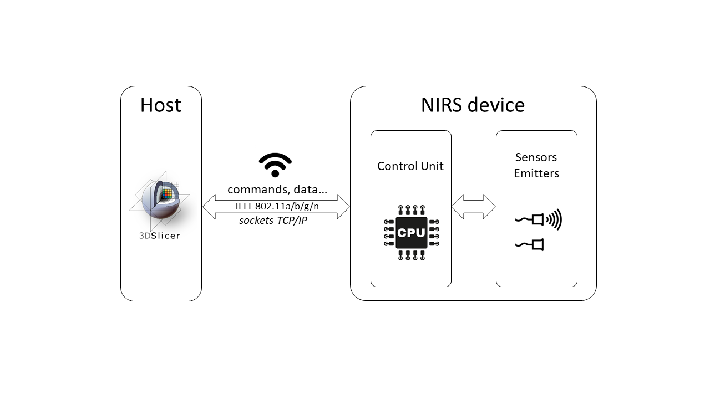
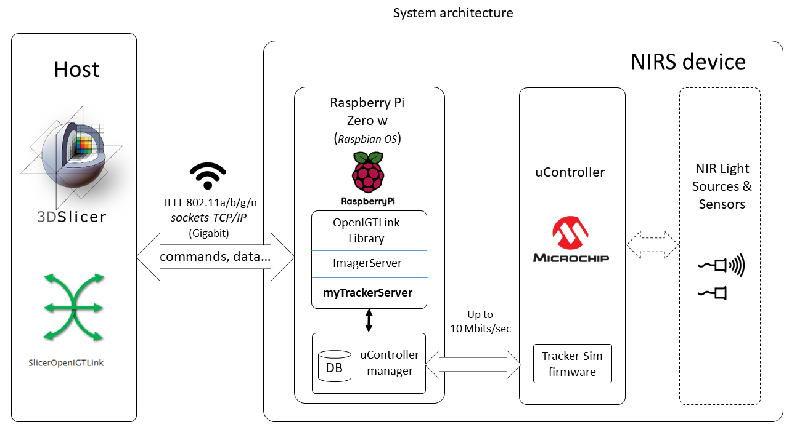
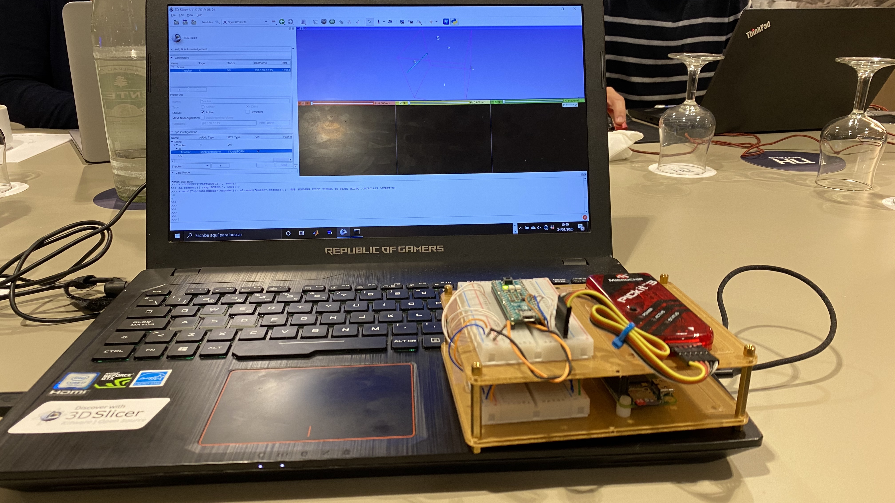

Back to [Projects List](../../README.md#ProjectsList)

# NIRS device OpenIGTLink interface

## Key Investigators

- Francisco Marcano Serrano (ULL - MACbioIDi)
- David Díaz Martín (ULL - MACbioIDi)
- José Luis González Mora (ULL - MACbioIDi)
- Juan Ruiz-Alzola (ULPGC - GTMA - MACbioIDi)

# Project Description

In this project, we will explore the possibility of communicating a proprietary NIRS equipment under development with 3D Slicer through OpenIGTLink protocol. Our team is currently developing a NIRS device that can be currently controlled and interrogated from 3DSlicer through commands implemented over TCP/IP protocol. We aim to include the ability in the NIRS device to interact with 3DSlicer through the standard OpenIGTLink protocol. To achieve this goal in this week, we propose to study what modifications of the device software are necessary to implement a minimum of interoperability between 3DSlicer and the NIRS device through OpenIGTLink.

## Objective

<!-- Describe here WHAT you would like to achieve (what you will have as end result). -->

1.	Implementing minimum set of commands to control and retrieve information from NIR device through OpenIGTLink protocol / 3DSlicer.

## Approach and Plan

<!-- Describe here HOW you would like to achieve the objectives stated above. -->

1.	Discuss the convenience of making our NIRS device OpenIGTLink-compliant.
2.	Select minimum set of queries/messages to implement.
3.	Implement a simple 3DSlicer module showing control/interaction with NIRS device.

## Progress and Next Steps

<!-- Update this section as you make progress, describing of what you have ACTUALLY DONE. If there are specific steps that you could not complete then you can describe them here, too. -->
- OpenIGTLink library was installed in NIRS device uProcessor (Raspberry Pi Zero)
- TrackerServer example code was changed (myTrackerServer) to receive simulated position parameters from uController.
- <a href="myTrackerServer.cxx"> myTrackerServer and ImageServer example code were implemented as services in the Raspberry Pi Zero to have a simple tracking and image servers </a>.
- SlicerOpenIGTLink module was installed in 3DSlicer to define connectors and visualize tracking and image data.
- A minimum mechanism was successfully implemented in the NIRS device to communicate with 3D Slicer through OpenIGTLink protocol.
- Raspberry pi Zero W + microcontroller combined system is an powerful and cheap option for making OpenIGTLink-compatible hardware and interacting with Slicer.

# Illustrations

Fig. 1: Architecture (original figure at the beginning of workshop) .

 
 

Fig. 2: System architecture (detail). NIR light sensors/sources modules were not installed in the hardware setup used in this workshop.

 
 

Fig. 3: Operation example. ImagerClient is running in the red window. TrackerClient is running in 3D window. Microcontroller is turned on ("operationmode" command) and off ("commandmode") by sending TCP/IP commands. TrackerClient receive position data when microcontroller is on.

 
 

Fig. 4: Hardware Setup used during the workshop.

 
 

<!-- Add pictures and links to videos that demonstrate what has been accomplished.

-->
<!--
# Background and References
-->

<!-- If you developed any software, include link to the source code repository. If possible, also add links to sample data, and to any relevant publications. -->
