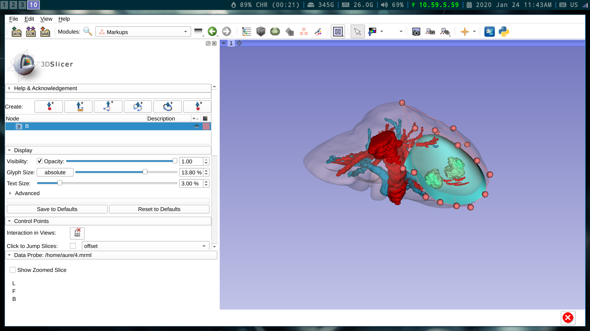

Back to [Projects List](../../README.md#ProjectsList)

# NorMIT-Plan

## Key Investigators

- Rafael Palomar (The Intervention Centre, Oslo University Hospital
  and NTNU).
- Andras Lasso (Laboratory for Percutaneous Surgery, Queen's University)
- Jean-Christophe Fillion-Robin (Kitware Inc.)

# Project Description

<!-- Add a short paragraph describing the project. -->

NorMIT-Plan is part of the **Nor**wegian centre for **M**inimally
**I**nvasive Guided **T**hrerapy (NorMIT). The centre offers resources
for medical technology research in minimally invasive
therapies. NorMIT-Plan is a software package developed as a set of 3D Slicer
modules which will provide tools for segmentation, 3D modeling and
surgical plannig for liver resection procedures.

[NorMIT-Plan Planning Module](https://youtu.be/7M3DULQp81k)

In this project we will update the software to the latest 3D Slicer
version, fix known bugs and create a 3D Slicer extension.

## Objective

<!-- Describe here WHAT you would like to achieve (what you will have as end result). -->

1. Objective A. Design a new module layout.
2. Objective B. Refactor old module elements using modern 3D Slicer infrastructure (Terminologies, Markups,...).
3. Objective C. Make a plan to integrate generic tools into 3D Slicer infrastructure.

## Approach and Plan

<!-- Describe here HOW you would like to achieve the objectives stated above. -->

1. Creation of a 3D Bezier Markup.
2. Meetings to decide on an integration strategy.

## Progress and Next Steps

<!-- Update this section as you make progress, describing of what you have ACTUALLY DONE. If there are specific steps that you could not complete then you can describe them here, too. -->

1. A prototype of a new Markup (3D Bezier surface) has been developed.
2. Plan to extend 3D Slicer infrastructure to allow third-party modules to register markups.
3. Plan to develop a module and extend 3D Slicer with the generic tools (3D deformable surface markup).

# Illustrations

<!-- Add pictures and links to videos that demonstrate what has been accomplished.

-->

# Background and References

<!-- If you developed any software, include link to the source code repository. If possible, also add links to sample data, and to any relevant publications. -->

 1. Palomar, Rafael, et al. "A novel method for planning liver resections using deformable Bézier surfaces and distance maps." Computer Methods and Programs in Biomedicine 144 (2017): 135-45.
 2. Palomar, Rafael, et al. "Surface reconstruction for planning and navigation of liver resections." Computerized Medical Imaging and Graphics 53 (2016): 30-42.
 3. Kumar, Rahul P., et al. "Three-Dimensional Blood Vessel Segmentation and Centerline Extraction based on Two-Dimensional Cross-Section Analysis." Annals of Biomedical Engineering 43 (2015): 1223-34.
