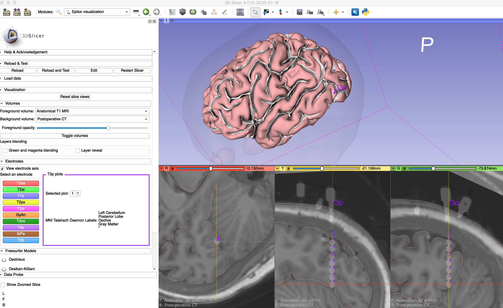
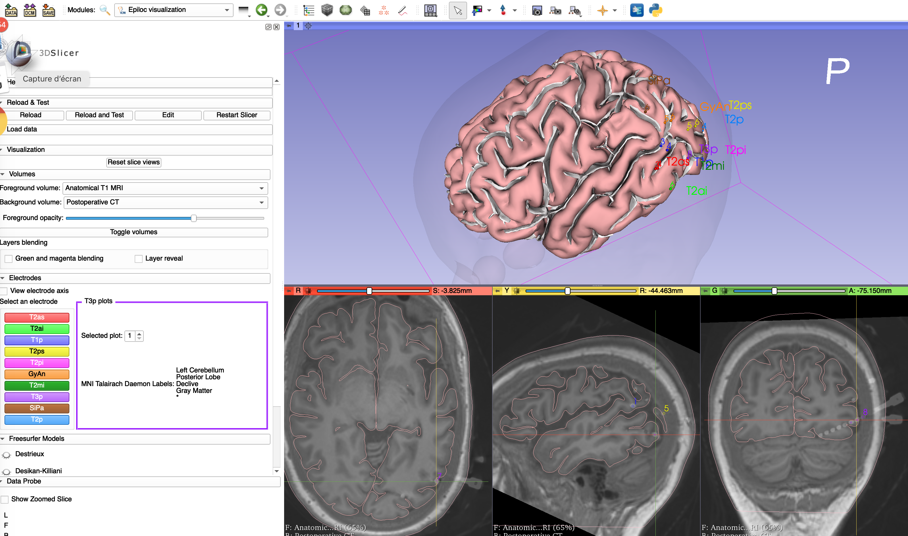

Back to [Projects List](../../README.md#ProjectsList)

Improuving StereoPlan STIM Slicer module for SEEG Procedures.

## Key Investigators

- Sara Fernandez Vidal (ICM Institute, CENIR/STIM Stereotaxy Platform)

# Project Description

In our center, since the end of 2017, surgery is conducted with the Rosa robot. Clinicians have to use the Rosa planning software because it drives the robot. But a high-quality segmentation of the cortex (gyral and sulcal surfaces, to create relevant cortical mappings) is lacking, as well as easy managing of multiple trajectories. This new toolbox, Stereo-plan, was presented at WSSFN 2019 meeting. It consists of an image-processing pipeline (coregistration of preoperative images, computation of patient-specific models, detection of the Leksell frame), whose results are integrated in a dedicated 3D Slicer plugin (Fig1). Stereo-Plan communicates with the Rosa robot through importation of AC, PC and IH points and exportation of computed trajectories.

## Objective

<!-- Describe here WHAT you would like to achieve (what you will have as end result). -->

1. To put the module/s in Slicer 4.11 and Python 3
2. To improuve the Module by adding new features and specifics imaging sequences (Vasular at PET Scan)

## Approach and Plan

<!-- Describe here HOW you would like to achieve the objectives stated above. -->

1. To put de code on python3 (2to3)
2. To modify markups interaction behavior (migration doc)
1. To add new features

## Progress and Next Steps

<!-- Update this section as you make progress, describing of what you have ACTUALLY DONE. If there are specific steps that you could not complete then you can describe them here, too. -->

1. Migration : Two modules dedicated to SEEG procedures (preOp :epi-Plan and postOp : epiloc-View) are now in 3D Slicer 4.11
2. new feature : Spin around un axe avaiable from the widget epi-Plan (reformat Slice2RASMAtrix) == !! keyword shortcut (mac: command+option+drag)
3. Much remains to be done.  SEEG procedure : add new features to fuse new modalities. DBS modules still in 3D Slicer 4.8 ...

# Illustrations

1. Stereo-Plan Videos

[StereoPlan in 3D Slicer 4.11 - 1, youtube](https://youtu.be/wsMNNrVeMs8)

[StereoPlan in 3D Slicer 4.11 - 2, youtube](https://youtu.be/ybS1HfrOWRE)

2. EpiLoc-View Captures

<!-- Add pictures and links to videos that demonstrate what has been accomplished.

-->

# Background and References

Modular stereotactic planning toolbox for SEEG procedures.
S. Fernandez Vidal, V. Frazzini, V. Lambrecq, V. Navarro,D. Dormont, B. Mathon, C. Adam,
E. Bardinet and  D. Hasboun. WSSFN 2019.

Very  helpfull : migration doc
 ==>>  [migration doc]  (https://www.slicer.org/wiki/Documentation/Nightly/Developers/Tutorials/MigrationGuide/Slicer#Markups)
