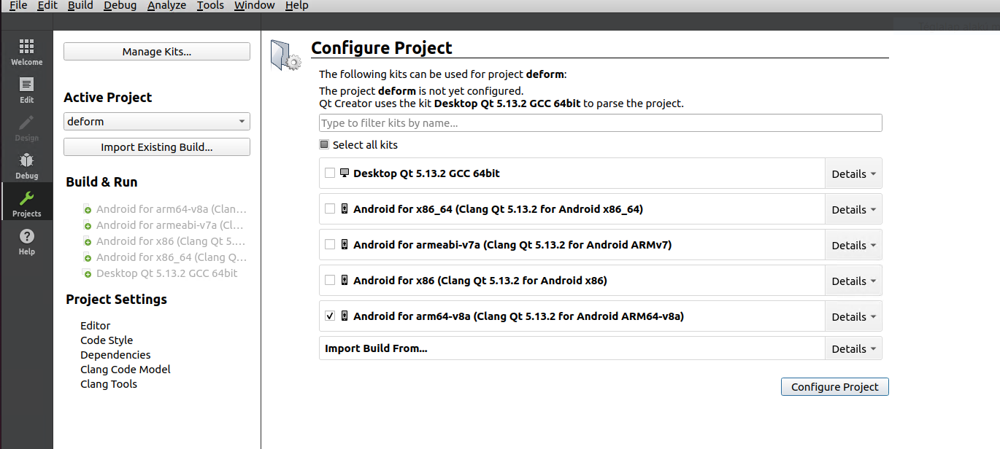
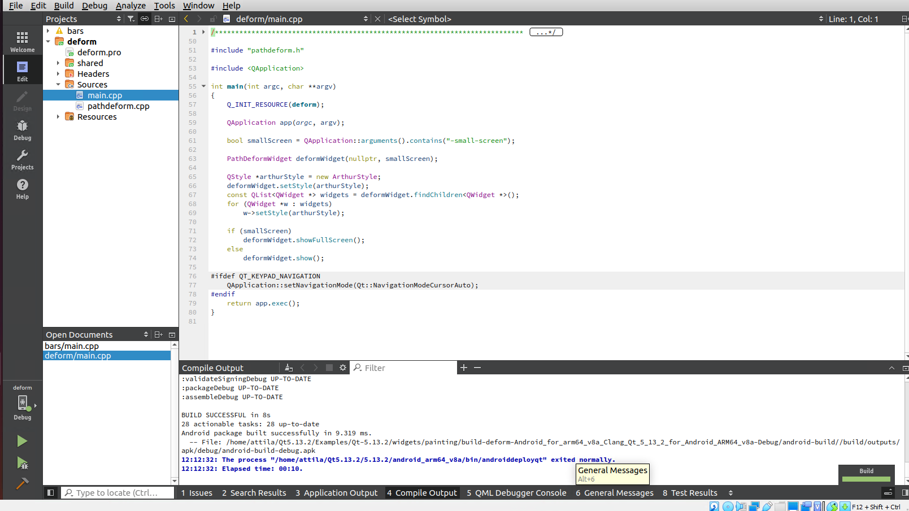
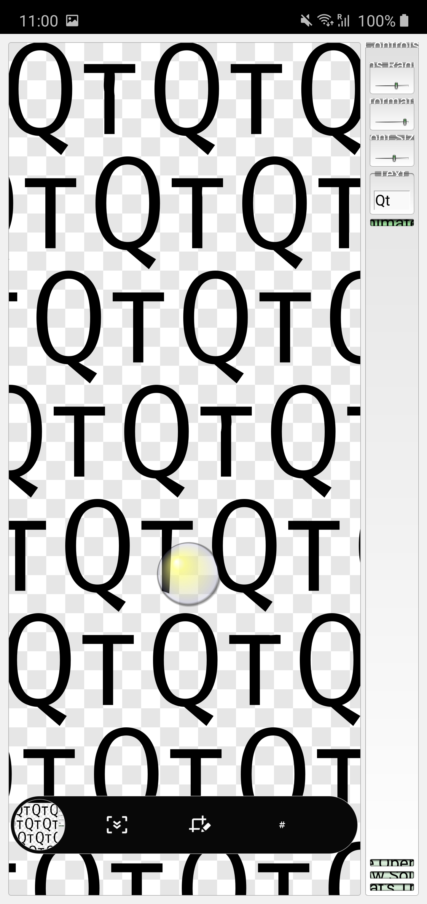

Back to [Projects List](../../README.md#ProjectsList)

# Slicer on Android

## Key Investigators

- Attila Nagy  (University of Szeged)
- Steve Pieper (Isomics)
-

# Project Description

<!-- Add a short paragraph describing the project. -->
Investigate the possibilities of portig Slicer to Android, to be used in a Desktop-like Android environment.

## Objective

<!-- Describe here WHAT you would like to achieve (what you will have as end result). -->

1. Put together a software environment with all the needed tools for cross-compilation and document it.
1. Proof of concept work: compile an example Qt app for ARM64 and install and run it on phone.
1. Once there, try to actually compile.

## Approach and Plan

<!-- Describe here HOW you would like to achieve the objectives stated above. -->

1. Lots of google-ing, trial and error...
1. Install a VM to host the build environment.
1. Install and configure all the needed tools, IDEs, etc
1. A POC compilation.

## Progress and Next Steps

<!-- Update this section as you make progress, describing of what you have ACTUALLY DONE. If there are specific steps that you could not complete then you can describe them here, too. -->

1. Did the VM install
1. Have all the tools configured properly
1. Compilaed a Qt app for ARM64, installed it, and it actually RUNS! :)

# Illustrations

<!-- Add pictures and links to videos that demonstrate what has been accomplished.-->

# Background and References

<!-- If you developed any software, include link to the source code repository. If possible, also add links to sample data, and to any relevant publications. -->

* https://www.androidauthority.com/android-q-desktop-mode-965704/
* https://www.samsung.com/us/explore/dex/
* https://en.wikipedia.org/wiki/Samsung_DeX
