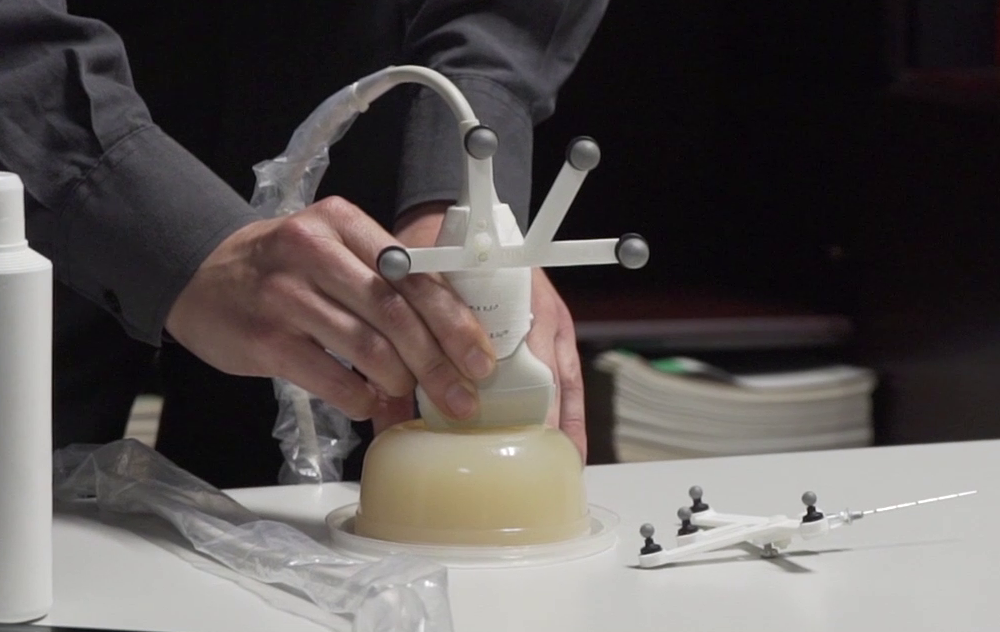
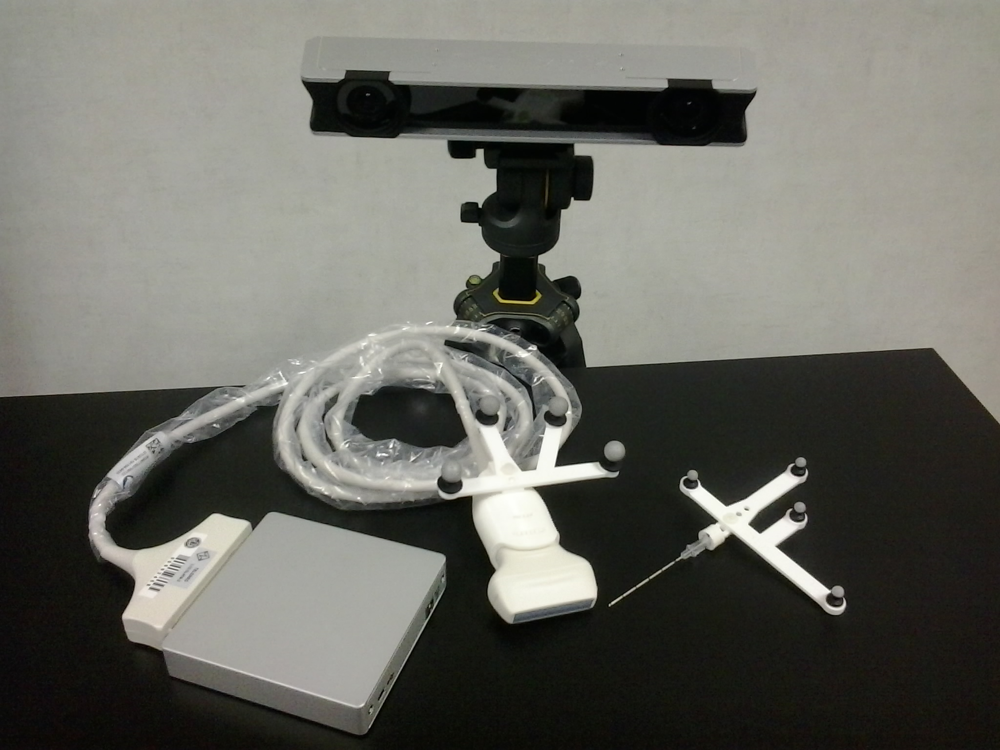
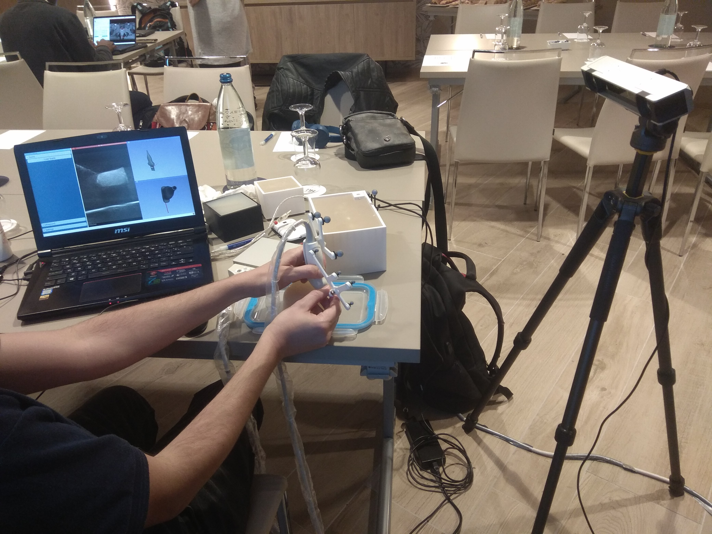
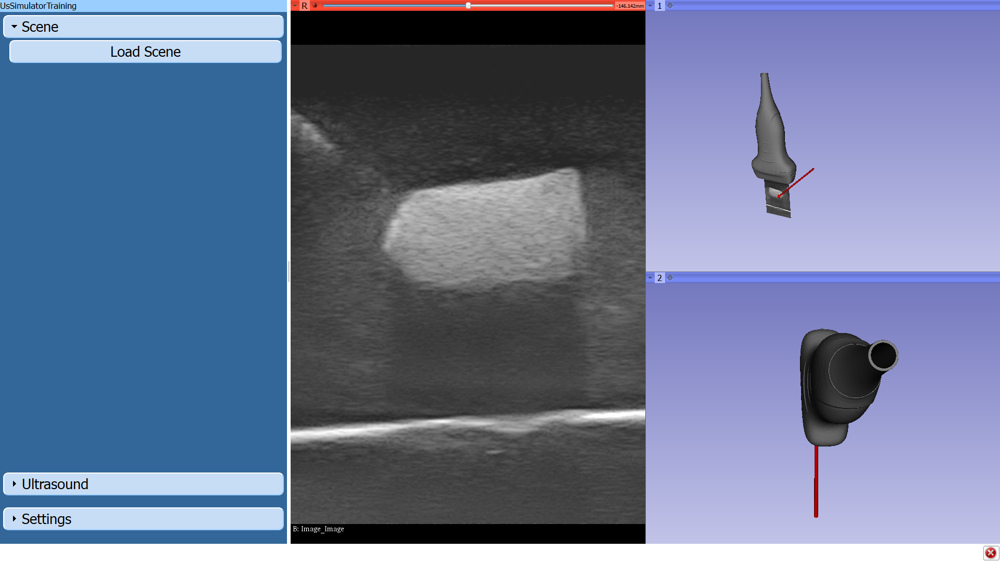

Back to [Projects List](../../README.md#ProjectsList)

# Ultrasound navigation training system for breast biopsy

## Key Investigators

- Guillermo Valentín Socorro-Marrero (University of Las Palmas de Gran Canaria)
- José-Carlos Ruiz-Luque (Instituto de Astrofísica de Canarias)
- Andras Lasso (Queen’s University, Canada)
- Md. Nurul Karim (University of Bremen)
- Miguel Angel Rodriguez-Florido (Laboratory of Technology for Education in Health)
- Juan Ruiz-Alzola (University of Las Palmas de Gran Canaria and Instituto de Astrofísica de Canarias)

# Project Description

<!-- Add a short paragraph describing the project. -->
We aiming at developing an affordable ultrasound navigation system for breast biopsy training, following the philosophy of the systems for vascular insertion presented in previous Project Weeks. The system comprises the construction of the breast phantom —including the tumor—, the position tracking of medical instruments —ultrasound probe and biopsy needle—, and the calculation of basic metrics to evaluate the efficiency in training exercise performance.

## Objective

<!-- Describe here WHAT you would like to achieve (what you will have as end result). -->
1. Construct an ultrasound phantom for training breast biopsy
1. Set up the OptiTrack V120:Duo system to track the ultrasound probe and the biopsy needle
1. Analyze registered tacking data and compute performance metrics.

## Approach and Plan

<!-- Describe here HOW you would like to achieve the objectives stated above. -->
1. Test and select materials in order to mimic breast tumors echogenicity
1. Build the breast phantom with tumors
1. Configure the OptiTrack V120:Duo tracking system and the corresponding device available in the PLUS to send the position data to 3D Slicer
1. Customize the interface to this particular procedure (breast biopsy)
1. Define some simple metrics to evaluate training performance and implement the algorithms to compute them in a manner similar to the one proposed in the Perk Tutor.

## Progress and Next Steps

<!-- Update this section as you make progress, describing of what you have ACTUALLY DONE. If there are specific steps that you could not complete then you can describe them here, too. -->
<!-- Describe specific steps you **have actually done**. -->
1. A tailor-made coarse approach to breast phantom using agar-agar gelatine was created. Its costs is below 8 USD and it is usable at room temperature for more than one week, time enough to complete an introductory course in this procedure. We also tested some common materials, available at home or in grocery stores, to mimic mammary tumors
1. The setup of the navigation system connecting both, ultrasound and tracking system to Slicer via PLUS Server has been completed.
1. Customization of the user interface developed for the previous work on vessel insertion was considered good enough and therefore no change was needed.

# Illustrations

<!-- Add pictures and links to videos that demonstrate what has been accomplished.

-->

Custom breast phantom.
 
 

OptiTrack V120:Duo position tracking system.
 
 

US Nav system. Test of position-tracking of tools and phantom ecogenicity.
 
 

Detail of the user interface.

# Background and References

<!-- If you developed any software, include link to the source code repository. If possible, also add links to sample data, and to any relevant publications. -->
- From previous Project Weeks:
    - [Custom GUI for an US simulator training system](http://projectweek.na-mic.org/PW28_2018_GranCanaria/Projects/CustomGUIForUSSimulator)
    - [New features for an ultrasound training system](http://projectweek.na-mic.org/PW30_2019_GranCanaria/Projects/UltrasoundSimulatorTraining)
- [Optitrack V120:Duo](http://optitrack.com/products/v120-duo)
- [PLUS OptiTrack device](http://perk-software.cs.queensu.ca/plus/doc/nightly/user/DeviceOptiTrack.html)
- [Perk Tutor](http://perktutor.github.io)
