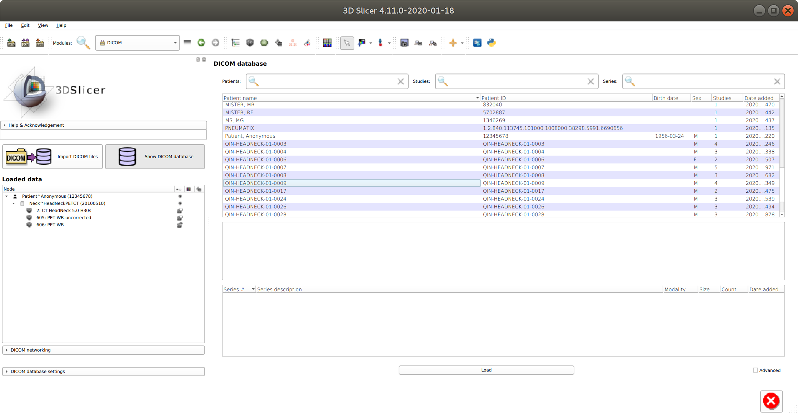
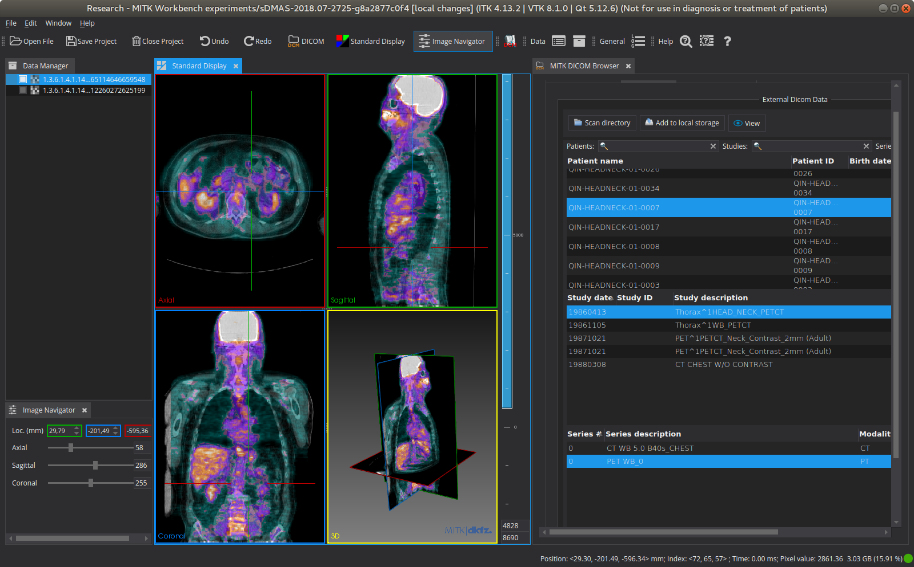

Back to [Projects List](../../README.md#ProjectsList)

# Improvements to ctkDICOMDatabase

## Key Investigators

- Marco Nolden (DKFZ/MITK)
- Steve Pieper (Isomics)
- [Andras Lasso](http://perk.cs.queensu.ca/users/lasso) (Queen's University, Canada)
- Jean-Christophe Fillion-Robin (Kitware)

# Project Description

The ctkDICOMDatabase is a component used both in 3D Slicer as well as the MITK Workbench to manage local DICOM files and offer a UI for browsing these files as well as getting data from a PACS using DICOM C-FIND, C-MOVE and C-GET. Recently the UI has been improved thanks to Andras Lasso ([1](https://github.com/Slicer/Slicer/commit/4d3ce7eb280806e91c0ce41124d0efb64b3b5f55), [2](https://github.com/commontk/CTK/commit/7f2f24a051fd58118e9d6ddb464eaf085ec05853)), and on previous project weeks there were first experiments on adding DICOM-Web support.

Current Slicer nightly:

## Objective

<!-- Describe here WHAT you would like to achieve (what you will have as end result). -->

1. Objective A. Integrate the recent UI improvements into the MITK Workbench
1. Objective B. Make the ctkDICOM executables work again as a development testbed and simple C++-based DICOM client.
1. Objective C. Investigate different options for DICOM-Web support: qRestSDK, cpprestsdk, using JavaScript within C++ ; show a prototype for a simple QIDO and WADO example

## Approach and Plan

<!-- Describe here HOW you would like to achieve the objectives stated above. -->

1. Update CTK Version in MITK and fix problems.
2. Explore the status of the ctkDICOM and ctkDICOM2 executables.
1. Continue efforts on C++-based DICOM-Web
1. ...

## Progress and Next Steps

<!-- Update this section as you make progress, describing of what you have ACTUALLY DONE. If there are specific steps that you could not complete then you can describe them here, too. -->

1. Updated the CTK version used in MITK, fixed some small interface changes
1. Debugged the changed behaviour when using in-memory databases and changing the MITK integration. Tested using various collections including DICOM-SEG generated by MevisLab provided by [@hmeine](https://github.com/hmeine)
1. Verified the ctkDICOM and ctkDICOM2 executables, ctkDICOM2 is the way to go, ctkDICOM would need some work to make it useful again

# Illustrations

# Background and References

<!-- If you developed any software, include link to the source code repository. If possible, also add links to sample data, and to any relevant publications. -->
