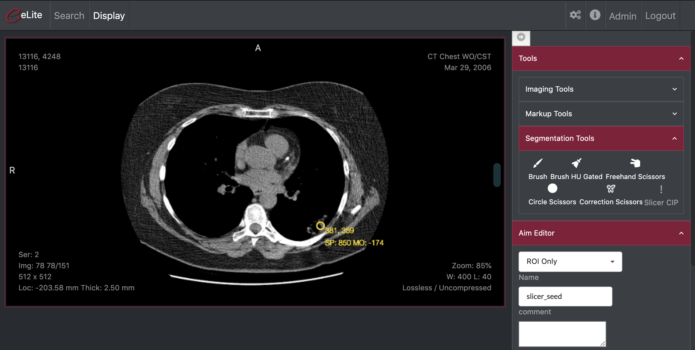

Back to [Projects List](../../README.md#ProjectsList)

# ePAD/Slicer Bridge and Segmentation Plugin

## Key Investigators

- Emel Alkim (Stanford University)
- Steve Pieper (Isomics)

# Project Description

Open dockerized Slicer from ePad, open segmentation plugin and save the segmetation back to ePad

## Objective

<!-- Describe here WHAT you would like to achieve (what you will have as end result). -->

1. Trigger openning dockerized Slicer from ePad
1. Open the series in Slicer
1. Open segmentation plugin
1. Send the segmentation back to dicomweb server

## Approach and Plan

<!-- Describe here HOW you would like to achieve the objectives stated above. -->

1. Leverage the work done in Boston hackfest 2016 and update it to align with new dicomweb server
1. Trigger Slicer CIP plugin
1. Get the segmentations back

## Progress and Next Steps

<!-- Update this section as you make progress, describing of what you have ACTUALLY DONE. If there are specific steps that you could not complete then you can describe them here, too. -->

1. Update [SlicerChronicle](https://github.com/pieper/SlicerChronicle) to python3 and Slicer 4.11
1. Generalize plan to work with locally running Slicer with Chronicle enabled (same code will work with cloud Slicer with or without docker container)
1. Update json job request file format
1. Test with local dicomweb-server
1. Add a button to ePad to trigger Slicer using Slicer Chronicle
1. Generate Slicer Chronicle JSON to trigger CIP and send to segmentation-server

# Illustrations

<!-- Add pictures and links to videos that demonstrate what has been accomplished.

-->

# Background and References

<!-- If you developed any software, include link to the source code repository. If possible, also add links to sample data, and to any relevant publications. -->
[Previous integration work in Boston Hackfest 2016] (https://docs.google.com/document/d/1BIQHLheqYhsfeHhCTVtid5bZMVywlo1UmeK6-ZmHeq8/edit?usp=sharing)
