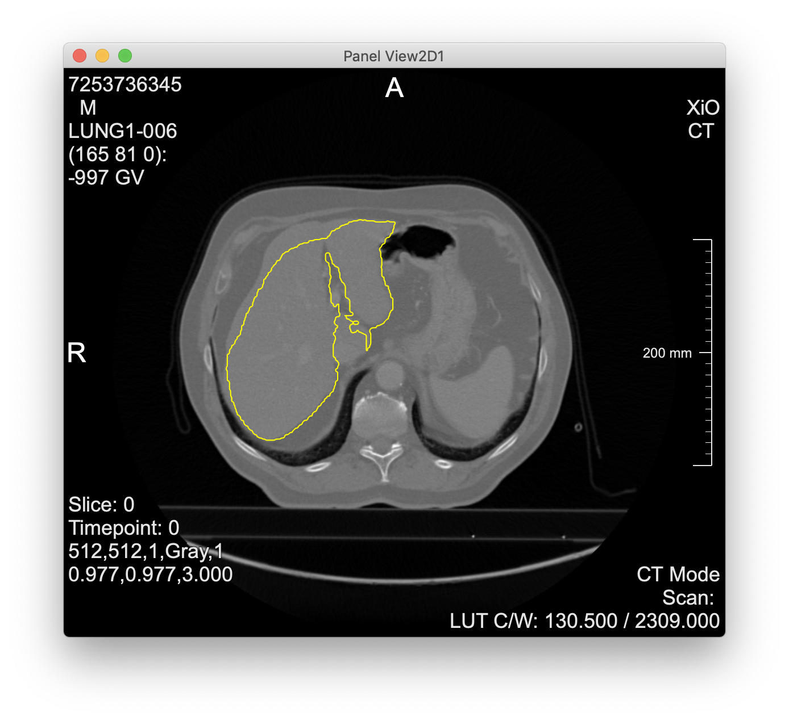

Back to [Projects List](../../README.md#ProjectsList)

# Evaluation of ModelHub.ai

## Key Investigators

- Hans Meine (Uni Bremen, Fraunhofer MEVIS)

# Project Description

Much like the recent integration of NVIDIA's AI-assisted annotation in Slicer and various other platforms,
there's the more vendor-neutral http://modelhub.ai (originated at Harvard MS / BWH / Data-Farber). This
project seems to be very well thought-through and documented, and recently got interesting models as well.

## Objective

<!-- Describe here WHAT you would like to achieve (what you will have as end result). -->

* Try out running models from http://modelhub.ai
* Possibly integrate in MeVisLab
* Compare with AIAA and other solutions

## Approach and Plan

* Install and run modelhub.ai software
* Investigate which models are interesting (e.g. liver & tumor segmentation)
* Try running models
* Find out how to integrate in MeVisLab or Slicer

## Progress and Next Steps

* Taking a closer look, modelhub.ai seems to be very well-designed, but got less traction and less models than AIAA
  * The API includes sample data for each model, making it trivial to test whether they work.
  * The API links models to publications, licenses for the model, the sample data, and modelhub itself.
  * However, there is only sparse technical metadata, compared with AIAA.
* The website allows to browse models (much more convenient than NVIDIA's GPU cloud).
* However, there are not many interesting medical imaging ones.
  * **cascaded-fcn-liver** is an interesting model (from the organizers of the LiTS challenge)
  * **deep-prognosis** gives a 2-year survival prognosis based on a NSCLC tumor ROI
* Evaluation of *cascaded-fcn-liver*
  * takes a single CT slice as DICOM file via a form-encoded POST request
  * returns contours as voxel coordinates in JSON format
  * screenshot from MeVisLab experiments below
  * "cascaded" = two networks for liver + tumor segmentation, but the API runs only the first (the second is included, but execution is left to the user)
* Evaluation of *deep-prognosis*
  * takes a 150x150x150 numpy array file in .npy format (again as form-encoded POST request)
  * the linked paper mentioned a 50x50x50 ROI, so there was a discrepancy, but the API gave clear requirements *before* running the model and a clear error message when feeding input of the wrong size
* Conclusions on http://modelhub.ai
  * was really not much work to get running
  * not many models available today, but nice open platform

# Illustrations

Liver contours computed via the **cascaded-fcn-liver** model parsed and visualized in MeVisLab:

