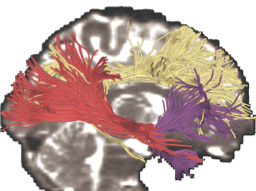

# White matter for Schizophrenia 2020

## Key Investigators

- Zora Kikinis (BWH)
- Nikos Makris (BWH, MGH)

# Project Description

1.  The objective of this project is to review white matter.

## Objective

<!-- Describe here WHAT you would like to achieve (what you will have as end result). -->

1. Our goal is to study diffusion MRI of healthy people and those with schizophrenia to identify white matter tracts that are involved in social cognition and/or emotional awareness.

## Approach and Plan
<!-- Describe here HOW you would like to achieve the objectives stated above. -->
1. The Levels of emotional awareness scale (LEAS) is used to assess social cognition. It has two parts: LEAS-self and LEAS-other, which are used to assess the ability to identify our own feeling and those of others, respectively.

1. Previously we have shown correlations between gray matter and the LEAS score.

1. We will refine our hypothesis of the white matter connecting the gray matter regions of interest.

## Progress and Next Steps

<!-- Update this section as you make progress, describing of what you have ACTUALLY DONE. If there are specific steps that you could not complete then you can describe them here, too. -->

We held discussions and refined our hypothesis of which white matter tracts to focus on in our study.

Next steps are to run correlations on data from ~20 people with schizophrenia and matched controls.

## Illustrations

Potential white matter tracts of emotional awareness.
 

## Background and References

<!-- If you developed any software, include link to the source code repository. If possible, also add links to sample data, and to any relevant publications. -->

1. Malcolm JG, Shenton ME, Rathi Y. Filtered multitensor tractography. IEEE Trans Med Imaging. 2010 Sep;29(9):1664-75.  PMID: 20805043.

1. Zhang F, Wu Y, Norton I, Rigolo L, Rathi Y, Makris N, O'Donnell LJ. An anatomically curated fiber clustering white matter atlas for consistent white matter tract parcellation across the lifespan. Neuroimage. 2018 Oct 1;179:429-447, PMID:29920375.

1. Martin Jáni, Zora Kikinis, et al., Neural Correlates of Emotional Awareness in Schizophrenia,
Manuscript in preparation.
