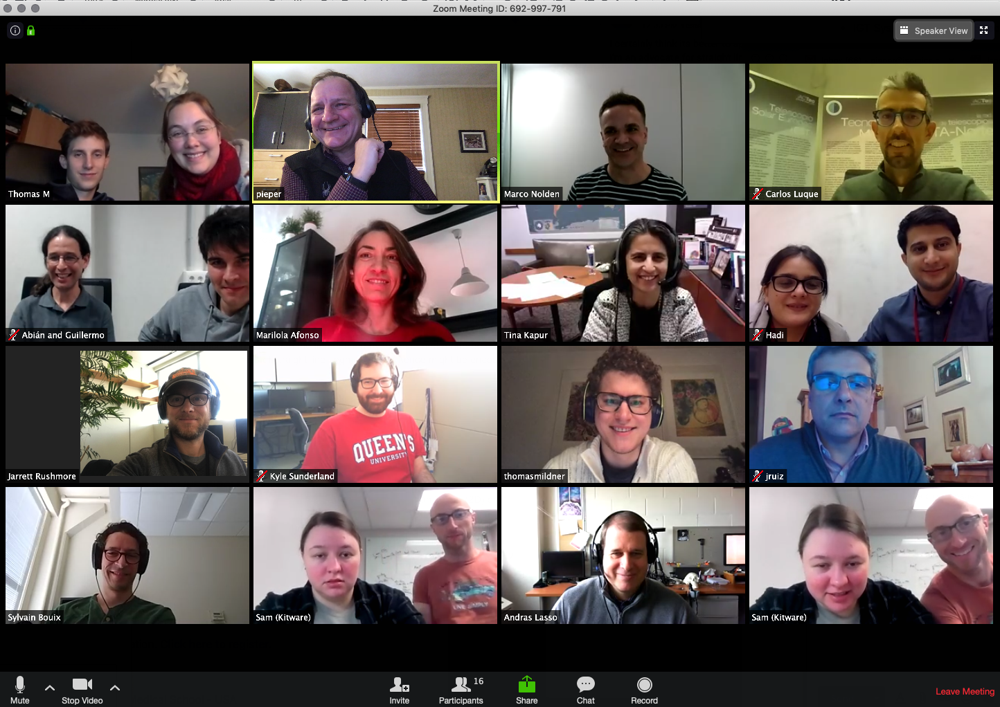

## Welcome to the web page for the 33rd Project Week!

The 33rd NA-MIC Project Week will be held during the week of January 20-24, 2020 in Las Palmas, Gran Canaria, Spain.

Please read about our experience in running these events since 2005: [Increasing the Impact of Medical Image Computing Using
Community-Based Open-Access Hackathons: the NA-MIC and 3D Slicer Experience](http://www.spl.harvard.edu/publications/item/view/3004).

## Logistics
- **Dates:** January 20-24, 2020.
- **Location:** Las Palmas, Gran Canaria, Spain
- **Discourse Forum:** Please ask on [discourse forum](https://discourse.slicer.org/c/community/project-week) if you have questions.
- [Venue and Hotel Information](Logistics.md#Venue)
- [Updates](Logistics.md#Updates)
- [ERASMUS mobility information](Logistics.md#Erasmus)
- [Frequently Asked Questions](Logistics.md#Faq)

- **REGISTRATION:** [Register here](https://www.fulp.es/na-mic-event-2020). Registration Fee: €350.

<table>
<tr>
<td> <b>Local Organizing Committee Host:</b> <ul><li>Juan Ruiz-Alzola, PhD, Professor of Imaging Technologies, director of the Grupo de Tecnología Médica y Audiovisual (GTMA), <a href="http://www.iuibs.ulpgc.es/">Instituto Universitario de Investigaciones Biomédicas y Sanitarias</a> (IUIBS), <a href="http://www.ulpgc.es">Universidad de Las Palmas de Gran Canaria</a> (ULPGC) </li> <li> Email Local Organizing Committee: <a href="mailto:marilola.afonso@ulpgc.es?cc=juan.ruiz@ulpgc.es&subject=ProjectWeek30">Technical Topics: Maria Dolores Afonso Suarez</a> <a href="mailto:asmaa.skareb@ulpgc.es?cc=juan.ruiz@ulpgc.es&subject=ProjectWeek30">Administrative Topics: Asmaa Skareb</a> </li></ul></td>
</tr>
</table>

## Preparatory Videoconferences

<table><tr>
    <td>
        
    </td>
    <td>
        <ul>
            <li>
                Zoom video conference: <a href="https://zoom.us/j/692997791">To join the videoconference</a>
            </li>
            <li>
<a href="https://github.com/NA-MIC/ProjectWeek/blob/master/PW33_2020_GranCanaria/PreparatoryMeetingsNotes.md">Conference call notes</a>
            </li>
        </ul>
    </td>
</tr></table>

## Projects [(How to add a new project?)](Projects/README.md)
<a name="ProjectsList"/>

### Segmentation

* [High Resolution Brain Segmentation](Projects/HighResolutionBrainSegmentation/README.md) (Sylvain Bouix, Jarret Rushmore, Nikos Makris, Kyle Sunderland, Andras Lasso)

* [Open Anatomy: glTF and metadata export](Projects/OpenAnatomy/README.md) (anatomy atlas, diffusion, etc) (Andras Lasso, Mike Halle, Steve Pieper, Kyle Sunderland)

* [Software for Annotation and Anatomy](Projects/AEVA/README.md) (AEVA) (Sam Horvath)

### Web and cloud

* [OHIF / Slicer Bridge](Projects/OHIFSlicerBridge/README.md) (Steve Pieper, Andras Lasso, James Petts, Mark Asselin, Kyle Sunderland, Csaba Pinter)

* [VTK.js Multi-volume Volume Rendering](Projects/VTKjsMultiVolumeRendering/README.md) (Erik Ziegler, James Petts, Jean-Christophe Fillion-Robin, Steve Pieper, Ken Martin (remote))

* [Tool framework for react-vtkjs-viewport?](Projects/ReactVtkjsTooling/README.md) (James A. Petts, Danny Brown, Erik Ziegler)

* [dicomweb-server](Projects/dicomweb-server/README.md) (Emel Alkim, Steve Pieper, Hans Meine, Erik Ziegler)

* [OHIF and IDC](Projects/OHIF+IDC/README.md), cancer images in the cloud (Steve Pieper, Ron Kikinis, Erik Ziegler, James A. Petts)

* [KHEOPS and OHIF](Projects/KHEOPS+OHIF/README.md), secure interface between KHEOPS and OHIF (Joël Spaltenstein, Nicolas van Dooren, Erik Ziegler, James A. Petts)

### IGT

* [Ultrasound navigation training system for breast biopsy](Projects/UltrasoundNavigationTrainingSystemForBreastBiopsy/README.md) (Guillermo Valentín Socorro-Marrero, José-Carlos Ruiz-Luque, Andras Lasso, Md. Nurul Karim, Juan Ruiz-Alzola)

* [Slicer to Unity Connection](Projects/SlicerToUnity/README.md) (Thomas Muender, Anke Reinschluessel, Thomas Mildner)

* Neurosurgical Ultrasound annotation (Tina Kapur, Thomas Noh, Alexandra Golby, Jarret Rushmore, Sarah Frisken)

* [Slicer iMSTK Integration](Projects/SlicerIMSTK/README.md) (Sam Horvath)

* [Arduino Slicer](Projects/ArduinoSlicer/README.md) (Paolo Zaffino, Andras Lasso, Mike Halle, James Petts, Steve Pieper)

### Clinical applications

* [BabySteps club foot treatment](Projects/ClubFoot/README.md) (Pooneh Roshanitabrizi, Hadi Fooladi Talari, Steve Pieper)

* [Integration of Diabetic Foot Segmentation Algorithm based on Deep Learning](Projects/DiabeticFootSegmentation/README.md) (Abián Hernández, Juan Ruiz...)

* [Customized interface for diabetic foot extension](Projects/CustomizedGUIDiabeticFoot/README.md) (Jose-Carlos Ruiz-Luque, Sara González, Juan Ruiz)

* [Synthetic CT evaluation](Projects/syntheticCT_evaluation/README.md) (Paolo Zaffino)

* [NorMIT-Plan](Projects/NorMIT-Plan/README.md "Liver resection
  planning software") (Rafael Palomar)
  
* Brain white matter of social cognition in schizophrenia and healthy (Zora Kikinis, Nikos Makris)

### Education

* [3DSlicer Training programs](Projects/3DSlicerTrainingPrograms/README.md) (Babacar Diao, Ahmedou Moulaye Idriss, Yahya Tfeil, 
Mohamed Septy, Ainina Ndiaye, Siham Alaoui, Mouhcine Madani, Otman Aghzout, Badiaa Ait Ahmed, GTMA group)

* [Customization of user interfaces for dissemination applications based on 3D Slicer](Projects/CustomizationOfUserInterfacesForDissemination/README.md) (Guillermo Valentín Socorro-Marrero, Nayra Pumar Carreras, José-Carlos Ruiz-Luque, Abián Hernández-Guedes, Juan Ruiz-Alzola)

* [Anatomical Atlases](Projects/AnatomicalAtlases/README.md) (Babacar Diao, Ahmedou Moulaye Idriss, Yahya Tfeil, 
Mohamed Septy, Ainina Ndiaye, Siham Alaoui, Mouhcine Madani, Otman Aghzout, Badiaa Ait Ahmed, GTMA group)

### Astronomy (Yep!)

* [SlicerAstro Update](Projects/SlicerAstroUpdate/README.md) (Davide Punzo)

### Infrastructure

* [Slicer5](https://www.slicer.org/wiki/Documentation/Labs/Slicer5-roadmap) Implementation (Andras, Jc, Steve, Csaba, ...)

* [Extensions Manager Refresh](Projects/ExtensionsManagerRefresh/README.md) (JC, Andras, Steve)

* CTK DICOM database and browser improvements (Marco Nolden, Andras Lasso, Steve Pieper, Jc)

* [Slicer on Android](Projects/SlicerOnAndroid/readme.md) (Attila Nagy, Steve Pieper and whoever is interested)

## Breakout sessions

* [Slicer VR](Breakouts/SlicerVR/README.md) (Adam Rankin, Csaba Pinter, JC, Andras Lasso, all welcome)

## Registrants

Do not add your name to this list below. It is maintained by the organizers based on your paid registration. **[Click here to register.](https://www.fulp.es/na-mic-event-2020)**

List of registered participants so far (names will be added here after processing registrations):
<!-- [List](REGISTRANTS.md) -->
<!-- ORGANIZERS: please edit REGISTRANTS.md -->

1. Tina Kapur (@tkapur)(tkapur@bwh.harvard.edu) - Brigham and Women’s Hospital and Harvard Medical School - USA
1. Marco Nolden (M.Nolden@Dkfz-Heidelberg.de) - German Cancer Research Center (DKFZ) - Germany
1. Hadi Fooladi Talari (hfooladit@cnmc.org) - Children's National Hospital - USA
1. Pooneh Roshanitabrizi (proshnani2@cnmc.org) - Children's National Hospital - USA
1. Ron Kikinis (@rkikinis) - Brigham and Women's Hospital and Harvard Medical School - USA
1. Zora Kikinis (zora@bwh.harvard.edu) - Brigham and Women's Hospital - USA
1. Sylvain Bouix (sylvain@bwh.harvard.edu) - Brigham and Women's Hospital - USA
1. Richard Rushmore (jrushmore@bwh.harvard.edu) - Brigham and Women's Hospital - USA
1. Juan Ruiz Alzola (@jruizalz)(juan.ruiz@ulpgc.es) - University of Las Palmas de Gran Canaria / Instituto de Astrofísica de Canarias - Spain
1. José-Carlos Ruiz-Luque (@carlos-luque)(carlos.luque@iac.es) - Instituto de Astrofísica de Canarias - Spain
1. Guillermo Valentín Socorro-Marrero (@gvsocorro)(guillermo.socorro@ulpgc.es) - University of Las Palmas de Gran Canaria - Spain
1. Abián Hernández Guedes (@SolidusAbi)(abian.hernandez@ulpgc.es) - University of Las Palmas de Gran Canaria - Spain
1. Nayra Pumar Carreras (nayra.pumar@ulpgc.es) - University of Las Palmas de Gran Canaria - Spain
1. Gabor Fichtinger (gabor@cs.queensu.ca) - Queen’s University - Canada
1. Davide Punzo, (@punzo)(punzodavide@hotmail.it) - Freelancer - France
1. Jean-Christophe Fillion-Robin (@jcfr)(jchris.fillionr@kitware.com) - Kitware Inc. - USA
1. Steven Pieper (@pieper)(pieper@isomics.com) - Isomics Inc. - USA
1. Asmaa Skareb (asmaa.skareb@ulpgc.es) - University of Las Palmas de Gran Canaria - Spain
1. Anke Verena Reinschluessel (areinsch@uni-bremen.de) - University of Bremen, Digital Media Lab - Germany
1. Thomas Muender (thom@uni-bremen.de) - University of Bremen - Germany
1. Paolo Zaffino (@pzaffino)(p.zaffino@unicz.it) - Magna Graecia University - Italy
1. Alexandra Golby (agolby@bwh.harvard.edu) - Brigham and Women’s Hospital and Harvard Medical School - USA
1. Sara González (sara.gonzalez@iac.es) - Instituto de Astrofísica de Canarias - Spain
1. Mark Asselin (mark.asselin@queensu.ca) - ACMIT Gmbh / Queen’s University - Canada
1. Csaba Pintér (@cpinter)(pinter.csaba@gmail.com) - Ebatin S.L. - Spain
1. Andras Lasso (@lassoan)(lasso@queensu.ca) - Queen’s University - Canada
1. Hans Meine (@hmeine) (meine@uni-bremen.de) - University of Bremen - Germany
1. Rafael Palomar (rafael.palomar@rr-research.no) - Oslo University Hospital - Norway
1. Thomas Mildner (thomas.s.mildner@gmail.com) - University of Bremen - Germany
1. James Petts (ovelasolutions@gmail.com) - Ovela Solutions LTD - UK
1. Sara Fernández Vidal (sara.fernandezvidal@icm-institute.org) - ICM BRain & Spine Institute - France
1. Sonia Pujol (spujol@bwh.harvard.edu) - Brigham and Women's Hospital and Harvard Medical School - USA
1. Michael Halle (@mhalle)(mhalle@bwh.harvard.edu) - Brigham and Women's Hospital and Harvard Medical School - USA
1. Babacar Diao (babacardiao104uro@yahoo.fr) - Ecole Militaire de Santé Dakar -Senegal
1. Samba Diaw (samba.diaw@esp.sn) - Université Cheikh Anta Diop - Senegal
1. Ainina Ndiaye (aninandiaye@yahoo.fr) - Université Cheikh Anta Diop - Senegal
1. Mohamed El Moctar Septy (@msepty)(moksepty@yahoo.fr) - Faculté de Médecine, Université de Nouakchott Al Aasriya - Mauritania
1. Ahmedou Moulaye Idriss (amdriss6@gmail.com) - Centre Hospitalier National Nouackchott - Mauritania
1. Yahya Ould Tfeil (tefeil2000@gmail.com) - Centre Hospitalier National Nouackchott - Mauritania
1. Artemisa Mendes Moreno (artemisa.moreno@docente.unicv.edu.cv) - Universidade de Cabo Verde - Cabo Verde
1. Samantha Horvath (sam.horvath@kitware.com) - Kitware Inc. - USA
1. Kyle Sunderland (1krs1@queensu.ca) - Queen’s University - Canada
1. Emel Alkim (ealkim@stanford.edu) - Stanford University Department of Biomedical Data Science - Stanford University - USA
1. Siham Alaoui (siham39@hotmail.com) - University Abdelmalek Essaâdi - Morocco
1. Mouhcine Madani (mouhcinemadani@gmail.com) - University Abdelmalek Essaâdi - Morocco
1. Otman Aghzout (oaghzout@uae.ac.ma) - University Abdelmalek Essaâdi - Morocco
1. Badiaa Ait Ahmed (aitahmedbadiaa@gmail.com) - University Abdelmalek Essaâdi - Morocco
1. Attila Nagy (@acetylsalicyl)(nagy.attila@med.u-szeged.hu) - Faculty of Medicine, University of Szeged - Hungary
1. Juan Andrés Ramírez González (juanandres.ramirez@ulpgc.es) - University of Las Palmas de Gran Canaria - Spain
1. Katie Mastrogiacomo (kmast@bwh.harvard.edu) - Surgical Planning Laboratory - USA
1. Carl-Fredrik Westin (westin@bwh.harvard.edu) - Brigham and Women's Hospital and Harvard Medical School - USA
1. Adam Rankin (@adamrankin)(arankin@robarts.ca) - Robarts Research Institute - Canada
1. Joël Spaltenstein (spalte@naturalimage.ch) - OsiriX Foundation - Switzerland
1. Nicolas van Dooren (vandooren.nicolas@gmail.com) - OsiriX Foundation - Switzerland
1. Erik Ziegler (erik@radicalimaging.com) - Open Health Imaging Foundation- France
1. William Wells (sw@bwh.harvard.edu) - Harvard Medical School - USA
1. Thomas Noh (tnoh@bwh.harvard.edu) - Brigham and Women's Hospital - USA
1. Hans Knutsson (hans.knutsson@liu.se) - Linköpingd University, Dept of Biomedical Engineering - Sweden 

## Program Calendar
<iframe src="https://calendar.google.com/calendar/embed?src=kitware.com_sb07i171olac9aavh46ir495c4%40group.calendar.google.com&ctz=Atlantic%2FCanary&mode=WEEK&dates=20200120%2f20200124" style="border: 0" width="800" height="600" frameborder="0" scrolling="no"></iframe>

[How to add this calendar to your own?](../common/Calendar.md)
