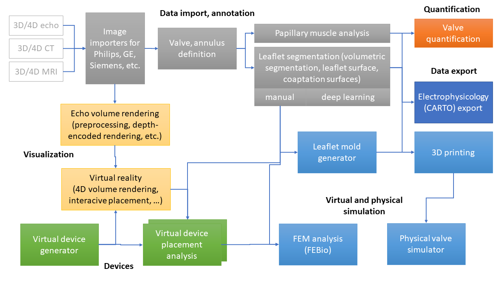

Back to [Projects List](../../README.md#ProjectsList)

# Updates on SlicerHeart (tools cardiac analysis, quantification, and planning)

## Key Investigators
- [Matthew Jolley](https://github.com/mattjolley), PI (Children's Hospital of Philadelphia)
- Research assistants:
  - Hannah H Nam (Children's Hospital of Philadelphia)
  - Chad Vigil (Children's Hospital of Philadelphia)
  - Alana Cianciulli (Children's Hospital of Philadelphia)
  - Alex V Nguyen (Children's Hospital of Philadelphia)
- Research engineers:
  - [Andras Lasso](https://github.com/lassoan) (PerkLab, Queen's University)
  - [Christian Herz](https://github.com/che85) (Children's Hospital of Philadelphia)
  - [Csaba Pinter](https://github.com/cpinter) (Ebatinca, Pixel Medical)
  - Sam Horvath, Jean-Christophe Robin-Fillion (Kitware)
  - Kyle Sunderland (PerkLab, Queen's University)
- Algorithms:
  - [Beatriz (Bea) Paniagua](https://github.com/bpaniagua) (Kitware)
  - [Jared Vicory](https://github.com/vicory) (Kitware)
  - David Allemang (Kitware)

# Project Description

SlicerHeart extension contains tools for cardiac image import (3D/4D ultrasound, CT, MRI), quantification, and implant placement planning and assessment.

## Objective

The goal for SlicerHeart project for this project week is to let people interested in cardiac applications know about what SlicerHeart can be used for now and what are the features that will be released publicly soon.

## Approach and Plan

1. Create project page that provides good overview of the project
1. Overview presentation on Monday
1. Presentation/discussion of any details depending on interest

## Progress and Next Steps

1. Create project page
2. Confirm presentation/demo schedule

# Illustrations

_[Valve segmentation](https://link.springer.com/article/10.1007/s00246-017-1785-4)_

_[Valve quantification](https://www.sciencedirect.com/science/article/pii/S0894731719300021)_

_[Virtual reality](https://www.onlinejase.com/article/S0894-7317(18)30343-2/fulltext)_

_[Phsyical modeling](https://www.spiedigitallibrary.org/conference-proceedings-of-spie/10135/1013516/Patient-specific-pediatric-silicone-heart-valve-models-based-on-3D/10.1117/12.2255849.full?SSO=1)_

_[Valve repair simulation](https://link.springer.com/article/10.1007/s00246-017-1785-4)_

# Background and References

- [SlicerHeart public repository](https://github.com/SlicerHeart/SlicerHeart)
