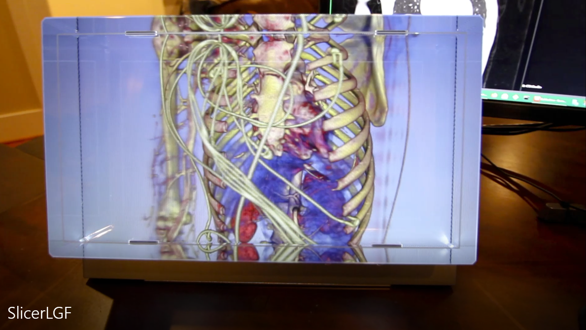

Back to [Projects List](../../README.md#ProjectsList)

# Slicer Looking Glass

## Key Investigators

- Stephen Aylward (Kitware)
- Jean-Christophe (Kitware)

# Project Description

Kitware has partnered with Looking Glass Factory (LGF) to add support for LGF’s holographic displays from any VTK-based application including ParaView, 3D Slicer, and any custom application you create.

## Objective

1. Introduce Looking Glass Factory hardware
1. Overview of Looking Glass Extension for 3D Slicer
1. Review compatibility issues with VTK 9.0 and 3D Slicer LGF.
1. Discuss research and clinical applications of holographic displays.

## Approach and Plan

1. Present LGF via videos and tutorials
1. Evaluate current Slicer + VTK9.0 candidate for compatibility with current LGF Slicer extension.

## Progress and Next Steps

<!-- Update this section as you make progress, describing of what you have ACTUALLY DONE. If there are specific steps that you could not complete then you can describe them here, too. -->

1. Create video for 5-minute presentation on Monday

# Illustrations

1. [Slicer+LGF Short Video](https://youtu.be/7-ROJ6awzqk)

# Background and References

Initial release of VTK + Looking Glass Factory:
* https://blog.kitware.com/vtk-holographic-display/

How-to video for ParaView + Looking Glass Factory:
* https://vimeo.com/460590350/74a0a8f1c7

Github for VTK extension:
* https://github.com/Kitware/LookingGlassVTKModule

Github for Slicer extension:
* https://github.com/KitwareMedical/SlicerLookingGlass
