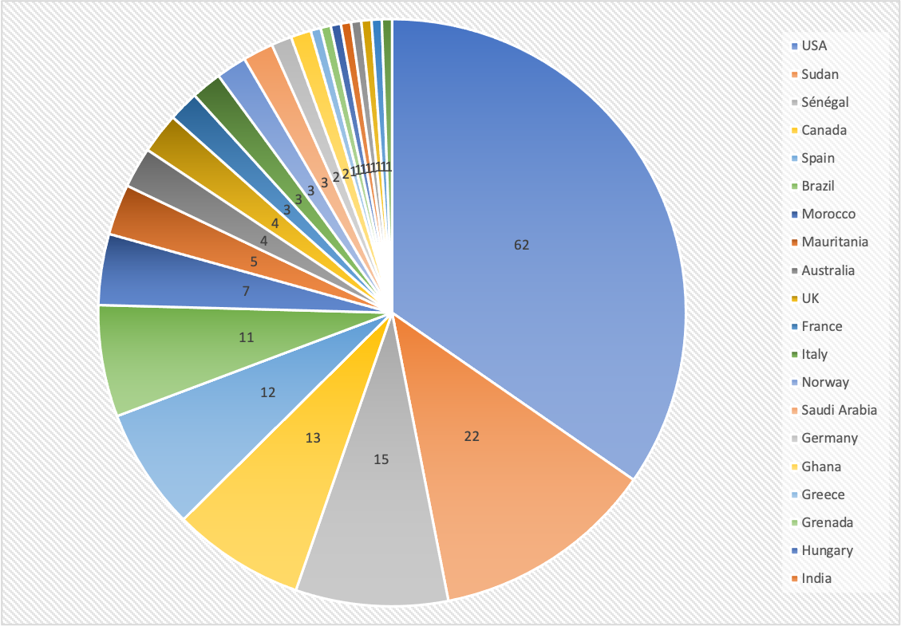

## Welcome to the web page for the 34th Project Week!

The [34th NA-MIC Project Week](https://projectweek.na-mic.org/PW34_2020_Virtual/) will be held virtually December 14-18, 2020.

The event is free and connection details will be provided after [registering](https://forms.gle/VFTNfKRNsgj6YSLB9).

Please read about our experience in running these events since 2005: [Increasing the Impact of Medical Image Computing Using
Community-Based Open-Access Hackathons: the NA-MIC and 3D Slicer Experience](http://perk.cs.queensu.ca/sites/perkd7.cs.queensu.ca/files/Kapur2016.pdf).

## Logistics
- **Dates:** December 14-18, 2020.
- **Location:** THE INTERNET (A zoom link will be emailed to all registered attendees by December 13, 2020)
- **Discourse Forum:** Please sign-up on the [discourse forum](https://discourse.slicer.org/c/community/project-week) to get updates and ask questions.
- **REGISTRATION:** [Link](https://forms.gle/VFTNfKRNsgj6YSLB9)

## Agenda

**Note: All times listed in the calendar below are given in EST (UTC-5) timezone.**

<iframe src="https://calendar.google.com/calendar/embed?src=kitware.com_sb07i171olac9aavh46ir495c4%40group.calendar.google.com&ctz=Atlantic&mode=WEEK&dates=20201214%2f20201218" style="border: 0" width="800" height="600" frameborder="0" scrolling="no"></iframe>

[How to add this calendar to your own?](../common/Calendar.md)

Notes on the agenda:

* The format of this virtual event will be different from the in-person ones.
* **Monday's session** will include:
  * 5-minute project presentations that include demos (for each of the projects listed below)
  * Approximately 1:45 of presentations with a 10 min break after the 10th presentation
  * An optional breakout session
* **Tuesday's session** will be a discussion about
  * Features in 3D Slicer that are new since the last Project Week
  * Design considerations that are relevant for end-to-end solutions (or customizable Slicer apps).  
* **Wednesday's session** will be a question and answer session about 3D Slicer for users and developers, a "live" version of what takes place asynchronously on the Slicer discourse forum.
* **Thursday's session** will be a discussion on recent advancing in the web and cloud technologies that are being used to create browser based visualization applications and large open databases.
* **Friday's session** will be a training workshop focused on fostering partnerships with researchers and clinicians in Western Africa. 
* The detailed program for each session is available from the link in the embedded Google Calendar above. 
* In addition to the scheduled presentations, projects may create separate breakout sessions to work in small groups after the end of the main session
  * Presenters and participants may use the chat function during the main session to request a breakout session with the designated person
  * A few breakout sessions have already been planned (see Breakout Sessions section below)

<a name="ProjectsList"/>

## Projects [(How to add a new project?)](Projects/README.md)

1. [SlicerSALT: Shape analysis](Projects/SlicerSALT/README.md) (Beatriz Paniagua, Kitware)
1. [SlicerHeart](Projects/SlicerHeart/README.md) (Andras Lasso)
1. [SlicerIGT and AIGT](Projects/SlicerIGT/README.md) (Tamas Ungi)
1. [SlicerMorph: An open and extensible platform to retrieve, visualize and analyze 3D morphology](Projects/SlicerMorph/README.md) (Sara Rolfe)
1. [SlicerCMF: Craniofacial image processing](Projects/SlicerCMF/README.md) (David Allemang)
1. [Plastimatch](Projects/Plastimatch/README.md) (Greg Sharp)
1. [SlicerArduino](Projects/SlicerArduino/README.md) [(video)](https://youtu.be/8R6LfBqHNPY) (Paolo Zaffino, Maria Francesca Spadea)
1. [PRISM volume rendering](Projects/PRISM_Volume_Rendering/Readme.md) (Simon Drouin)
1. [Virtual reality](Projects/SlicerVR/README.md) (Csaba Pinter)
1. [SlicerWeb and Slicer in Cloud environments](Projects/Slicer_in_Cloud_Environments/README.md) (Steve Pieper, Theodore Aptekarev)
1. [XNAT - OHIF](Projects/XNAT-OHIF/README.md)  (Dan Marcus)
1. [MONAI: PyTorch-based, open-source framework for deep learning in healthcare imaging](Projects/MONAI/README.md) (Stephen Aylward)
1. [Napari: multi-dimensional image viewer for python](Projects/Napari/README.md) (Nicholas Sofroniew)
1. [NCI Imaging Data Commons](Projects/ImagingDataCommons/README.md) (Andrey Fedorov,Steve Pieper, Ron Kikinis)
1. [aevaSlicer volumetric mesh generation from segmentations](Projects/aevaSlicer/Readme.md) (Sam Horvath)
1. Landmark Curves for Brain Images (Jarrett Rushmore, BWH/MGH/BU, Sylvain Bouix, BWH/HMS,  Nikos Makris, BWH/MGH/HMS)
1. [RadOncSegmentor](Projects/RadOncSegmentor/Readme.md) Segmentation for Radiation Treatment Planning (Aditya Apte, Eve LoCastro, Harini Veeraraghavan, MSKCC)
1. [Scalable Quality Assurance for Neuroimaging (SQAN)](Projects/SQAN/README.md) (Arvind Gopu)
1. [Train the Trainers](Projects/TrainTheTrainers/README.md)  formation program with African countries: training & anatomical atlases (Juan Ruiz, Asmaa Skareb, Marilola Afonso, Nayra Pumar)
1. [SlicerLiverAnalysis](Projects/SlicerLiverAnalysis/README.md) (Rafael Palomar OUS,NTNU. Ole Vegard Solberg, SINTEF)
1. [MICUDA - Generalized Entropy MI Registration](Projects/MICUDA/README.md) (Luiz Otavio Murta, Vinicius Pavanelli Vianna)
1. [TRAKO](Projects/TRAKO/README.md) (Daniel Haehn, Steve Pieper)
1. [Slicer Training - DICOM](Project/SlicerTraining-DICOM/README.md) (Sonia Pujol)

Breakout Sessions:
1. [Ultrasound Image Guided Therapy](https://docs.google.com/document/d/1laFD-GSYOq-mN0tLomYqcqLwrYXuwiMDU46AVToLcKE/edit) (Tamas Ungi, Tina Kapur, Simon Drouin) 
1. [Collaborative VR discussion](Projects/CollaborativeVR/Readme.md) (Csaba Pinter and Simon Drouin)
1. [Subject hierarchy: Drag&drop folders in views](Projects/SubjectHierarchyFolders/README.md) (Csaba Pinter, Steve Pieper)
1. Slicer Segmentation (Andras Lasso)

## Registrants

Do not add your name to this list below. It is maintained by the organizers based on your registration. [Register here](https://forms.gle/VFTNfKRNsgj6YSLB9).

List of registered participants so far (names will be added here after processing registrations):
<!-- [List](REGISTRANTS.md) -->
<!-- ORGANIZERS: please edit REGISTRANTS.md -->
1.	Simon Drouin	,	École de technologie supérieure (ETS Montreal)	,	QC	,	Canada
1.	Tina Kapur	,	Brigham and Women's Hospital and Harvard Medical School	,	MA	,	USA
1.	Nadya Shusharina	,	Massachusetts General Hospital	,	MA	,	USA
1.	Salim Kanoun	,	Institut Claudius Regaud - Toulouse	,	Occitanie	,	France
1.	Hans Johnson	,	University of Iowa	,	IA	,	USA
1.	Steve Pieper	,	Isomics, Inc.	,	MA	,	USA
1.	Csaba Pintér	,	Ebatinca S.L., Pixel Medical Inc.	,	Las Palmas	,	Spain
1.	Saima Safdar	,	University of western australia	,	WA	,	Australia
1.	Alexandra Golby	,	Brigham and Women’s hospital and Harvard Medical School 	,	MA	,	United States 
1.	Randy Gollub	,	MGH	,	MA	,	USA
1.	Simon Oxenford	,	Charité – Universitätsmedizin Berlin	,	Berlin	,	Germany
1.	Sonia Pujol	,	Brigham and Women's Hospital, Harvard Medical School	,	MA	,	USA
1.	Sylvain Bouic	,	Brigham and Women's Hospital	,	MA	,	USA
1.	Khalid Al Orabi	,	King abdullah medical city 	,	Makkah	,	Saudi Arabia
1.	Andrey Fedorov	,	Brigham and Women's Hospital	,	MA	,	USA
1.	Farah Alkhatib	,	University of Western Australia 	,	Western Australia 	,	Australia
1.	Dhruv Kool Rajamani	,	Worcester Polytechnic Institute	,	MA	,	USA
1.	Adam Wittek	,	Intelligent Systems for Medicine Laboratory, The University of Western Australia	,	Western Australia	,	Australia
1.	Matthew Toews	,	École de Technologie Supérieure	,	QC	,	Canada
1.	Vivian Monezi Tetzner	,	USP-FFCLRP	,	SP	,	Brazil
1.	Samantha Horvath	,	Kitware	,	North Carolina	,	USA
1.	Rafael Palomar	,	Oslo University Hospital	,	Norway	,	Norway
1.	Paolo Zaffino	,	Magna Graecia University of Catanzaro	,	Catanzaro	,	Italy
1.	Michael Young	,	Indiana University	,	IN	,	USA
1.	Arvind Gopu	,	Indiana University	,	Indiana	,	USA
1.	Attila Nagy	,	University of Szeged	,	Szeged	,	Hungary
1.	Curtis Lisle	,	KnowledgeVis, LLC	,	FL	,	USA
1.	Vinicius Pavanelli Vianna	,	USP - University of Sao Paulo	,	Sao Paolo	,	Brazil
1.	NIKOLAOS MAKRIS	,	MASSACHUSETTS GENERAL HOSPITAL	,	MA	,	USA
1.	Tamas Ungi	,	Queen's University	,	Ontario	,	Canada
1.	Eve LoCastro	,	Memorial Sloan Kettering Cancer Center	,	NY	,	USA
1.	Ole Vegard Solberg	,	SINTEF	,	Trøndelag	,	Norway
1.	Mehran Azimbagirad	,	University of Sao Paulo	,	SP	,	Brazil
1.	Sara Rolfe	,	University of Washington	,	WA	,	USA
1.	Junichi Tokuda	,	Brigham and Women's Hospital	,	MA	,	USA
1.	Harini Veeraraghavan	,	Memorial Sloan Kettering Cancer Center	,	NY	,	USA
1.	Renzo Phellan Aro	,	McGill University	,	QC	,	Canada
1.	Beatriz Paniagua	,	Kitware Inc	,	NC	,	USA
1.	Theodore Aptekarev	,	-	,	-	,	Russia/Israel
1.	Eleni Siampli	,	Childrens National Medical Center	,	DC	,	USA
1.	Ron Kikinis	,	Harvard Medical School	,	Massachusetts	,	USA
1.	Carl-Fredrik Westin	,	Harvard Medical School	,	MA	,	United States
1.	Lauren J ODonnell	,	BWH	,	MA	,	United States
1.	Raul San Jose	,	Brigham and Women's Hospital	,	MA	,	USA
1.	Julien Finet	,	Kitware	,	Rhône-Alpes	,	France
1.	David Allemang	,	Kitware Inc	,	NC	,	USA
1.	Forrest Li	,	Kitware, Inc.	,	NC	,	USA
1.	Matt McCormick	,	Kitware	,	North Carolina	,	USA
1.	Sarah Frisken	,	Brigham and Women's Hospital	,	MA	,	USA
1.	Jean-Christophe Fillion-Robin	,	Kitware	,	North Carolina	,	USA
1.	Nick Jowkar	,	Brigham and Women's Hospital 	,	MA	,	USA
1.	Luiz Murta	,	University of São Paulo	,	SP	,	Brasil
1.	Murat Maga	,	Seattle Children's Research Institute / University of Washington	,	WA	,	USA
1.	Marco Nolden	,	German Cancer Research Center (DKFZ)	,	N/A	,	Germany
1.	Nayra Pumar Carreras	,	Universidad de Las Palmas de Gran Canaria	,	Las Palmas	,	Spain
1.	khalid Elamin Awad	,	University of Khartoum, Faculty of Medicine	,	Khartoum	,	Sudan 
1.	Marie Ndiaye	,	Université Assane Seck de Ziguinchor	,	Sénégal	,	Sénégal
1.	Gregory C. Sharp	,	Massachusetts General Hospital	,	MA	,	USA
1.	David García-Mato	,	Universidad Carlos III de Madrid	,	Madrid	,	Spain
1.	Samba NDIAYE	,	CHEIKH ANTA DIOP UNIVERSITY	,	SENEGAL	,	SENEGAL
1.	Ahmed Temtam	,	Old Dominion University 	,	VA	,	USA
1.	Jared Vicory	,	Kitware	,	NC	,	USA
1.	Daniel Haehn	,	University of Massachusetts Boston	,	MA	,	USA
1.	Jarrett Rushmore	,	Boston University, Brigham and Women's Hospital, MGH	,	MA	,	USA
1.	Tagwa Idris	,	Massachusetts General Hospital 	,	MA	,	USA
1.	Fathelrahman Idris Gasmelseed Ali	,	University of Khartoum, Faculty of medicine 	,	Khartoum 	,	Sudan 
1.	EL Tahir Ahmed EL Tahir	,	University of Alfashir	,	North Darfur	,	Sudan
1.	Abdelmajed Manna 	,	Department of Anatomy, university of Alfashir 	,	North Darfur 	,	Sudan 
1.	Noureldeen abaker	,	Uorolgy resident	,	South Darfur	,	Sudan
1.	Mahil Mohamed Sharief Abdalla	,	Department of Anatomy, Faculty of Medicine, University of Khartoum 	,	Khartoum 	,	Sudan
1.	Haythem Mohammed Gorshi Ahmed 	,	University of Khartoum 	,	Khartoum 	,	Sudan 
1.	Abuzar Mubarak Omer Osman	,	Ondokuz mayıs üniversity OMÜ	,	black sea	,	Turkey
1.	Ehab Mohammed Rabie Abd Allah	,	Cairo University school of medicine	,	Khartoum	,	Sudan 
1.	Nicholas Sofroniew	,	Chan Zuckerberg Initiative	,	CA	,	USA
1.	Osama Mohammed Ahmed Mohammed ELNOUR 	,	Faculty of medicine and health scince 	,	North Darfur State 	,	Sudan 
1.	Mustafa Bahar	,	Soba University Hospital 	,	Khartoum	,	Sudan
1.	Dr.anatomy83@yahoo.com	,	Prince Sattam bin Abdulaziz University 	,	Riyadh 	,	Saudi Arabia 
1.	Abubaker Elssidig Elhaj Bakhit Farg	,	University of Ha'il. KSA	,	Ha'il Prevalence 	,	Saudia Arabia 
1.	Pape Mady THIAO 	,	École militaire de santé de Dakar 	,	SÉNÉGAL 	,	Sénégal 
1.	Elsadig Suleiman Adam 	,	Nyala Specialized Hospital 	,	South Darfur 	,	Sudan 
1.	Juan Ruiz-Alzola	,	University of Las Palmas de Gran Canaria	,	Canarias	,	Spain
1.	Idafen Santana	,	Las Palmas de Gran Canaria University	,	Canary Islands	,	Spain
1.	NORALDAIM AHMED FADOL MOHAMMED 	,	Ministry of health 	,	Darfor	,	Sudan 
1.	Leila omer adam Ahmed	,	University of al fashir	,	North Darfur	,	Sudan
1.	Babacar DIAO	,	Cheikh Anta DIOP University	,	Senegal	,	Senegal
1.	Khaly / TALL	,	Ecole Supérieure Polytechnique de Dakar	,	Sénégal	,	Sénégal
1.	Idy	,	École Supérieure Polytechnique	,	Senegal	,	Senegal
1.	Stephen Aylward	,	Kitware	,	NC	,	USA
1.	Salah Osman	,	Rick	,	Sudan	,	Sudan
1.	Selly Suzuki	,	São Leopoldo Mandic 	,	Sao Paulo	,	Brazil
1.	Haythem Guermazi	,	Faculté de Médecine de L'université de Nouakchott Al Aasriya Mauritania	,	Nouakchott	,	Mauritania
1.	William Wells	,	BWH	,	MA	,	USA
1.	Christian Herz	,	Children's Hospital of Philadelphia	,	PA	,	USA
1.	Mamadou Samba CAMARA	,	Ecole Supérieure Polytechnique / University of Dakar	,	Senegal	,	Senegal
1.	Michal Brzus	,	University of Iowa	,	IA	,	USA
1.	Wafa Nour	,	Khartoum breast care center	,	Khartoum	,	Sudan
1.	Izabel Rubira-Bullen	,	University Sao Paulo	,	Sao Paulo	,	Brazil
1.	Tim Olsen	,	Radiologics	,	IL	,	USA
1.	Rabab SEDRATI	,	ABDELMALEK ESAADI UNIVERSITY	,	Single	,	Morocco
1.	IDRIS AHMED ABAKER IBRAHIM	,	Alfasher university	,	NORTH DARFUR	,	Sudan
1.	Idris Ahmed Abaker Ibrahim	,	Alfasher university	,	NORTH DARFUR	,	Sudan
1.	ASSANE NDIAYE	,	Assane Seck University	,	Sénégal	,	Sénégal
1.	Asmaa Skareb	,	Canary Islands Institute of Technology 	,	Gran Canaria 	,	Spain
1.	Souleymane Diatta	,	chu fann	,	Dakar	,	Sénégal
1.	Aya Zakareya Noor Hamid 	,	Haj Al Safi Hospital	,	Khartoum	,	Sudan 
1.	Michela Destito	,	Magna Graecia University of Catanzaro	,	Catanzaro	,	Italy
1.	Manjula	,	Malmö University	,	Skane	,	Sweden
1.	armin	,	medken	,	WA	,	USA
1.	EL FARAZE Mohammed	,	National School of Applied Sciences	,	célibataire	,	Morocco
1.	Blake Griggs	,	Radiologics, Inc	,	CA	,	USA
1.	Salah osman salah	,	Rick	,	Khartoum	,	Sudan 
1.	SOW NDEYE FATOU	,	Université Cheikh Anta Diop 	,	Dakar	,	Sénégal
1.	PAPA SALMANE BA	,	Université Cheikh Anta Diop 	,	Dakar	,	Sénégal
1.	Assane Ndiaye	,	Université Assane Seck de Ziguinchor	,	ZIGUINCHOR	,	Sénégal
1.	Momar Sokhna Diop 	,	Université Cheikh Anta Diop 	,	Dakar	,	Sénégal 
1.	Amadou Gabriel Ciss	,	Université Cheikh Anta Diop 	,	Dakar	,	Sénégal
1.	Souleymane Diao	,	Université Cheikh Anta Diop 	,	Sénégal	,	Sénégal
1.	Kamal Eldeen Mohammed Ibrahim Dahab	,	University of Khartoum	,	Khartoum	,	Sudan
1.	Shiraz Yousif	,	University of khartoum 	,	Sidney	,	Australia
1.	Dan Marcus	,	Washington Universituy	,	MO	,	USA

## Statistics
As of Sun December 13th:
* 120 registered attendees
* More than 50 institutions
* 18 countries

