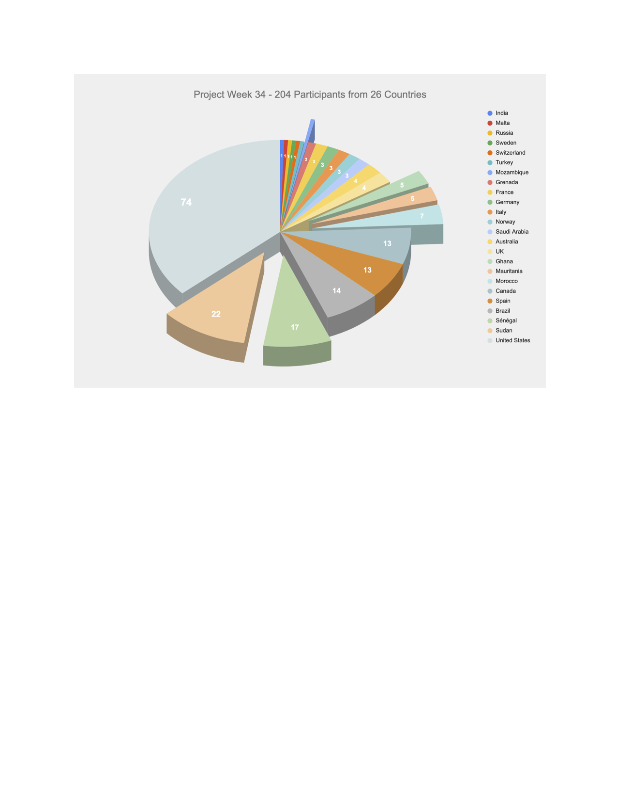

## Welcome to the web page for the 34th Project Week!

The [34th NA-MIC Project Week](https://projectweek.na-mic.org/PW34_2020_Virtual/) was held virtually December 14-18, 2020.

## History
Please read about our experience in running these events since 2005: [Increasing the Impact of Medical Image Computing Using
Community-Based Open-Access Hackathons: the NA-MIC and 3D Slicer Experience](http://perk.cs.queensu.ca/sites/perkd7.cs.queensu.ca/files/Kapur2016.pdf).

## Logistics
- **Dates:** December 14-18, 2020.
- **Location:** THE INTERNET
- **Discourse Forum:** Please sign-up on the [discourse forum](https://discourse.slicer.org/c/community/project-week) to get updates and ask questions.
  - [Project week discourse topic](https://discourse.slicer.org/t/project-week-starts-tomorrow/15040) for less real-time conversation
- **Slack:** [Invite Link](https://join.slack.com/t/namic-projectweek/shared_invite/zt-bmxjicl0-zWkWOV~Sp5lTh1dWhq4nYw)
- **REGISTRATION:** [Link](https://forms.gle/VFTNfKRNsgj6YSLB9)

## Agenda

**Note: Zoom Rooms Open at 11am EST and Project Presentations Start at 12noon EST on MONDAY**

<iframe src="https://calendar.google.com/calendar/embed?src=kitware.com_sb07i171olac9aavh46ir495c4%40group.calendar.google.com&ctz=Atlantic&mode=WEEK&dates=20201214%2f20201218" style="border: 0" width="800" height="600" frameborder="0" scrolling="no"></iframe>

[How to add this calendar to your own?](../common/Calendar.md)

Notes on the agenda:

* The format of this virtual event will be different from the in-person ones.
* **Monday's session** will include:
  * 5-minute project presentations that include demos (for each of the projects listed below)
  * Approximately 1:45 of presentations with a 10 min break after the 10th presentation
  * An optional breakout session
* **Tuesday's session** will be a discussion about
  * Features in 3D Slicer that are new since the last Project Week
  * Design considerations that are relevant for end-to-end solutions (or customizable Slicer apps).
* **Wednesday's session** question and answer session about 3D Slicer for users and developers, a "live" version of what takes place asynchronously on the Slicer discourse forum. See discussed questions and answers [here](Breakouts/LiveDiscourse/README.md).
* **Thursday's session** will be a discussion on recent advancing in the web and cloud technologies that are being used to create browser based visualization applications and large open databases.
* **Friday's session** will be a training workshop focused on fostering partnerships with researchers and clinicians in Western Africa.
* The detailed program for each session is available from the link in the embedded Google Calendar above.
* In addition to the scheduled presentations, projects may create separate breakout sessions to work in small groups after the end of the main session
  * Presenters and participants may use the chat function during the main session to request a breakout session with the designated person
  * A few breakout sessions have already been planned (see Breakout Sessions section below)

<a name="ProjectsList"/>

## Project Presentations for Monday [(How to add a new project?)](Projects/README.md)

1. [SlicerSALT: Shape analysis](Projects/SlicerSALT/README.md) (Beatriz Paniagua, Kitware)
1. [SlicerHeart](Projects/SlicerHeart/README.md) (Andras Lasso)
1. [SlicerIGT and AIGT](Projects/SlicerIGT/README.md) (Tamas Ungi)
1. [SlicerMorph: An open and extensible platform to retrieve, visualize and analyze 3D morphology](Projects/SlicerMorph/README.md) (Sara Rolfe)
1. [SlicerCMF: Craniofacial image processing](Projects/SlicerCMF/README.md) (David Allemang)
1. [SlicerArduino](Projects/SlicerArduino/README.md) [(video)](https://youtu.be/8R6LfBqHNPY) (Paolo Zaffino, Maria Francesca Spadea)
1. [PRISM volume rendering](Projects/PRISM_Volume_Rendering/README.md) (Simon Drouin)
1. [Virtual reality](Projects/SlicerVR/README.md) (Csaba Pinter)
1. [SlicerWeb and Slicer in Cloud environments](Projects/Slicer_in_Cloud_Environments/README.md) (Steve Pieper, Theodore Aptekarev)
1. [Napari: multi-dimensional image viewer for python](Projects/Napari/README.md) (Nicholas Sofroniew)

10-minute BREAK

11. [XNAT - OHIF](Projects/XNAT-OHIF/README.md)  (Dan Marcus)
1. [MONAI: PyTorch-based, open-source framework for deep learning in healthcare imaging](Projects/MONAI/README.md) (Tina Kapur for Stephen Aylward)
1. [NCI Imaging Data Commons](Projects/ImagingDataCommons/README.md) (Andrey Fedorov,Steve Pieper, Ron Kikinis)
1. [aevaSlicer volumetric mesh generation from segmentations](Projects/aevaSlicer/README.md) (Sam Horvath)
1. [Landmark Curves for Brain Images](Projects/Landmark%20Curves%20for%20Brain%20Images/README.md) (Jarrett Rushmore, BWH/MGH/BU, Sylvain Bouix, BWH/HMS,  Nikos Makris, BWH/MGH/HMS, Kyle Sunderland, Queen's University, Andras Lasso, Queen's University)
1. [RadOncSegmentor](Projects/RadOncSegmentor/README.md) Segmentation for Radiation Treatment Planning (Aditya Apte, Eve LoCastro, Harini Veeraraghavan, MSKCC)
1. [Scalable Quality Assurance for Neuroimaging (SQAN)](Projects/SQAN/README.md) (Arvind Gopu)
1. [Train the Trainers](Projects/TrainTheTrainers/README.md)  formation program with African countries: training & anatomical atlases (Juan Ruiz, Asmaa Skareb, Marilola Afonso, Nasara Cabrera Abu, Tagwa Idris, Septy Inge, Otman Aghzout, Babacar Diao, Alexandra Fernandes, Badiaa Ait Ahmed, Nayra Pumar)
1. [SlicerLiverAnalysis](Projects/SlicerLiverAnalysis/README.md) (Rafael Palomar OUS,NTNU. Ole Vegard Solberg, SINTEF)
1. [MICUDA - Generalized Entropy MI Registration](Projects/MICUDA/README.md) (Luiz Otavio Murta, Vinicius Pavanelli Vianna)
1. [TRAKO](Projects/TRAKO/README.md) (Daniel Haehn, Steve Pieper, Lauren O'Donnell, Yogesh Rathi))
1. [Slicer Training - DICOM](Projects/SlicerTraining-DICOM/README.md) (Sonia Pujol)
1. [Slicer + Looking Glass Factory's Holographic Display](Projects/SlicerLookingGlass/README.md) (Jean-Christophe Fillion-Robin, Stephen Aylward)
1. [Open Anatomy](Projects/OpenAnatomy/README.md) (Mike Halle et. al.)

## Breakout Sessions:

To learn how to join, leave or display list of breakout rooms. See [here](./ZoomBreakoutRoom.md).

1. Monday @ 3pm [Ultrasound Image Guided Therapy](https://docs.google.com/document/d/1laFD-GSYOq-mN0tLomYqcqLwrYXuwiMDU46AVToLcKE/edit) (Tamas Ungi, Tina Kapur, Simon Drouin)
1. Tuesday @ 11am [Collaborative VR discussion](Projects/CollaborativeVR/README.md) (Csaba Pinter and Simon Drouin)
1. Wednesday @ 11am EST Project/Room 10 & 11: Dan Marcus, XNAT + OHIF
1. Wednesday @ 11am: Project 15 Landmark Curves for Brain Images  (Jarrett Rushmore, Kyle Sunderland)
1. Wednesday @ 2pm. Project 12 MONAI: PyTorch-based, open-source framework for deep learning in healthcare imaging (Stephen Aylward)
1. Thursday @ 11am. [Segmentation import/export/storage](Breakouts/SegmentationStorageFormat/README.md) (Andras Lasso)
1. Thursday @ 2pm [Image segmentation clinic](Breakouts/Segmentation/README.md)Bring your own segmentation problem or learn from how we solve others'(Andras Lasso)

## Registrants

Do not add your name to this list below. It is maintained by the organizers based on your registration. [Register here](https://forms.gle/VFTNfKRNsgj6YSLB9).

List of registered participants so far (names will be added here after processing registrations):

1.	Simon Drouin	,	École de technologie supérieure (ETS Montreal)	,	QC	,	Canada
1.	Tina Kapur	,	Brigham and Women's Hospital and Harvard Medical School	,	MA	,	USA
1.	Nadya Shusharina	,	Massachusetts General Hospital	,	MA	,	USA
1.	Salim Kanoun	,	Institut Claudius Regaud - Toulouse	,	Occitanie	,	France
1.	Hans Johnson	,	University of Iowa	,	IA	,	USA
1.	Steve Pieper	,	Isomics, Inc.	,	Massachusetts	,	USA
1.	Csaba Pintér	,	Ebatinca S.L., Pixel Medical Inc.	,	Las Palmas	,	Spain
1.	Saima Safdar	,	University of western australia	,	WA	,	Australia
1.	Alexandra Golby	,	Brigham and Women’s hospital and Harvard Medical School 	,	MA	,	USA
1.	Randy Gollub	,	MGH	,	MA	,	USA
1.	Simon Oxenford	,	Charité – Universitätsmedizin Berlin	,	Berlin	,	Germany
1.	Sonia Pujol	,	Brigham and Women's Hospital, Harvard Medical School	,	MA	,	USA
1.	Sylvain Bouic	,	Brigham and Women's Hospital	,	MA	,	USA
1.	Khalid Al Orabi	,	King abdullah medical city 	,	Makkah	,	Saudi Arabia
1.	Andrey Fedorov	,	Brigham and Women's Hospital	,	MA	,	USA
1.	Farah Alkhatib	,	University of Western Australia 	,	Western Australia 	,	Australia
1.	Dhruv Kool Rajamani	,	Worcester Polytechnic Institute	,	Massachusetts	,	USA
1.	Adam Wittek	,	Intelligent Systems for Medicine Laboratory, The University of Western Australia	,	Western Australia	,	Australia
1.	Matthew Toews	,	École de Technologie Supérieure	,	QC	,	Canada
1.	Vivian Monezi Tetzner	,	USP-FFCLRP	,	SP	,	Brazil
1.	Samantha Horvath	,	Kitware	,	North Carolina	,	USA
1.	Rafael Palomar	,	Oslo University Hospital	,	Norway	,	Norway
1.	Paolo Zaffino	,	Magna Graecia University of Catanzaro	,	Catanzaro	,	Italy
1.	Michael Young	,	Indiana University	,	IN	,	USA
1.	Arvind Gopu	,	Indiana University	,	Indiana	,	USA
1.	Attila Nagy	,	University of Szeged	,	N/A	,	Hungary
1.	Curtis Lisle	,	KnowledgeVis, LLC	,	FL	,	USA
1.	Vinicius Pavanelli Vianna	,	USP - University of Sao Paulo	,	Sao Paulo	,	Brazil
1.	NIKOLAOS MAKRIS	,	MASSACHUSETTS GENERAL HOSPITAL	,	MASSACHUSETTS	,	USA
1.	Tamas Ungi	,	Queen's University	,	Ontario	,	Canada
1.	Eve LoCastro	,	Memorial Sloan Kettering Cancer Center	,	New York	,	USA
1.	Ole Vegard Solberg	,	SINTEF	,	Trøndelag	,	Norway
1.	Mehran Azimbagirad	,	University of Sao Paulo	,	SP	,	Brazil
1.	Sara Rolfe	,	University of Washington	,	WA	,	USA
1.	Junichi Tokuda	,	Brigham and Women's Hospital	,	MA	,	USA
1.	Harini Veeraraghavan	,	Memorial Sloan Kettering Cancer Center	,	New York	,	USA
1.	Renzo Phellan Aro	,	McGill University	,	QC	,	Canada
1.	Beatriz Paniagua	,	Kitware Inc	,	NC	,	USA
1.	Theodore Aptekarev	,	-	,	-	,	Russia/Israel
1.	Eleni Siampli	,	Childrens National Medical Center	,	DC	,	USA
1.	Ron Kikinis	,	Harvard Medical School	,	Massachusetts	,	USA
1.	Carl-Fredrik Westin	,	Harvard Medical School	,	MA	,	USA
1.	Lauren J ODonnell	,	BWH	,	MA	,	USA
1.	Raul San Jose	,	Brigham and Women's Hospital	,	MA	,	USA
1.	Julien Finet	,	Kitware	,	Rhône-Alpes	,	France
1.	David Allemang	,	Kitware Inc	,	NC	,	USA
1.	Forrest Li	,	Kitware, Inc.	,	NC	,	USA
1.	Matt McCormick	,	Kitware	,	North Carolina	,	USA
1.	Sarah Frisken	,	Brigham and Women's Hospital	,	MA	,	USA
1.	Jean-Christophe Fillion-Robin	,	Kitware	,	North Carolina	,	USA
1.	Nick Jowkar	,	Brigham and Women's Hospital 	,	MA	,	USA
1.	Luiz Murta	,	University of São Paulo	,	SP	,	Brazil
1.	Murat Maga	,	Seattle Children's Research Institute / University of Washington	,	Washington	,	USA
1.	Marco Nolden	,	German Cancer Research Center (DKFZ)	,	N/A	,	Germany
1.	Nayra Pumar Carreras	,	Universidad de Las Palmas de Gran Canaria	,	Las Palmas	,	Spain
1.	khalid Elamin Awad	,	University of Khartoum, Faculty of Medicine	,	Khartoum	,	Sudan
1.	Marie Ndiaye	,	Université Assane Seck de Ziguinchor	,	Sénégal	,	Sénégal
1.	Gregory C. Sharp	,	Massachusetts General Hospital	,	MA	,	USA
1.	David García-Mato	,	Universidad Carlos III de Madrid	,	Madrid	,	Spain
1.	Samba NDIAYE	,	CHEIKH ANTA DIOP UNIVERSITY	,	SENEGAL	,	Sénégal
1.	Ahmed Temtam	,	Old Dominion University 	,	VA	,	USA
1.	Jared Vicory	,	Kitware	,	North Carolina	,	USA
1.	Daniel Haehn	,	University of Massachusetts Boston	,	Massachusetts	,	USA
1.	Jarrett Rushmore	,	Boston University, Brigham and Women's Hospital, MGH	,	MA	,	USA
1.	Tagwa Idris	,	Massachusetts General Hospital 	,	MA	,	USA
1.	Fathelrahman Idris Gasmelseed Ali	,	University of Khartoum, Faculty of medicine 	,	Khartoum 	,	Sudan
1.	EL Tahir Ahmed EL Tahir	,	University of Alfashir	,	North Darfur	,	Sudan
1.	Abdelmajed Manna 	,	Department of Anatomy, university of Alfashir 	,	North Darfur 	,	Sudan
1.	Noureldeen abaker	,	Uorolgy resident	,	South Darfur	,	Sudan
1.	Mahil Mohamed Sharief Abdalla	,	Department of Anatomy, Faculty of Medicine, University of Khartoum 	,	Khartoum 	,	Sudan
1.	Haythem Mohammed Gorshi Ahmed 	,	University of Khartoum 	,	Khartoum 	,	Sudan
1.	Abuzar Mubarak Omer Osman	,	Ondokuz mayıs üniversity OMÜ	,	black sea	,	Turkey
1.	Ehab Mohammed Rabie Abd Allah	,	Cairo University school of medicine	,	Khartoum	,	Sudan
1.	Nicholas Sofroniew	,	Chan Zuckerberg Initiative	,	CA	,	USA
1.	Osama Mohammed Ahmed Mohammed ELNOUR 	,	Faculty of medicine and health scince 	,	North Darfur State 	,	Sudan
1.	Mustafa Bahar	,	Soba University Hospital 	,	Khartoum	,	Sudan
1.	Dr.anatomy83@yahoo.com	,	Prince Sattam bin Abdulaziz University 	,	Riyadh 	,	Saudi Arabia
1.	 Abubaker Elssidig Elhaj Bakhit Farg	,	University of Ha'il. KSA	,	Ha'il Prevalence 	,	Saudi Arabia
1.	Pape Mady THIAO 	,	École militaire de santé de Dakar 	,	SÉNÉGAL 	,	Sénégal
1.	Elsadig Suleiman Adam 	,	Nyala Specialized Hospital 	,	South Darfur 	,	Sudan
1.	Juan Ruiz-Alzola	,	University of Las Palmas de Gran Canaria	,	Canarias	,	Spain
1.	Idafen Santana	,	Las Palmas de Gran Canaria University	,	Canary Islands	,	Spain
1.	NORALDAIM AHMED FADOL MOHAMMED 	,	Ministry of health 	,	Darfor	,	Sudan
1.	Leila omer adam Ahmed	,	University of al fashir	,	North Darfur	,	Sudan
1.	Babacar DIAO	,	Cheikh Anta DIOP University	,	Senegal	,	Sénégal
1.	Khaly / TALL	,	Ecole Supérieure Polytechnique de Dakar	,	Sénégal	,	Sénégal
1.	Idy	,	École Supérieure Polytechnique	,	Senegal	,	Sénégal
1.	Stephen Aylward	,	Kitware	,	NC	,	USA
1.	Selly Suzuki	,	São Leopoldo Mandic 	,	Sao Paulo	,	Brazil
1.	Haythem Guermazi	,	Faculté de Médecine de L'université de Nouakchott Al Aasriya Mauritania	,	Nouakchott	,	Mauritania
1.	William Wells	,	BWH	,	Massachusetts	,	USA
1.	Christian Herz	,	Children's Hospital of Philadelphia	,	Pennsylvania	,	USA
1.	Mamadou Samba CAMARA	,	Ecole Supérieure Polytechnique / University of Dakar	,	Senegal	,	Sénégal
1.	Michal Brzus	,	University of Iowa	,	IA	,	USA
1.	Wafa Nour	,	Khartoum breast care center	,	Khartoum	,	Sudan
1.	Izabel Rubira-Bullen	,	University Sao Paulo	,	Sao Paulo	,	Brazil
1.	Tim Olsen	,	Radiologics	,	IL	,	USA
1.	Blake Griggs	,	Radiologics, Inc	,	CA	,	USA
1.	Amadou Gabriel Ciss	,	université cheikh anta diop	,	senegal	,	Sénégal
1.	Idris Ahmed Abaker Ibrahim	,	Alfasher University faculty of medicine	,	NORTH DARFUR	,	Sudan
1.	SOW NDEYE FATOU	,	UCAD	,	DAKAR	,	Sénégal
1.	Souleymane Diatta	,	chu fann	,	dakar	,	Sénégal
1.	Momar Sokhna Diop 	,	Cheikh Anta Diop University	,	Senegal 	,	Sénégal
1.	Dan Marcus	,	Washington Universituy	,	MO	,	USA
1.	PAPA SALMANE BA	,	UCAD	,	Sénégal 	,	Sénégal
1.	armin	,	medken	,	wa	,	USA
1.	Salah osman salah	,	Rick	,	Khartoum	,	Sudan
1.	Aya Zakareya Noor Hamid 	,	Haj Al Safi Hospital	,	Khartoum	,	Sudan
1.	Shiraz Yousif	,	University of khartoum 	,	NSW	,	Australia
1.	Assane Ndiaye	,	Université Assane Seck	,	Senegal	,	Sénégal
1.	Kamal Eldeen Mohammed Ibrahim Dahab	,	University of Khartoum	,	Khartoum	,	Sudan
1.	Asmaa Skareb	,	Canary Islands Institute of Technology 	,	Gran Canaria 	,	Spain
1.	Manjula	,	Malmö University	,	Skane	,	Sweden
1.	Michela Destito	,	Magna Graecia University of Catanzaro	,	Italy	,	Italy
1.	Souleymane Diao	,	Université Cheikh Anta Diop 	,	Sénégal	,	Sénégal
1.	Geir Arne Tangen	,	SINTEF	,	Trondheim	,	Norway
1.	Mohammed Nimir	,	University Hospital Coventry and Warwickshire	,	West Midlands	,	UK
1.	Marwan Ahmed	,	St. George’s University 	,	Saint George’s 	,	Grenada
1.	Elimam Elghazali Siddig Mohamed Mustafa	,	University of Khartoum	,	Khartoum 	,	Sudan
1.	Badiaa AIT AHMED	,	University Abdelmalek Essaâdi	,	North Africa	,	Morocco
1.	Rabab SEDRATI	,	ABDELMALEK ESAADI UNIVERSITY	,	North of Africa 	,	Morocco
1.	Ahmedou Moulaye IDRISS	,	Faculty of Medicine University of Nouakchott Al Aasriya	,	Mauritania	,	Mauritania
1.	Mohamed bamba hbedy	,	Faculté médecine Nouakchott 	,	Nouakchott 	,	Mauritania
1.	EL FARAZE Mohammed	,	ABDELMALEK ESAADI UNIVERSITY	,	NORTH OF AFRICA	,	Morocco
1.	Kyle Sunderland	,	Queen's University	,	Ontario	,	Canada
1.	EL GUERI Jaouad 	,	ENSA Tétouan 	,	North of Africa 	,	Morocco
1.	Otman AGHZOUT	,	University Abdelmalek Essaedi	,	North Africa	,	Morocco
1.	Andras Lasso	,	PerkLab, Queen's University	,	ON	,	Canada
1.	Pedro Moreira	,	Brigham and Women's Hospital	,	MA	,	USA
1.	Dr. Gargi Jani	,	National forensic sciences university	,	Gujarat	,	India
1.	Anita Carolina Ribeiro	,	FOUSP 	,	São Paulo 	,	Brazil
1.	Daniele Piccolo	,	Nucleode SRL, University of Padua	,	UD	,	Italy
1.	David Manso Arcediano	,	Cella Medical Solutions 	,	Murcia	,	Spain
1.	Mohamed aly Dedew	,	Faculty of medecine of Nouakchott 	,	Nouakchott 	,	Mauritania
1.	Miguel Xochicale	,	King's College London	,	London	,	UK
1.	Mahomed Sidique Abdul Cadar Dada 	,	Uem 	,	Maputo 	,	Moçambique
1.	Tasos Raptis	,	National Technical University of Athens	,	Attiki	,	Greece
1.	María Dolores Afonso Suárez	,	Universidad de Las Palmas de Gran Canaria	,	Canary Islands	,	Spain
1.	Simon Doran	,	Institute of Cancer Research	,	Surrey	,	UK
1.	Elameen Adam	,	University of Bahri	,	Khartoum	,	Sudan
1.	Fatima Elnagieb Adam Gamereldien 	,	Nyala Teaching hospital 	,	South Darfour 	,	Sudan
1.	Rafael Pineda Reyes	,	University of Cordoba	,	Cordoba	,	Spain
1.	Blanca Zufiria Gerbolés	,	Vicomtech	,	guipuzkoa	,	Spain
1.	Mohammed Eltahir	,	University of Bahri 	,	Khartoum 	,	Sudan
1.	Godwin Wunpiini Yiddi	,	Kwame Nkrumah University of Science and Technology	,	Ashanti Region	,	Ghana
1.	Kate Alpert	,	Radiologics	,	CO	,	USA
1.	Gordon Harris	,	Massachusetts General Hospital	,	MA	,	USA
1.	Supriya Somarouthu	,	Massachusetts General Hospital	,	Massachusetts	,	USA
1.	Awa NDIAYE SY	,	Université Cheikh Anta Diop de Dakar - Faculté de Médecine, de Pharmacie et d'Odontologie	,	SENEGAL	,	Sénégal
1.	Aditya Apte	,	Memorial Sloan Kettering Cancer Center	,	New York	,	USA
1.	Andrea Avena-Koenigsberger	,	Indiana University	,	INDIANA	,	USA
1.	Juan Carlos Prieto	,	UNC	,	North Carolina	,	USA
1.	Michael Halle	,	Brigham and Women's Hospital	,	Massachusetts	,	USA
1.	Marta Vidal-Garcia	,	University of Calgary	,	Alberta	,	Canada
1.	antonietta del bove	,	UNIVERSITAT ROVIRA I VIRGILI	,	SPAIN	,	Spain
1.	Terrie Simmons-Ehrhardt 	,	Virginia Commonwealth University 	,	VA	,	USA
1.	Arthur Porto	,	Louisiana state university	,	LA	,	USA
1.	Lucia Cevidanes	,	University of Michigan	,	MI	,	USA
1.	Lucas Lo Vercio	,	University of Calgary	,	Alberta	,	Canada
1.	Roozbeh Shams	,	Polytechnique Montreal	,	QC	,	Canada
1.	Eva Zaffarini	,	University of Calgary	,	Alberta	,	Canada
1.	James Dickson	,	Radiologics Inc	,	Pennsylvania	,	USA
1.	Erik Ziegler	,	Radical Imaging	,	Rhone-Alpes	,	France
1.	Mounia Chakkour	,	Abdelmalek Essaâdi University (ENSA Tetuan) 	,	North Africa	,	Morocco
1.	Étienne Léger	,	Concordia University	,	Québec	,	Canada
1.	Benedict Kingsford Andam	,	Kwame Nkrumah University of Science and Technology	,	Ayeduase 	,	Ghana
1.	Mohammad Alsad	,	Imperial College London	,	Cambs	,	UK
1.	YAHYA TFEIL	,	faculty of medicine alassriya university mauritaniaania	,	nouakchott	,	Mauritania
1.	jonas bianchi	,	University of the Pacific	,	California	,	USA
1.	MOHAMED SABAN	,	UNIVERSIDAD DE VALENCIA	,	VALENCIA	,	Spain
1.	Amdaouch Ibtisam	,	University of Abdelmalek Essaadi	,	Tanger-Tetouan	,	Morocco
1.	Mariela Peralta-Mamani	,	Bauru School of Dentistry-University of Sao Paulo	,	SP	,	Brazil
1.	Ángel Terrero Pérez	,	Bauru School of Dentistry, University of Sao Paulo	,	Sao Paulo	,	Brazil
1.	David Orlando Grajales Lopera	,	Polytechnique Montreal	,	Québec	,	Canada
1.	Alexis Girault	,	Kitware	,	NC	,	USA
1.	Leonardo F Machado	,	University of São Paulo até Ribeirão Preto	,	SP	,	Brazil
1.	Manuel Gustavo Chávez Sevillano 	,	Rio de Janeiro State University	,	Rio de Janeiro	,	Brazil
1.	Gabor Fichtinger	,	Queen's Univ	,	ON	,	Canada
1.	Charles Johnson	,	University of Iowa	,	Iowa	,	USA
1.	Morgan Hough	,	Center17 	,	CA	,	USA
1.	Aron Aliaga Del Castillo	,	Bauru Dental School, University of São Paulo	,	São Paulo	,	Brazil
1.	Camila Massaro	,	University of São Paulo 	,	Sp	,	Brazil
1.	Wilson Komla	,	Kwame Nkrumah University of Science and Technology	,	Ashanti Region	,	Ghana
1.	Victor Elikem Akpaloo	,	Kwame Nkrumah University of Science and Technology 	,	Greater Accra Region	,	Ghana
1.	ABOAGYE, Gifty Takyiwaa	,	Kwame Nkrumah University of Science and Technology 	,	Ashanti	,	Ghana
1.	omar sow	,	université assane seck de ziguinchor	,	ziguinchor	,	senegal
1.	Rudolf Bumm	,	Department of Surgery, Kantonsspital Graubünden	,	Graubünden	,	Switzerland
1.	Kelly Diamond	,	Seattle Children's Research Institute	,	WA	,	United States
1.	Autumn Kulaga	,	CCDC Data & Analysis Center	,	MD	,	US
1.	DELEAT-BESSON	,	University of Michigan	,	Michigan	,	United States
1.	Celia LE	,	University of Michigan	,	Michigan	,	United States
1.	Deise Caldas	,	Malta 	,	Saint Julians 	,	Malta
1.	Steve Moore	,	Washington University	,	MO	,	USA
1.	Cseh Martin	,	University of Szeged 3D Center	,	Csongrad	,	Hungary
1.	Nasara Cabrera Abu 	,	Canary Islands Government 	,	Canary Islands 	,	Spain
1.	Sokhna Astou Gawane Thiam	,	Université Cheikh Anta Diop  	,	Sénégal	,	Sénégal
1.	Jasmin Metzger	,	German Cancer Research Center	,	BW	,	Germany
1.	Aron Helser	,	Kitware	,	NC	,	US
1.	Marcela Gurgel	,	Federal University of Ceara	,	Ceara	,	Brazil
1.	Jason Haider	,	Xenco Medical	,	California	,	United States
1.	Jordan Karten	,	Massachusetts General Hospital	,	MA	,	USA
1.	Ron Alkalay	,	Beth Israel Deaconess Medical Center	,	MA	,	US
1.	Parikshit Juvekar	,	Brigham & Women's Hospital	,	Massachusetts	,	USA
1.	Dhiego Bastos	,	BWH	,	MA	,	United States

## Statistics

* 204 registered attendees
* 26 countries
* 101 institutions (82 academic, 18 industry, and 1 goverment)

