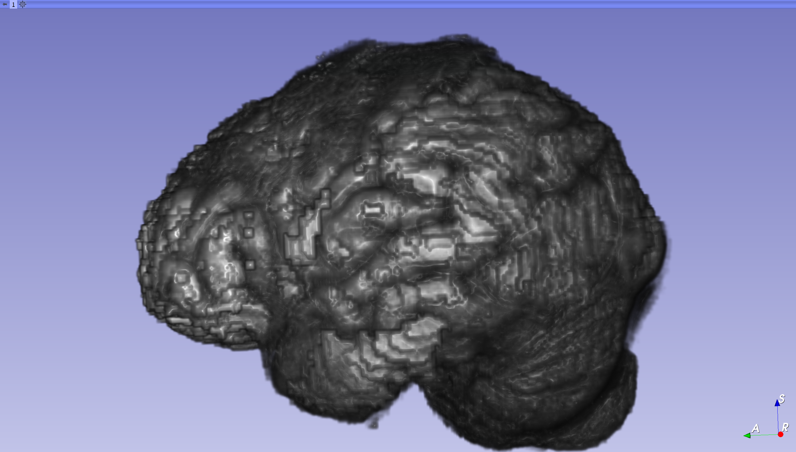
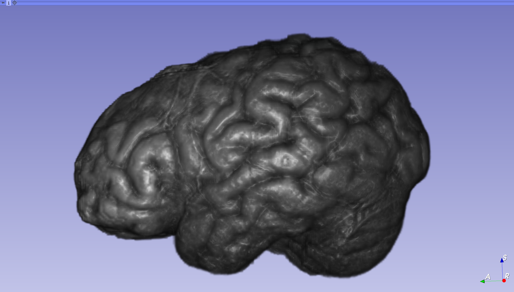
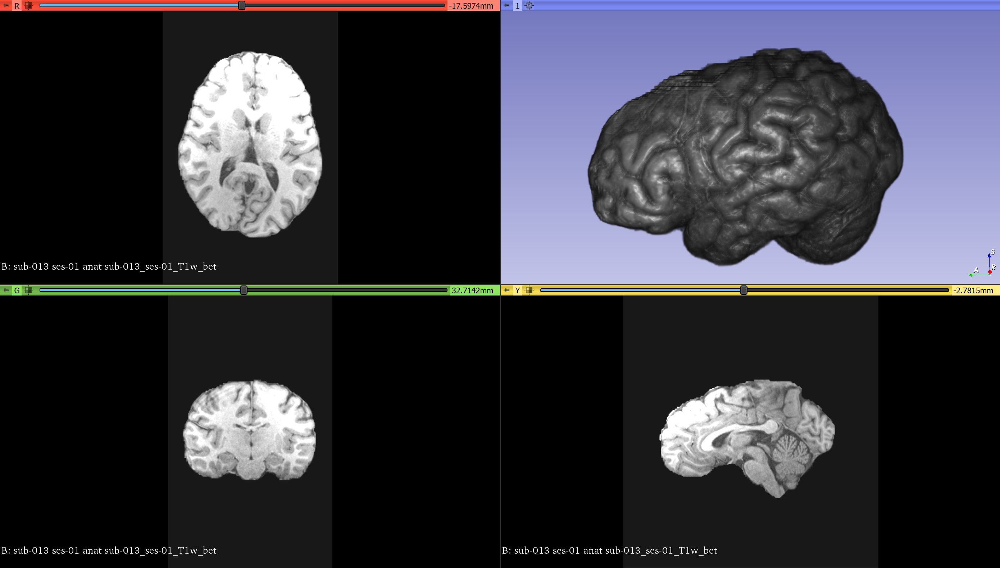
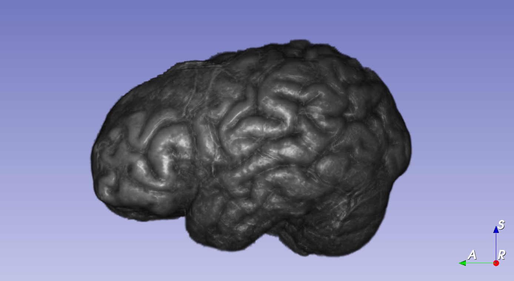
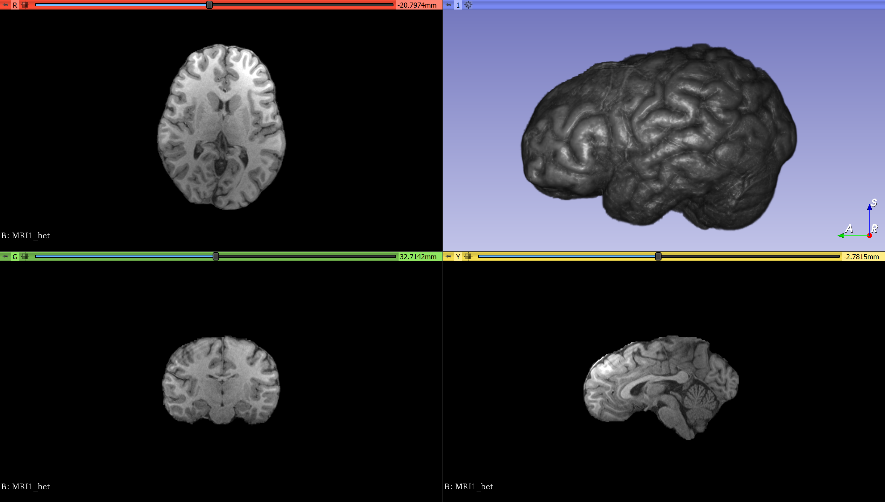

Back to [Projects List](../../README.md#ProjectsList)

# CNN based Brain Masking Module

## Key Investigators

- Raymond Yang (University of Massachusetts Boston)
- Lipeng Ning (BWH & Harvard Medical School)
- Daniel Haehn (University of Massachusetts Boston)
- Yogesh Rathi (BWH & Harvard Medical School)
- Steve Pieper (Isomics, Inc.)

# Project Description

Develop a deep learning based Brain Masking Module with improved performance and accuracy over current alternatives.

## Objective

<!-- Describe here WHAT you would like to achieve (what you will have as end result). -->

1. Objective A. Test accuracy and reliability of a Deep Learning based Brain Masking Solution
1. Objective B. Integrate the solution into 3D slicer
1. Objective C. Test and improve performance of the integrated solution

## Approach and Plan

<!-- Describe here HOW you would like to achieve the objectives stated above. -->

1. Explore Image Registration options (EasyReg/MERMAID)
1. Research current Deep Learning based Brain Masking (HD-BET, Auto Net)
1. Get access to data for training and testing
1. Create the solution
1. Figure out how to integrate the solution
1. Evaluate the performance

## Progress and Next Steps

<!-- Update this section as you make progress, describing of what you have ACTUALLY DONE. If there are specific steps that you could not complete then you can describe them here, too. -->

1. Applied for NIH Dataset Request
1. Tested HD-BET Segmentation
1. Extracted PyTorch parameter(s) from HD-BET
1. Begin building Slicer Module with HD-BET parameters

# Illustrations

<!-- Add pictures and links to videos that demonstrate what has been accomplished.
[Description of picture](Example2.jpg)

-->
Swiss Skull Stripper

HD-BET Fast segmentation

HD-BET Accurate segmentation (5 model ensemble)

# Background and References

[EasyReg](https://github.com/uncbiag/easyreg) |
[HD-BET](https://github.com/MIC-DKFZ/HD-BET) |
[Auto Net](https://github.com/SadeghMSalehi/AutoContextCNN) 

Anatomical Data Augmentation via Fluid-based Image Registration Zhengyang Shen, Zhenlin Xu, Sahin Olut, Marc Niethammer. MICCAI 2020.

Region-specific Diffeomorphic Metric Mapping Zhengyang Shen, François-Xavier Vialard, Marc Niethammer. NeurIPS 2019.

Networks for Joint Affine and Non-parametric Image Registration Zhengyang Shen, Xu Han, Zhenlin Xu, Marc Niethammer. CVPR 2019.

Isensee F, Schell M, Tursunova I, Brugnara G, Bonekamp D, Neuberger U, Wick A, Schlemmer HP, Heiland S, Wick W, Bendszus M, Maier-Hein KH, Kickingereder P. Automated brain extraction of multi-sequence MRI using artificial neural networks. Hum Brain Mapp. 2019; 1–13. https://doi.org/10.1002/hbm.24750

S. S. Mohseni Salehi, D. Erdogmus and A. Gholipour, "Auto-Context Convolutional Neural Network (Auto-Net) for Brain Extraction in Magnetic Resonance Imaging," in IEEE Transactions on Medical Imaging, vol. 36, no. 11, pp. 2319-2330, Nov. 2017, doi: 10.1109/TMI.2017.2721362.
