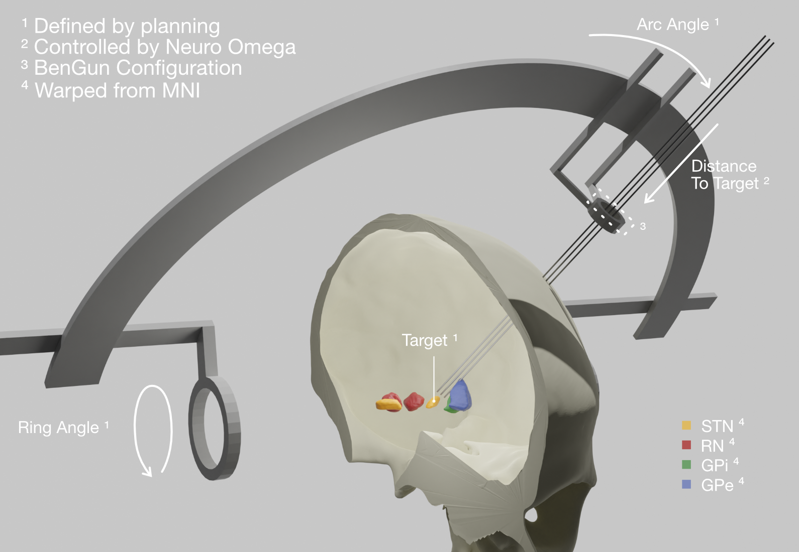
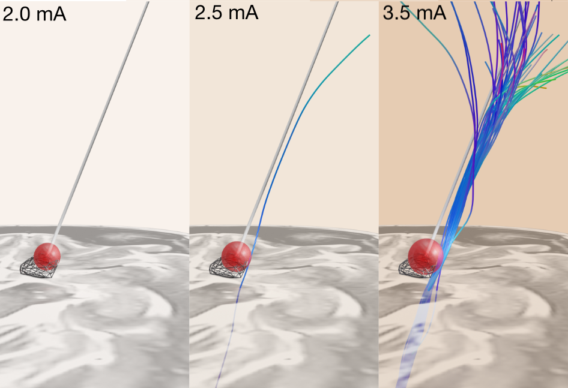

Back to [Projects List](../../README.md#ProjectsList)

# Deep Brain Stimulation Navigation

## Key Investigators

- Simon Oxenford (Charite, Berlin)

# Project Description

### Deep Brain Stimulation

During deep brain stimulation surgery, (depending on the center) micro electrodes are used to reassess the planned trajectory of implantation. The idea of the project is to communicate with the micro electrode's controler in order to get their location and signals. Together with the planning information, these can then be visualised in patient space, including different image modalities, atlases and electrophysiology features.

- Synergy with [PyDBS Project](../VRDisplayPluginForPyDBSUsingZspace/README.md).

### Test Stimulations

Micro electrodes are also used to do test stimulations at increasing steps to induce therapeutic and side effects to better inform final electrode placement.

- Synergy with [TMS Project](../TMS_Slicer_Module/README.md).

### Registration Refinement

In order to achieve higher accuracy of the atlases registration to patient space, we rely on [antsRegistration](https://github.com/simonoxen/SlicerANTs) and we are also working on a module to manually fix for mismatches in the registration output.

- Synergy with image registration in general.

## Objective

<!-- Describe here WHAT you would like to achieve (what you will have as end result). -->

1. Objective A. ...
1. Objective B. ...
1. Objective C. ...

## Approach and Plan

<!-- Describe here HOW you would like to achieve the objectives stated above. -->

1. Describe specific steps of **what you plan to do** to achieve the above described objectives.
1. ...
1. ...

## Progress and Next Steps

<!-- Update this section as you make progress, describing of what you have ACTUALLY DONE. If there are specific steps that you could not complete then you can describe them here, too. -->

1. SlicerNetstim extension added to ExtensionIndex.
1. Preview video of how WarpDrive module works.
1. [Recognized usability and performance improvements to implement.](https://github.com/netstim/SlicerNetstim/issues/3)

# Illustrations

<!-- Add pictures and links to videos that demonstrate what has been accomplished.

-->

# Background and References

<!-- If you developed any software, include link to the source code repository. If possible, also add links to sample data, and to any relevant publications. -->

- [https://github.com/netstim/SlicerNetstim](https://github.com/netstim/SlicerNetstim)
