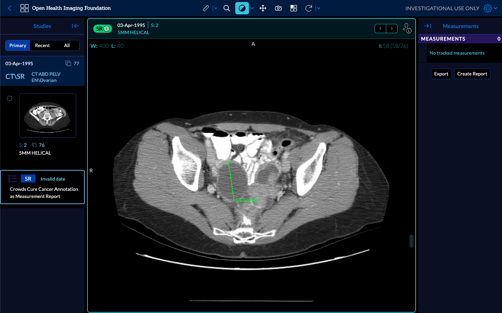
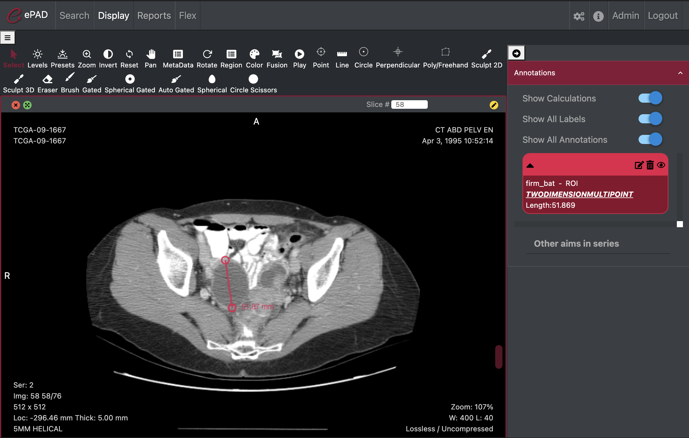
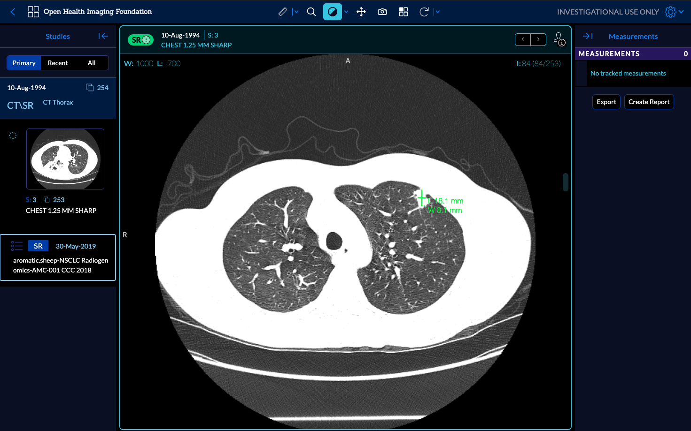
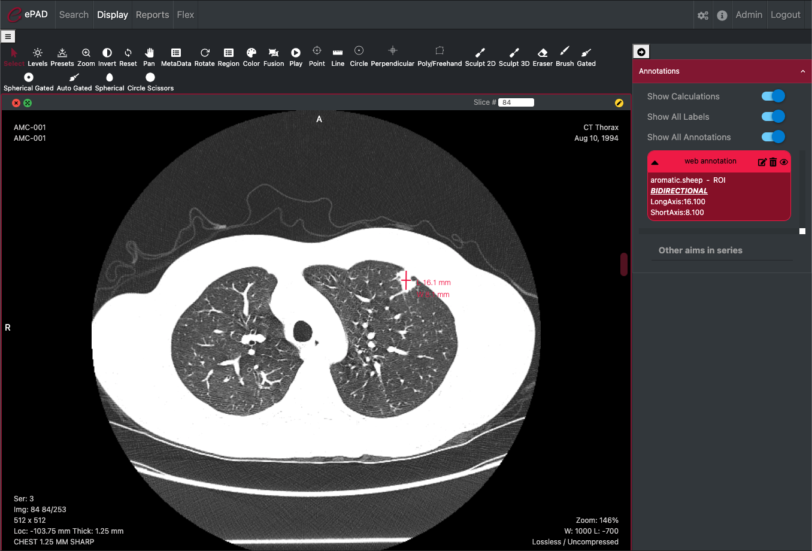
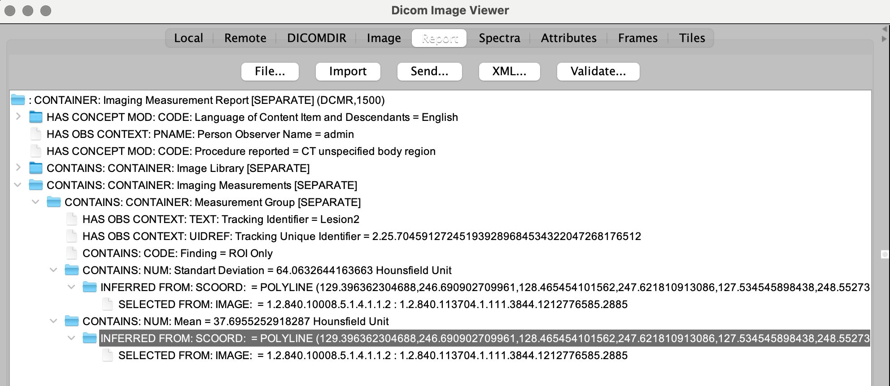

Back to [Projects List](../../README.md#ProjectsList)

# Extending DICOM-SR support in dcmjs and adding test cases

## Key Investigators

- Emel Alkim (Stanford University)
- Steve Pieper (Isomics)
- Andrey Fedorov (Brigham and Women's Hospital, Boston)

# Project Description

<!-- Add a short paragraph describing the project. -->

## Objective

<!-- Describe here WHAT you would like to achieve (what you will have as end result). -->

1. Identify gaps in dcmjs for reading/writing DICOM-SR
1. Add support for freehand and segmentation
1. Convert AIM to DICOM-SR and DICOM-SR to AIM and show interoperability between ePAD, OHIF and Slicer 3D

## Approach and Plan

<!-- Describe here HOW you would like to achieve the objectives stated above. -->

1. Find some test data and generate test cases for Length and Bidirectional
1. Find some segmentation and/or freehand DICOM-SRs, convert to AIM and back
1. Complete freehand and segmentation implementations and add test cases

## Progress and Next Steps

<!-- Update this section as you make progress, describing of what you have ACTUALLY DONE. If there are specific steps that you could not complete then you can describe them here, too. -->

1. dcmjs already has full implementation for Length and Bidirectional
2. aimapi has the draft implementation on for the conversion of AIM to DICOM-SR and back
3. Got test data from Andrey ([https://www.dropbox.com/s/98rylgt25b2sm9r/planar_annotations.zip?dl=0]).
    - The sample has 1 prostate, one lung.
    - They have SCOORD and SCOORD3D instead of measurements to identify polyline and point respectively. dcmjs support is dependent on the measurement existance
    - for point dcmjs point object expects a CONTAINS:NUM:center => inferred from: SCOOR3D: point structure, whereas the sample point has CONTAINS:SCOORD3D:Image Region
    - for polyline (bounding box), dcmjs has no measurement support implemented for freehand. biridectional implemetation is like CONTAINS:NUM:LongAxis => INFERRED FROM: SCOORD: POLYLINE whereas the sample has CONTAINS:COORD:Image Region=POLYLINE => SELECTED FROM: IMAGE
4. Put sample datasets to data releases
    - [Length](https://github.com/dcmjs-org/data/releases/tag/DICOMSR_CCC2017_Length)
    - [Bidirectional](https://github.com/dcmjs-org/data/releases/tag/DICOMSR_CCC2018_Bidirectional)
    - [Point Planar](https://github.com/dcmjs-org/data/releases/tag/DICOMSR_Prostate_X)
    - [Bounding-box Planar](https://github.com/dcmjs-org/data/releases/tag/DICOMSR_PetCtLung_BB)
5. Added reading [tests](https://github.com/dcmjs-org/dcmjs/blob/sr-update-aim/test/test_sr.js) for each shape
6. Added adapter [test sample](https://github.com/dcmjs-org/dcmjs/blob/sr-update-aim/test/test_adapters.js) for bidirectional
7. Implemented freehand DICOMSR writing and reading. And tested it by the conversion of AIM to DICOMSR. [Freehand AIM](https://github.com/RubinLab/epadlite/blob/feature/dicomsr/test/data/sr/freehand.json) [Freehand DICOMSR](https://github.com/RubinLab/epadlite/blob/feature/dicomsr/test/data/sr/freehand.dcm)
    - It uses the TID 300 representation and adds the ROI multiple times for each calculation. David Clunie suggested we use TID 1401, put the ROI first and add the measurements as children. The discussion is on [github PR](https://github.com/dcmjs-org/dcmjs/pull/197). We will fix this as a future work but it needs more discussion about changing the implementation for other shapes and how to support the old DICOM SRs. We will add test cases when the implementation is finalized
8. Converted length and bidirectional sample DICOMSRs to AIMs. Loaded in ePAD and OHIF
9. Remaining gaps:
    - Support for planar ROIs with no measurements
    - Saving and reading TID 1401 template
    - Segmentation implementation
    - The unit of pixel values are either SUV for PETs or HU (otherwise). I added pixelUnit support to the tool, but currently cornerstone tools doesn't support it so it defaults to this behavior
    - Multiple Measurement Groups/ROIs in one DICOMSR
    - Point/Probe shape support

# Illustrations

<!-- Add pictures and links to videos that demonstrate what has been accomplished.

-->
Crowds Cure Cancer 2017 Length in OHIF

Crowds Cure Cancer 2017 Length in ePAD

Crowds Cure Cancer 2018 Bidirectional in OHIF

Crowds Cure Cancer 2018 Bidirectional in ePAD

Freehand DICOMSR in DICOM Image Viewer

# Background and References

<!-- If you developed any software, include link to the source code repository. If possible, also add links to sample data, and to any relevant publications. -->
1. dcmjs library https://github.com/dcmjs-org/dcmjs
1. aimapi library https://github.com/RubinLab/aimapi-js
2. epadlite dicomsr branch https://github.com/RubinLab/epadlite/tree/feature/dicomsr
