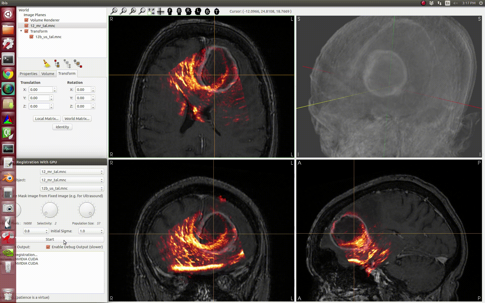

Back to [Projects List](../../README.md#ProjectsList)

# GPU Rigid Registration

## Key Investigators
- Gelel Rezig (Ecole de technologie supérieur, Montréal, Canada)
- Houssem Eddine Gueziri (Montreal Neurological Institute and Hopital, Canada)
- Simon Drouin (Ecole de technologie supérieur, Montréal, Canada)

# Project Description
<!-- Add a short paragraph describing the project. -->
With this project, we would like to add a new feature to Slicer.
The goal of this project is to extract code from an opensource software for image-based neurosurgery guidance: IBIS Neuronav.
This code in C++ aims to perform registration between different images using the GPU. It is located in an IBIS Neuronav 
plugin. Then, it will be implemented in Slicer to be available for all users. 

## Objective
<!-- Describe here WHAT you would like to achieve (what you will have as end result). -->
1. Objective A. Extract the code from IBIS Neuronav
2. Objective B. Create a file usable by Slicer

## Approach and Plan
<!-- Describe here HOW you would like to achieve the objectives stated above. -->
1. Isolate the function in IBIS Neuronav
2. Extract the code
3. Create an executable file for Slicer

## Progress and Next Steps
<!-- Update this section as you make progress, describing of what you have ACTUALLY DONE. If there are specific steps that you could not complete then you can describe them here, too. -->
1. Identification and preparation of usable code :white_check_mark:
- Isolate the code from IBIS and Adapt the code to make it usable outside.
- Creation of a specific library using Cmake.

(You can find all the code on this github link : https://github.com/IbisNeuronav/GPURigidRegistrationLib ) 

2. Implementing functionality on Slicer :hourglass_flowing_sand:

# Illustrations

# Background and References
<!-- If you developed any software, include link to the source code repository. If possible, also add links to sample data, and to any relevant publications. -->
- http://ibisneuronav.org 
- https://github.com/IbisNeuronav/Ibis 
- https://github.com/IbisNeuronav/GPURigidRegistrationLib
