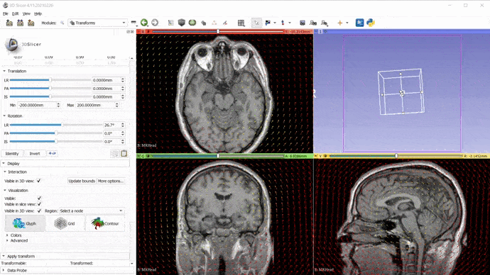
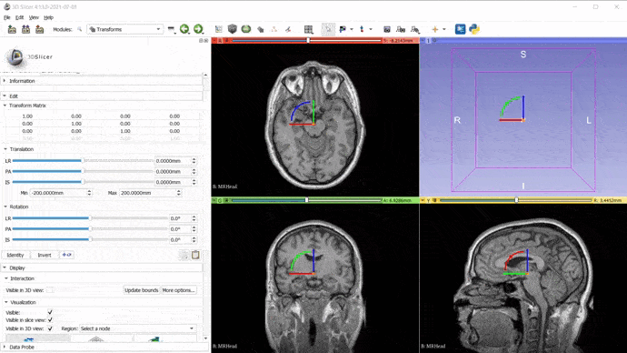
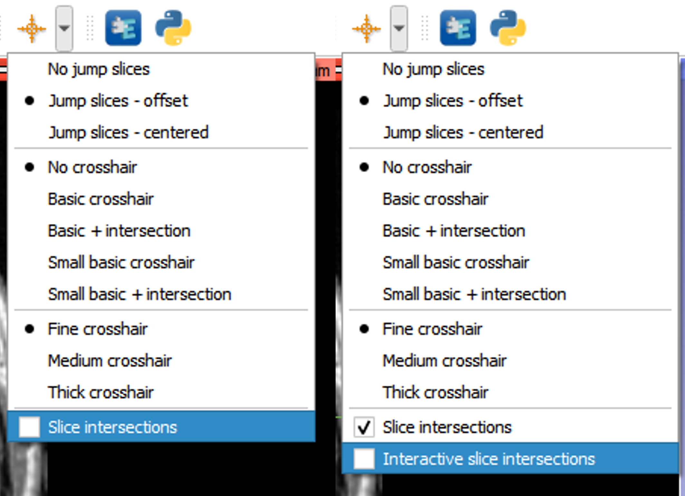
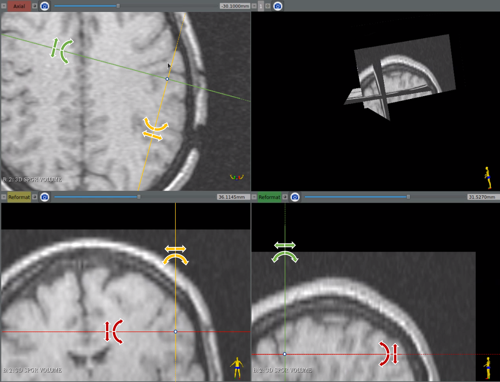

Back to [Projects List](../../README.md#ProjectsList)

# Interactive Slice Intersections

## Key Investigators

- David García-Mato (Ebatinca S.L., Las Palmas de Gran Canaria, Spain)
- Kyle Sunderland (PerkLab, Queen's University, Kingston, ON, Canada)
- Csaba Pinter (Ebatinca S.L., Las Palmas de Gran Canaria, Spain)

# Project Description

Current slice navigation is based on hotkeys like Shift+drag for moving the 3D cursor, or Ctrl+Alt+drag&drop for rotation of the slice planes when slice intersections are shown. It would be great to have these features available more explicitly that could be used directly with the mouse, avoiding the use of keyboard.

In this project, we want to develop an interactive slice intersections mode to enable users to navigate slices using interaction handles (similar to markups translation/rotation).

Details:

- Unlike the intersection lines, the interactive slice representation lines will be drawn from one window border to the opposite, with dash line for the part that does not correspond to the intersection of the planes.
- When the mouse is over the line, a widget appears with translation arrows under the mouse and rotation arrows close to it, with the tip of the arrows oriented towards the center of intersection
- If we click on the translation arrows and move the mouse, the line is translated (these are under the mouse so that this basic feature can be done basically by quick drag&drop)
- If we click on the rotation arrows and move the mouse, the 2 lines are rotated to keep the current angle (the user would need to move the mouse to get to these arrows providing the more advanced feature)
- There is no distinction for the direction of the movement, both sides of the arrows allow to move in both directions
- When the mouse goes close to the intersection center, the widget representation is different (circle at the center, 4 arrows ?) and we can translate both lines (like pressing Shift key)
- When the mouse is over a handle it is highlighted
- When we click on the widget and start moving the mouse, the widget representation is hidden or made mostly transparent (not the lines) to see the underlying image
- We would like to have access to some interaction events, like StartInteractionEvent, ModifiedEvent, EndInteractionEvent at least.

A sketch is shown on the "Illustrations" section below.

More information in this GitHub issue: [here](https://github.com/Slicer/Slicer/issues/5544) 

## Objective

<!-- Describe here WHAT you would like to achieve (what you will have as end result). -->

1. Create base classes to control interaction handles.
2. Develop the interactive slice intersections mode. 
3. Customize slice interaction handles.
4. Test it on sample images.

## Approach and Plan

<!-- Describe here HOW you would like to achieve the objectives stated above. -->

1. Explore the rendering pipeline for current Markups interaction handles (i.e., MarkupsInteractionPipeline class in vtkSlicerMarkupsWidgetRepresentation).
2. Move base class and display options to a lower level.
3. Create new classes vtkMRMLInteractionWidget and vtkMRMLInteractionWidgetRepresentation in DisplayableManager
4. Customize handles to control slice intersection in an intuitive manner.

## Progress and Next Steps

<!-- Update this section as you make progress, describing of what you have ACTUALLY DONE. If there are specific steps that you could not complete then you can describe them here, too. -->

1. Migrate pipelines for generic widget interaction handles from Markups module to new base classes in DisplayableManager (vtkMRMLInteractionWidget and vtkMRMLInteractionWidgetRepresentation)
2. Improve base interaction classes to allow easy implementation of custom interaction handles.
3. Implement interaction handles test case for manipulating transform nodes.

5. Create new classes to render interaction handles for interactive slice intersection: vtkMRMLSliceIntersectionInteractionWidget and vtkMRMLSliceIntersectionInteractionRepresentation.
6. Add new option in ViewersToolbar to select interactive slice intersection mode. This option is only enabled and visible when slice intersection mode is active.

7. TO DO: Customize handles for interactive slice intersection.
8. TO DO: Test new mode in sample images

# Illustrations

# Background and References

- GitHub issue: [here](https://github.com/Slicer/Slicer/issues/5544) 

- Slicer branch for interactive slice intersection: [here](https://github.com/dgmato/Slicer) 

- Current branch for migration of interaction handles: [here](https://github.com/Sunderlandkyl/Slicer/tree/interaction_display_manager)

<!-- If you developed any software, include link to the source code repository. If possible, also add links to sample data, and to any relevant publications. -->
