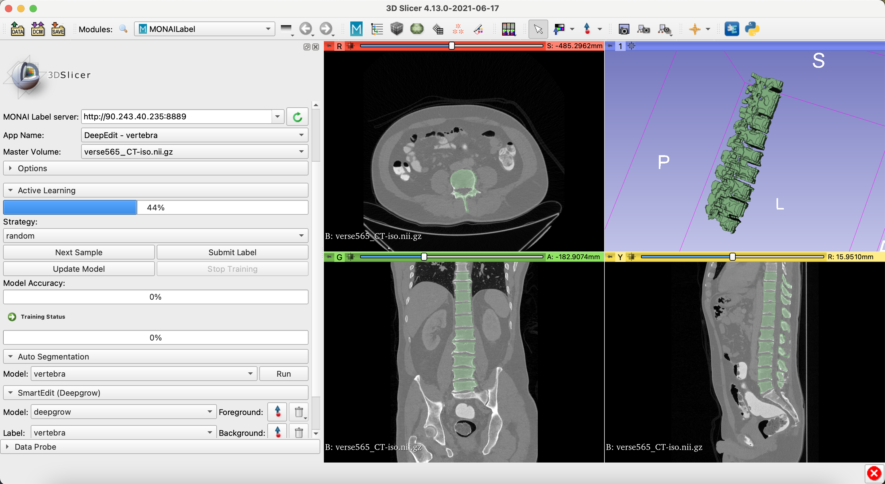

Back to [Projects List](../../README.md#ProjectsList)

# MONAI Label in Slicer

## Key Investigators

- Andres Diaz-Pinto (King's College London)
- Fernando Pérez-García (UCL/KCL)
- Sachidanand Alle (NVIDIA)
- Alvin Ihsani (NVIDIA)
- Vishwesh Nath (NVIDIA)
- Erik Ziegler (Radical Imaging)
- Alireza Sedghi (Queen's University)
- Dennis Bontempi (Maastricht University)
- Andrey Fedorov (Brigham and Women’s Hospital, Boston)
- Steve Pieper (Isomics)

# Project Description

<!-- Add a short paragraph describing the project. -->

Introduce MONAI Label, create new Apps, and implement new features to facilitate medical image segmentation using deep learning.

## Objective

<!-- Describe here WHAT you would like to achieve (what you will have as end result). -->

1. Introduce MONAI Label and the Slicer plugin to all participants
3. Implement MONAI Label Apps to segment spine on CT images and brain left ventricle on MR images
4. Implement a MONAI Label App for multiple label segmentation.
5. Design a data wrapper to connect the Image Data Commons [IDC](https://imaging.datacommons.cancer.gov/) with [MONAI Label](https://github.com/Project-MONAI/MONAILabel)
6. Design [OHIF](https://ohif-platform-docs.netlify.app/) plugin for MONAI Label

## Approach and Plan

<!-- Describe here HOW you would like to achieve the objectives stated above. -->

1. Introduce MONAI Label in breakout session
2. Implement the MONAI Label Apps 
3. Get more practice on the IDC
4. Create DICOM datastore for MONAI Label
5. Plan and discuss features to have in the OHIF plugin

## Progress and Next Steps

<!-- Update this section as you make progress, describing of what you have ACTUALLY DONE. If there are specific steps that you could not complete then you can describe them here, too. -->

1.  [Introduced MONAI Label](Slicer_demo_MONAILabel_29June2021.pdf)
2.  [Create MONAI Label Apps](https://github.com/Project-MONAI/MONAILabel/tree/main/sample-apps)
3.  [Added multilabel support](https://github.com/Project-MONAI/MONAILabel/issues/154)
4.  Data wrapper for IDC and OHIF plugin development will contnue after Slicer week
5.  Data share agreements will be signed to improve vertebra and muscle segmentation after Slicer week

# Illustrations

<!-- Add pictures and links to videos that demonstrate what has been accomplished.

-->

# Background and References

<!-- If you developed any software, include link to the source code repository. If possible, also add links to sample data, and to any relevant publications. -->
[MONAI Label](https://github.com/Project-MONAI/MONAILabel)

[MONAI Label Apps](https://github.com/Project-MONAI/MONAILabel/tree/main/sample-apps)

[Imaging Data Commons](https://imaging.datacommons.cancer.gov/)

[OHIF](https://ohif-platform-docs.netlify.app/)
