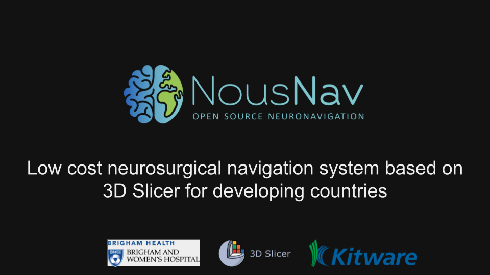
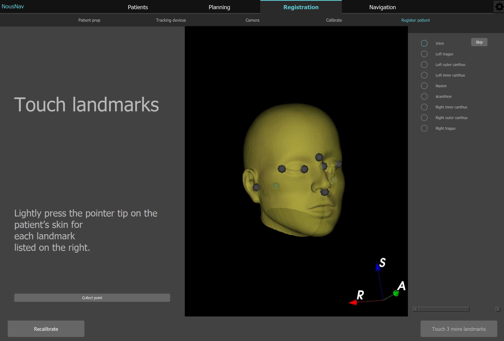
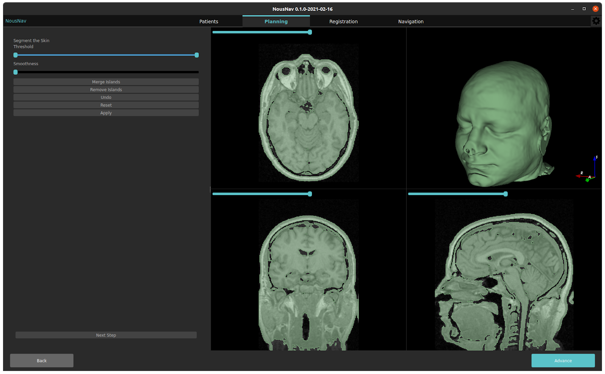
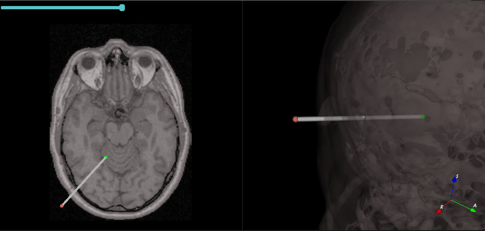

Back to [Projects List](../../README.md#ProjectsList)

# NousNav: Low-cost neuronavigation system

## Key Investigators

- Alexandra Golby (BWH)
- Sam Horvath (Kitware)
- Sarah Frisken (BWH)
- David Allemang (Kitware)
- Tina Kapur (BWH)
- Steve Pieper (Isomics)
- Jean-Christophe Fillion-Robin (Kitware)
- Sonia Pujol (BWH)

# Project Description

The NousNav project is an initiative led by Dr Alex Golby to develop a low-cost neuronavigation system designed for use in low- and middle-income countries.  We are developing a 3D Slicer based application focused on supporting segmentation, registration and navigation tasks.

The project will also include the development of open source hardware desgins for these applications.

## Objective

During the project week, we aim to present the project and identify a specific neuronavigation task for which we can team up with anoher group and address.

1. Put together system demo.
1. Connect with other developers and researchers who are interested in contributing to the project

## Approach and Plan

<!-- Describe here HOW you would like to achieve the objectives stated above. -->

1. Complete registration implementation
1. Demo / discuss the software at the IGT brakout

## Progress and Next Steps

<!-- Update this section as you make progress, describing of what you have ACTUALLY DONE. If there are specific steps that you could not complete then you can describe them here, too. -->

1. :heavy_check_mark: Improved application based on testing of Planning/Registration/Navigation workflow
   1. Integrated UI for placing fiducials during planning. See [PR #98](https://github.com/NousNav/NousNav/pull/98)
   2. Fix minimum threshold value in skin segmentation. See [PR #99](https://github.com/NousNav/NousNav/pull/99)
   3. Created [demo-version](https://github.com/NousNav/NousNav/commits/demo-version) branch with tweaks and improvements
      1. Update Motive profile
      2. Setup registration verification page
      3. Add intial layout for navigation section
1. :heavy_check_mark: Recorded and edited a ~2-min video showcasing the complete Planning, Registration and Navigation workflow. See [video](https://drive.google.com/file/d/1cfWCd2-31rGxKGYWsacnr5M6aInSOAty/view?usp=sharing)
1. ...

| Click on the image below to see the video |
|----|
| |

# Illustrations

<!-- Add pictures and links to videos that demonstrate what has been accomplished.

-->

# Background and References

<!-- If you developed any software, include link to the source code repository. If possible, also add links to sample data, and to any relevant publications. -->
