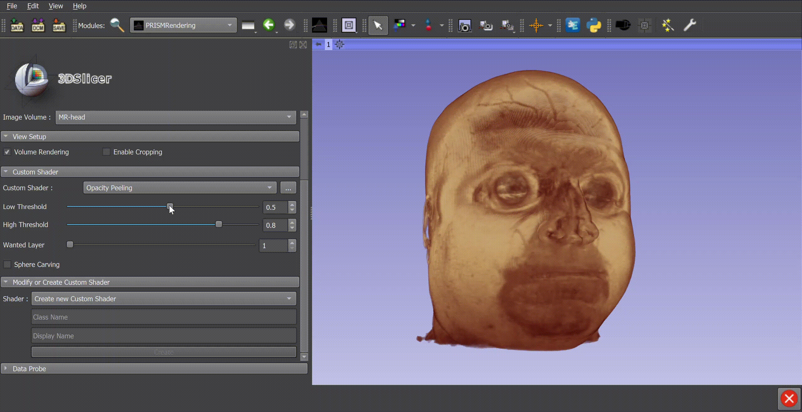

Back to [Projects List](../../README.md#ProjectsList)

# PRISM Volume Rendering

## Key Investigators

- Simon Drouin, ETS Montreal
- Steve Pieper, Isomics, Cambridge MA, USA
- Kyle Sunderland, PerkLab, Queen’s University, Canada 
- Andrey Titov, ETS Montreal
- Rafael Palomar, Oslo University Hospital / NTNU, Norway

# Project Description

The goal of this project is to enable the development of advanced 3D rendering techniques in Slicer. The goal is to facilitate access to GPU shaders and enable GPU-based filtering in Slicer by improving shader access multipass rendering in VTK and Slicer. The [PRISM Module](https://github.com/ETS-vis-interactive/SlicerPRISMRendering) in Slicer will serve as a test environment for the new capabilities.

## Objective

1. Facilitate the development and debugging of GPU shaders for Slicer
2. Extend the principles introduced in the PRISM module to surface rendering and other types of rendering
3. Integrate work by Kyle Sunderland on VTK GPU image filters (see branch [here](https://github.com/Sunderlandkyl/VTK/commits/vtkGPUImageFilter3)) so that the filters are usable in Slicer
4. Integrate GPU filters with volume rendering in such a way that filtered volumes do not have to be transfered back to CPU memory before rendering 

## Progress and Next Steps

1. All parties met on Monday to discuss the required functionality in VTK and Slicer to enable more advanced rendering effects:
    1. The current VTK mechanism to modify shaders is limited
    2. It makes it difficult to combine different effects
    3. Development is difficult because the complete shader in not accessible
    4. Rafael: In Slicer, there is a need for a system that arbitrate the modification of shaders by different modules
    5. The Slicer shader property node is available only for volume rendering. The feature could easily be ported to surface rendering to facilitate the editing of surface shader
1. Previous efforts by Simon Drouin were made to facilitate shader debugging. Code is available in [this branch](https://gitlab.kitware.com/drouin-simon/vtk/-/tree/volume-shader-readability). The code still needs work to enable a debug mode where shader code can be kept in memory with additional tags to facilitate development. 

### Next steps
* Move vtkShaderProperties to the vtkMRMLDisplayNode level
* Explore custom rendering to simplify integration with the vtk render process.  Prior work includes:
  * Python scripted Actor/Mappers: https://www.slicer.org/wiki/Slicer3:Python:ScriptedActor
  * SimpleMapper: https://github.com/IbisNeuronav/Ibis/tree/master/IbisVTK/vtkExtensions

# Illustrations

# Background and References

<!-- If you developed any software, include link to the source code repository. If possible, also add links to sample data, and to any relevant publications. -->
- PRISM Module [GitHub repository](https://github.com/ETS-vis-interactive/SlicerPRISMRendering).
- [Original article](https://journals.plos.org/plosone/article?id=10.1371/journal.pone.0193636) about the PRISM framework that served as a basis to develop the PRISM module in Slicer
- Previous project weeks
  - https://projectweek.na-mic.org/PW30_2019_GranCanaria/Projects/GLSLShaders/
  - https://projectweek.na-mic.org/PW28_2018_GranCanaria/Projects/MultiVolumeRendering/
  - 
