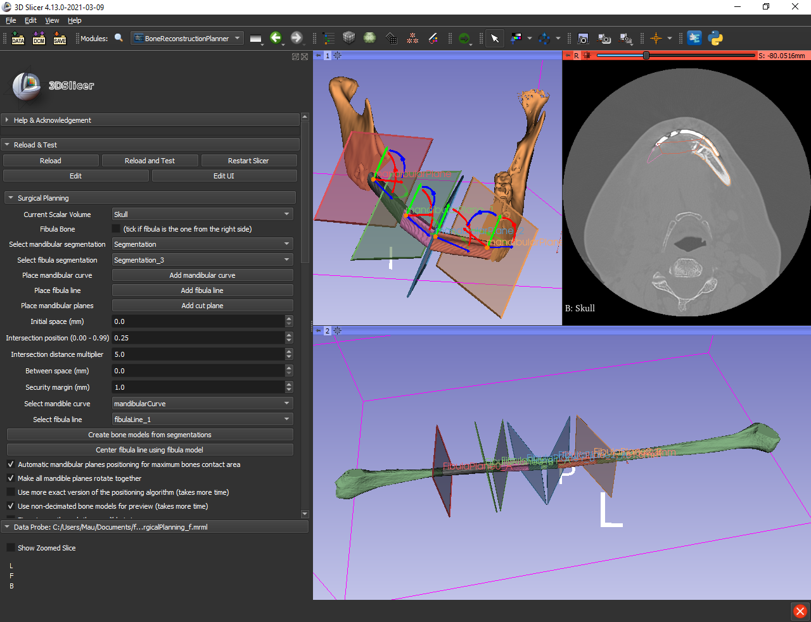
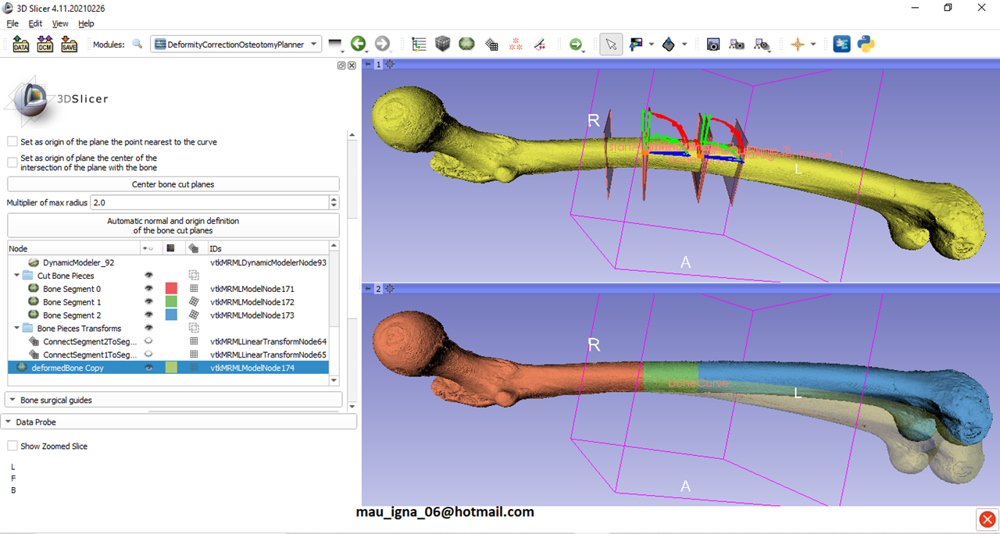
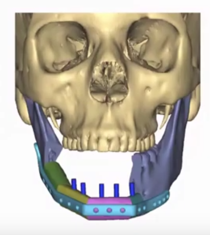
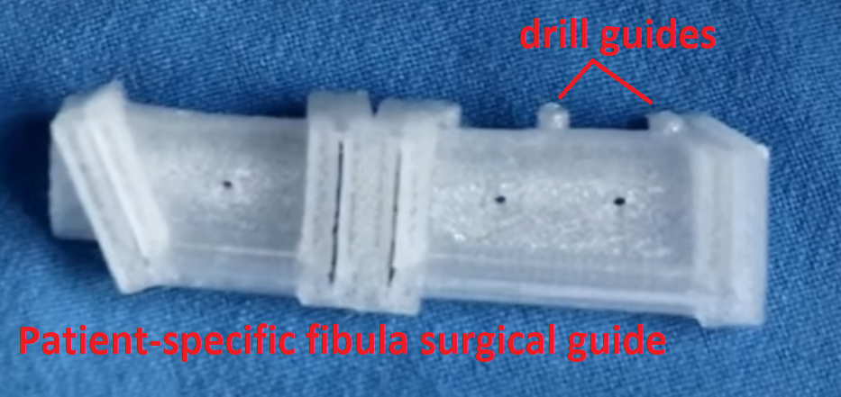
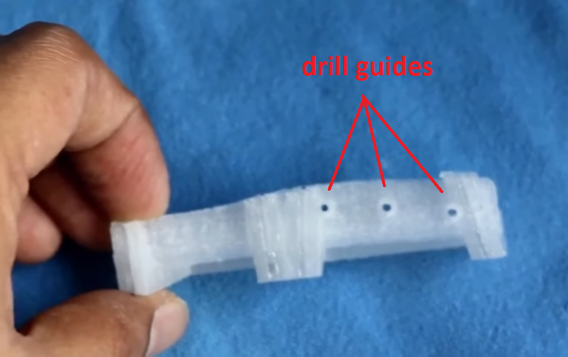
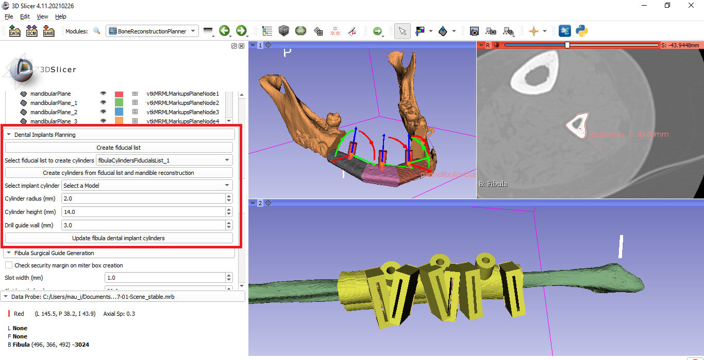

Back to [Projects List](../../README.md#ProjectsList)

# Planar Osteotomies Virtual Surgical Planning And Patient-Specific Surgical Guides

## Key Investigators

- MSc. Mauro I. Dominguez
- Dr. Manjula Herath
- PhD. Andras Lasso

# Project Description

Slicer infrastructure is ready to plan any kind of planar cuts if involved tissues are segmentable and rigid (e.g. bones) and it is possible to simulate the corresponding reconstructions.

With the addition of vtkbool to Slicer's Sandbox extension it is now possible to do boolean operations that allow to create patient-specific surgical guides.

Having in mind the previous comments two Slicer modules were created:
- BoneReconstructionPlanner for virtual surgical planning of mandibular reconstruction with vascularized fibula free flap and generation of patient-specific surgical guides.
- DeformityCorrectionOsteotomyPlanner for virtual surgical planning of long-bone deformity correction by closing-wedge osteotomies and generation of patient-specific guides.

BoneReconstructionPlanner has been already used in 3 surgeries.

DeformityCorrectionOsteotomyPlanner has achieved virtual surgical planning and patient-specific guides feature is on development. This module will be added to BoneReconstructionPlanner extension when it's ready.

## Objective

<!-- Describe here WHAT you would like to achieve (what you will have as end result). -->

1. Objective A. Help new developers that want to make available a planning module for a non-covered kind of surgery.
1. Objective B. Add dental implants planning to BoneReconstructionPlanner and drill guides to the fibula-surgical-guide.
1. Objective C. Add kirschner wires planning and positioning to the surgical-guide on DeformityCorrectionOsteotomyPlanner

## Approach and Plan

<!-- Describe here HOW you would like to achieve the objectives stated above. -->

For dental implant planning on BoneReconstructionPlanner:
1. Make GUI to position/orient the dental implants.
1. Define transforms from reconstructed-mandible to fibula
1. Create drill guides on the fibula-surgical-guide using the previously created transforms for position/orientation.

For kirschner wires planning on DeformityCorrectionOsteotomyPlanner:
1. Make a fixation plate 3D model and corresponding well-placed kirschner wires (cylinders).
1. Make a registration of fixation plate algorithm
1. Define transforms from corrected-bone to deformed-bone.
1. Create kirchner-wire-guides on the deformed-bone-surgical-guide using the previously created transforms for position/orientation.

## Progress and Next Steps

<!-- Update this section as you make progress, describing of what you have ACTUALLY DONE. If there are specific steps that you could not complete then you can describe them here, too. -->

1. New code available at [DentalImplantsBranch](https://github.com/SlicerIGT/SlicerBoneReconstructionPlanner/tree/DentalImplantsBranch) of BoneReconstructionPlanner project.
1. Dental Implants Surgical Planning.
1. Corresponding Drill Guides on Fibula Surgical Guides.

# Illustrations

<!-- Add pictures and links to videos that demonstrate what has been accomplished.

-->

## Achieved till the start of Project Week

- Mandibular Reconstruction Virtual Surgical Planning:

- Mandibular Reconstruction Patient-specific Surgical Guides (mandible and fibula guides):

- Deformity Correction Virtual Surgical Planning:

## Desired work to be finished on project week:

- Dental Implants Virtual Surgical Planning on Mandibular Reconstruction:

- Dental Implants guides on Fibula Surgical Guide

## Achieved on Project Week

- Dental Implant Planning for reconstructed mandible and Drill Guides on the Fibula Surgical Guide

# Background and References

<!-- If you developed any software, include link to the source code repository. If possible, also add links to sample data, and to any relevant publications. -->

[BoneReconstructionPlanner project](https://github.com/SlicerIGT/SlicerBoneReconstructionPlanner).

[DeformityCorrectionOsteotomyPlanner project](https://github.com/mauigna06/SlicerDeformityCorrectionOsteotomyPlanner).
