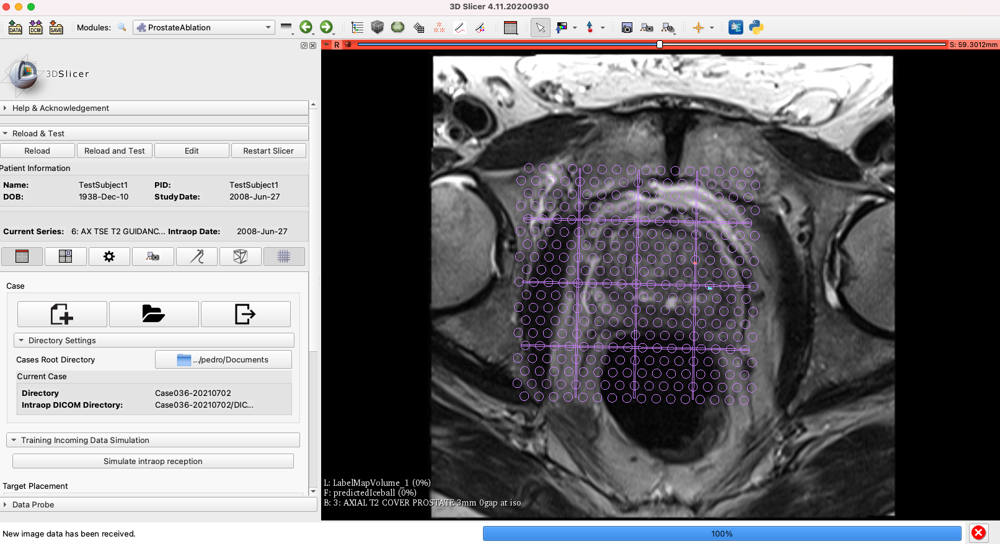
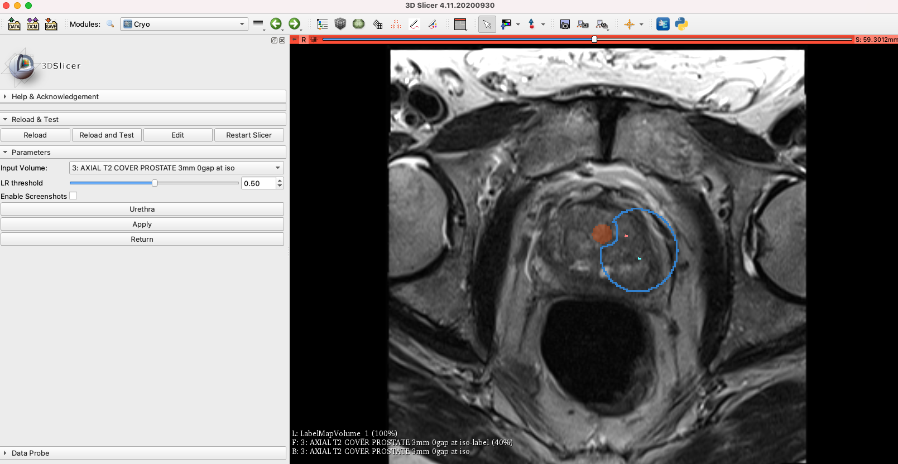
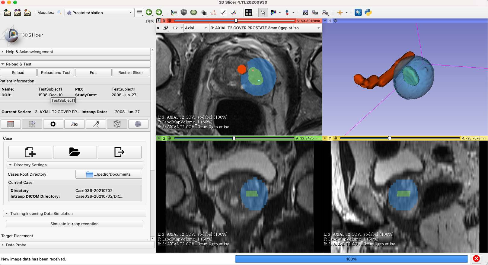
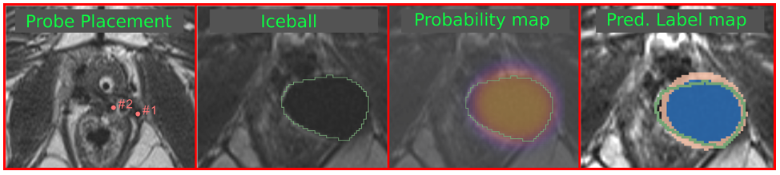

Back to [Projects List](../../README.md#ProjectsList)

# Slicer module for planning MR-guided focal cryoablation of prostate cancer

## Key Investigators

- Pedro Moreira (BWH)
- Nicholas Fordham (BWH)

# Project Description
Prostate cancer (PCa) recurrence after radiotherapy may affect 10 to 60% of patients within 5-10 years after treatment.
Salvage prostatectomy of post-radiation recurrent PCa is challenging because of radiation-induced fibrosis and shrinkage of the prostate gland.
Minimally invasive focal cryoablation has been selected as an alternative salvage treatment for PCa post-radiation recurrence. Safe and effective focal cryoablation requires the deployment of the cryo-needles at optimal locations so that the created lethal ablation zone fully encompasses the tumor while preserving surrounding healthy tissues.
Currently, physicians rely on the pre and intraoperative images and their own experience to define the best cryo-needle locations and manually insert them using a grid template. However, predicting the final shape of the lethal ablation zone is challenging as it will depend on several patient-specific factors such as proximity to heat sources and thermal properties of the prostatic tissue. The primary objective of this project is to develop a planner to maximize the amount of the target volume encompassed by the defined isotherm while sparing critical structures. The planner will use a data-driven approach to estimate the visible iceball using a logistic regression model and consider a safety margin to define the best cry-needle placement. Our ultimate goal is to develop a 3D Slicer module for MR-guided focal cryoablation ready to be used in clinical procedures
## Objective

<!-- Describe here WHAT you would like to achieve (what you will have as end result). -->

1. Objective A. Modify the current module for Python 3 (Slicer 4.11)
2. Objective B. Implement a iceball prediction algorithm
3. Objective C. Integrate the prediction and the current Module used for MRI-guided cryoablation
4. Objective D. Implement a optimal planning algorithm in 3D Slicer

## Approach and Plan

<!-- Describe here HOW you would like to achieve the objectives stated above. -->

1. Change the current module to work with Slicier 4.11
3. Create a module with the logistic regression model
4. Test the algorithm with retrospective data

## Progress and Next Steps
### Update to python 3
Pedro did the modifications to addapt the current module to Python3. Most of the errors were related to dict_keys and managing the markups. We also had a problem loading the DICOM files, but was fixed replacing "slicer.util.loadVolume" by "self.scalarVolumePlugin.load". There are still some miror errors that has to be address within next week.

Figure 1: ProstateAblation module

### Statistical model to predict the iceball
We've developed a module this week that capture the desired probe location defined by the physician on the ProstateAblation module, a few points along the urethra, and uses the logistic regression presented on CARS2020 [1] to estimate the final iceball. The user can also define the threshold to select the sensitivity of the logistic regression. The code is still quite slow as it goes through the entire image, future implementation should use a ROI around the probe location. We are also working on displaying the total volume of the iceball and the minimum ablation margin. According to the literature, an ablation margin around 5mm is desirable.

Figure 2: The blue segmentation is the estimated iceball given the probe location and the segmented urethra.

Figure 3: Integration of the iceball estimation and the ProstateAblation module. the ablation target is marked in green, while the estimated iceball is in blue.

One of the advantages of the current approach is the prediction and the vizualization of the ablation margins in 3D, However, we still need to discuss the best way to vizualize the prediction and planning results. We should meet the Dr. Tuncali soon to get his input.

### Data curation
Nick is working on the cryoablation database to segment all intraprocedure images. We currently have data of 44 cases, but it is still not publicly available.

## Next Steps

1. Implement the search/optimization algorithm to suggest the optimal number of probes and its locations to the physician.
2. CLEAN THE CODE and fix the current issues.
3. Test the planner and predictor using retrospective data

# Illustrations

# Background and References

[1] Moreira P, Tuncali K, Tempany C and Tokuda J, A data-driven approach to predicting lethal temperature isotherm in MRI-guided focal cryoablation, in CARS 2020 Computer Assisted Radiology and Surgery, Munich, Germany, June 2020.
[2] ProstateAblations module https://github.com/pedrolfm/SlicerProstateAblation
[3] Iceball estiamtion https://github.com/pedrolfm/IceballEstimation
<!-- If you developed any software, include link to the source code repository. If possible, also add links to sample data, and to any relevant publications. -->
