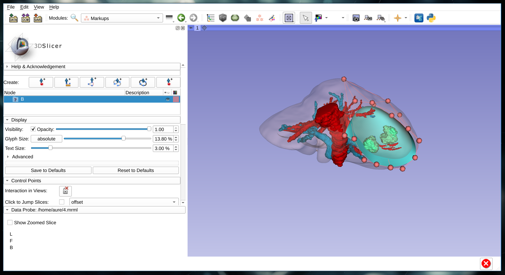

Back to [Projects List](../../README.md#ProjectsList)

# Slicer-Liver: liver resection planning in 3D Slicer

## Key Investigators

- Rafael Palomar (Oslo Unviersity Hospital and NTNU)
- Gabriella d'Albenzio (Oslo University Hospital)
- Ole Vegard Solberg (SINTEF)
- Geir Arne Tangen (SINTEF)

# Project Description

<!-- Add a short paragraph describing the project. -->

This project will kick-start the development of the *Slicer-Liver* extension
that will be developed through the [ALive project](https://alive-research.no).
The objective of the Slicer-Liver extension is to provide researchers
with tools to perform liver analytics towards planning of liver interventions
(resections, ablations). At this point in the project we need to port early
prototypes of our resection planning algorithms into 3D Slicer.

[Early prototype of the resection planning module](https://youtu.be/7M3DULQp81k)

## Objective

<!-- Describe here WHAT you would like to achieve (what you will have as end result). -->

1. Integrate liver resection planning tools in a 3D Slicer extension.

## Approach and Plan

<!-- Describe here HOW you would like to achieve the objectives stated above. -->

1. Development of a resection initialization widget using markups and shaders.
1. Development of a deformables surface using markups.
1. Development of interaction between the initialization markups and the deformable surface.
1. Development of distance measurements visualized in the resections using shaders.
1. Add a GUI to manage resections.

## Progress and Next Steps

The core components of the planning platform have been developed but not
integrated together. Shaders and pluggable markups infrastructure have been used
for the development of the resection initialization, but are not yet integrated
for visualization of other measurments (e.g., safety margins).

Our next steps are :
1. Integrating all the resection components together
2. Develop a Qt UI to drive the process
3. Improve stability -- software testing
4. Improve performance -- wider use of shaders

# Background and References
1. [NorMIT-Plan at NA-MIC project week](https://projectweek.na-mic.org/PW34_2020_Virtual/Projects/SlicerLiverAnalysis/) (December 2020)
1. [NorMIT-Plan at NA-MIC project week](https://projectweek.na-mic.org/PW33_2020_GranCanaria/Projects/NorMIT-Plan/) (january 2020)
1. Palomar, Rafael, et al. "A novel method for planning liver resections using deformable Bézier surfaces and distance maps." Computer Methods and Programs in Biomedicine 144 (2017): 135-45.
1. Palomar, Rafael, et al. "Surface reconstruction for planning and navigation of liver resections." Computerized Medical Imaging and Graphics 53 (2016): 30-42.
