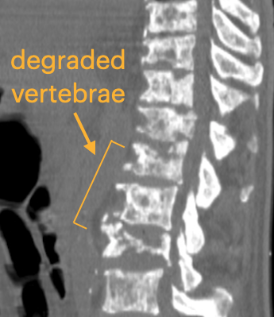
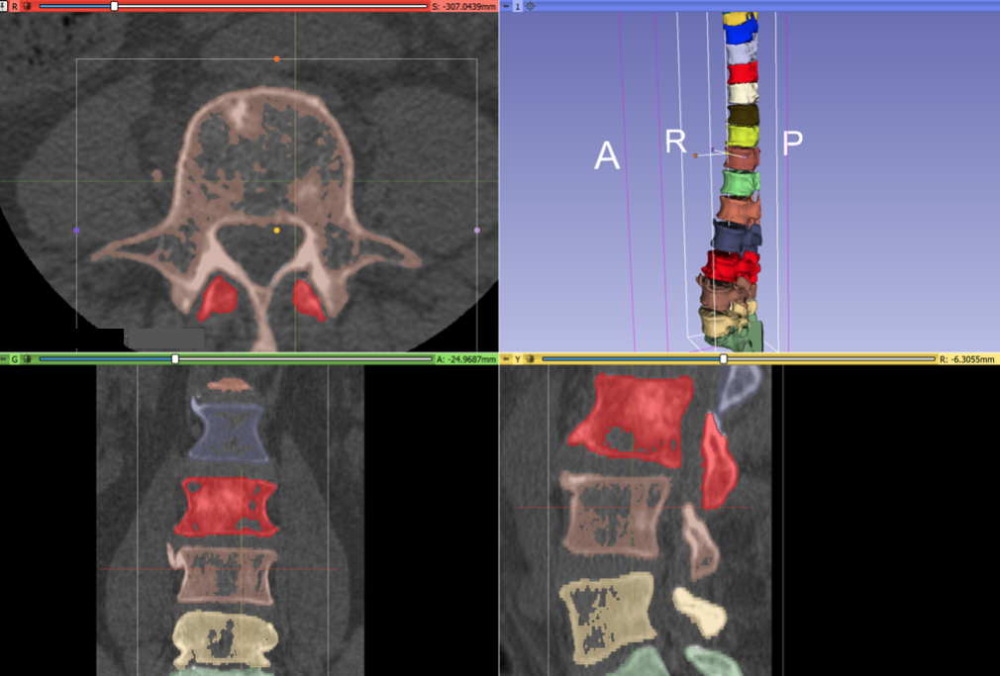

Back to [Projects List](../../README.md#ProjectsList)

# Development of Deep Learning Segmentation for Spines with Metastatic Disease 

## Key Investigators

- Ron Alkalay (Beth Israel Deaconess Medical Center)
- Curtis Lisle  (KnowledgeVis,LLC)
- Andres Diaz-Pinto (Kings College Longon) 
- Andras Lasso (Queens University)

## Project Description

We have labeled CT data sets for lumbar and/or thoracic as well as full spine columns for 
patients at baseline. For a good # of patients, we also have 3 and 6m follow-up CT, but these are 
not yet labeled.  It would be great to get some help/advice regarding how to 
speed up the segmentation for the labeling and extraction of volume information from the masks.
The segmented volumes are needed for the analytical and computational modeling pipeline 
as part of a collaboration with MIT. Lytic spines present a special segmentation challenge because the interior of
vertibrae have degraded and appear like surrounding tissue in CT scans.

## Objective

<!-- Describe here WHAT you would like to achieve (what you will have as end result). -->

1. Objective A. Setup MONAI-based neural network training on the labeled scans. 
1. Objective B. Investigate using MONAILabel as a possibly better way to annotate new scans. 
1. Objective C. Train a DNN on the labeled data.  Can this model be used in MONAILabel? 
1. Objective D. Find a path forward to better annotation using DL-assisted segmentation.

## Approach and Plan

<!-- Describe here HOW you would like to achieve the objectives stated above. -->

1. Start with publically available VerSe spine dataset.
1. Evaluate MONAILabel from Andres using model trained on VerSe as a segmentation tool for these lytic spines.  How good is segmentation? 
1. Consider fine-tuning model in MONAILabel with lytic spines from our dataset
1. Train model on only our lytic spines for comparison
1. Install MONAILabel on GPU hardware at BI to setup for better annotation after project week

## Progress and Next Steps

<!-- Update this section as you make progress, describing of what you have ACTUALLY DONE. If there are specific steps that you could not complete then you can describe them here, too. -->

1. Received permission to share a few cases with collaborators
1. Acquired GPU hardware.  Evaluated installing Linux, WSL, and Conda-on-windows. Settled on Windows
2. Andres Diaz-Pinto used the VerSe spine dataset to create a MONAILabel vertebrae segmentation app
3. Curt was able to install and run MONAILabel locally 
4. Andras Lasso helped with a script to fill internal holes in the vertebrae
5. Segmentation Editor performance is improved with the VTK9 version of Slicer and Andras engineering fixes
6. Curt started preparing for ML training of a network using Ron's improved annotations, but this is still in progress.
7. **Next Steps:** Improve segmentations for the remaining annotated spines and use in MONAILabel.
8. **Next Steps:** identify any other collaborators interested to continue working on this project; eventually expanding to include nearby muscle and disks

### Complete protocol for semi-automatic spine segmentation

This protocol can be used to quickly and accurately segmentat the spine (each vertebra in a separate segment; no internal holes), which can be used as training data for deep learning based segmentation:
- Define a bone threshold using Threshold effect and use that as a mask (do not Apply the threshold). Choose a threshold value that only selects bones, not soft tissues. Cancellous bone inside the vertebrae will be missed, but those holes will be filled in a later step.
- Paint a seed in each vertebra with a different color in a sagittal slice. Paint seed in an axial slice for one of the vertebrae.
- Use "Grow from seeds effect" to segment the entire spine automatically. Adjust seeds as needed, then finalize the segmentation by clicking Apply.
- Fill holes inside the vertebrae by copy-pasting [this script](https://gist.github.com/lassoan/0f45db8bae792ea19ccad36ceefbf52d) into the Python console.

## Illustrations

<!-- Add pictures and links to videos that demonstrate what has been accomplished.

-->
Here is an example of how the degraded vertebrae look in CT scans and the challenges of segmentation in Slicer. 
Note the interior holes because of the heterogeneous nature of the lytic bone.

Because the bone in the spines is degraded from cancer, it is difficult to get a good segmentation.  Here is the result of several hours of manual segmentation:

During the project week, we received consulting assistance on segmentation techniques from Andras Lasso and Rudolf Bumm.  After Andras' wrote us a post-processing script, the final result of registration is much better.  These annotations can be used for neural net training:

Here is the MONAILabel server and Slicer Module running on Curt's workstation.  The app created annotations of vertebrae automatically created by a neural network trained using the VerSe spine dataset.  This app works for interactively improving the segmentation through editing (using the deepedit algorithm):

Development was started for training a standalone neural network model, also using the MONAI framework.  Here is a sample training image showing a portion of the spine vertibrae and the corresponding label going into the neural network for training.  This shows why it was critical to achieve solid annotations for the interior portions of the vertebrae:

## Background and References

<!-- If you developed any software, include link to the source code repository. If possible, also add links to sample data, and to any relevant publications. -->

[VerSe: A Vertebra Labelling and Segmentation Benchmark](https://www.researchgate.net/publication/338853005_VerSe_A_Vertebrae_Labelling_and_Segmentation_Benchmark).

