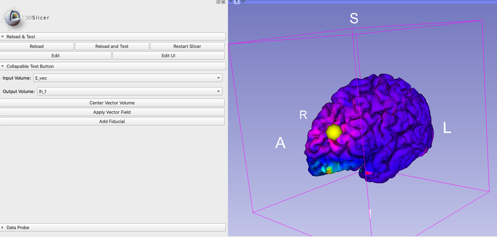
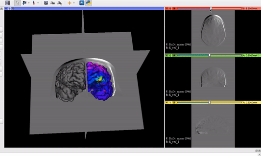
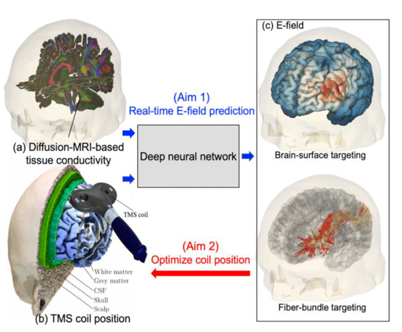

Back to [Projects List](../../README.md#ProjectsList)

# Real-time visualization in transcranial magnetic stimulation (TMS)

## Key Investigators

- Loraine Franke (University of Massachusetts Boston)
- Lipeng Ning (BWH & Harvard Medical School)
- Yogesh Rathi (BWH & Harvard Medical School)
- Steve Pieper (Isomics, Inc.)
- Daniel Haehn (University of Massachusetts Boston)

# Project Description

Transcranial magnetic stimulation is a nonivasive procedure used for treating depression with magnetic and electric fields to stimulate nerve cells. 
A TMS coil is slowly moved over the subject's head suface to target certain areas in the brain. 
Our project aims to develop a deep-learning powered software for real-time E-Field prediction and a visualization of TMS within 3D Slicer.

## Objective

Real-time visualization of an electric field (E-field) for transcranial magnetic stimulation (TMS) on the brain surface as well as visualizing the E-field along fiber bundles (DTI), and later the possibility to optimize the exact coil position or to target certain fibers.

## Approach and Plan

Integrate the visualization process as a new module within the MRML scene architecture:

- Evaluate different methods to visualize the E-field on the surface mesh (find fastest method which is appropriate for a real-time visualization)
- Rendering of a virtual TMS coil in the 3D Slicer module
- Develop an approach to move/rotate the coil model over the brain surface in 3D Slicer (similar to markups/fiducials)

## Progress and Next Steps

<!-- Update this section as you make progress, describing of what you have ACTUALLY DONE. If there are specific steps that you could not complete then you can describe them here, too. -->
1. Visualize Efield (volume) on brain surface (polydata/mesh) by adjusting the models orientation and applying the vtkProbeFilter within a new Slicer Module.
2. Tested the rendering time of our visualization approach with renderer.GetLastRenderTimeInSeconds() resulted in an average of 0.8 milliseconds.
3. Added a functionality to create fiducials and to move it along the brain model's surface.

Next steps: 
- Replace the fiducial with a TMS coil model.
- Compare with further methods for rendering time (vtkpointlocator, cppyy, manual with optimized storage)
- Apply vector field visualization on tractography data / pick fibers (similar to [DBS Navigation](../DBSNavigation/README.md) ).

## Illustrations

Fiducial (yellow sphere) moving along the brain surface with mapped vector field:

The fiducial in this screenshot will later be replaced by a TMS coil model.

The vector field volume and the brain surface mesh overlapping after applying the module's functionalities:

Visualization goal from another software we want to implement as Module in 3D Slicer:

Visualization process also on tractography for fiber bundle targeting:

# Background and References

vtkProbeFilter: https://vtk.org/doc/nightly/html/classvtkProbeFilter.html
Moving fiducials with CPYY: https://gist.github.com/pieper/f9da3e0a73c70981b48d0747132526d5

Measure rendering time in 3D Slicer:
1. Getting renderer: https://slicer.readthedocs.io/en/latest/developer_guide/script_repository.html#access-vtk-views-renderers-and-cameras
2. Then applying renderer.GetLastRenderTimeInSeconds()

- Random note following the project presentations: https://cyclotronresearchcentre.github.io/forward/ might be useful for using diffusion-weighted imaging to compute conductivity tensors in the white matter to make the electromagnetic simulations more accurate.
