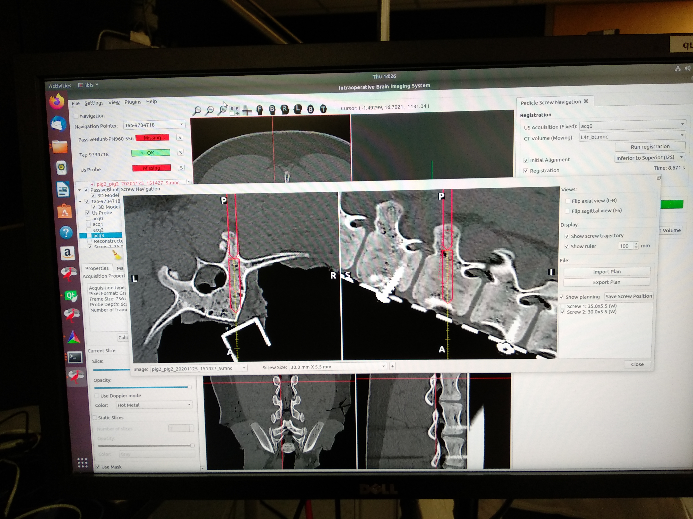

Back to [Projects List](../../README.md#ProjectsList)

# US-CT Vertebra Registration

## Key Investigators

- Houssem Gueziri (Montreal Neurological Institute, Montreal, Canada)
- Tamas Ungi (Queen's University, Kingston, Canada)

# Project Description

This project aims at evaluating the feasibility of percutaneous US to CT image registration, on a porcine dataset, for minimally invasive spine surgery. 
The goal is to combine the registration method for _open_ surgery implemented in IBIS with the segmentation/bone enhancement method in AIGT.

## Objective

<!-- Describe here WHAT you would like to achieve (what you will have as end result). -->

1. Read/Write US data acquired with IBIS into Slicer.
3. Segment the vertebral surface of US data obtained from porcine cadavers
4. Register segmented images with CT images

## Approach and Plan

<!-- Describe here HOW you would like to achieve the objectives stated above. -->

1. Convert the data from IBIS acquisitions to ultrasound sequences
2. Generate ground truth segmentation from CT images
3. Use AIGT to train model for axial image segmentation
4. Use segmented data with IBIS registration and evaluate registration

## Progress and Next Steps

<!-- Update this section as you make progress, describing of what you have ACTUALLY DONE. If there are specific steps that you could not complete then you can describe them here, too. -->

- 

# Illustrations

<!-- Add pictures and links to videos that demonstrate what has been accomplished.

-->

Data processing workflow

Navigation with IBIS

# Background and References

<!-- If you developed any software, include link to the source code repository. If possible, also add links to sample data, and to any relevant publications. -->