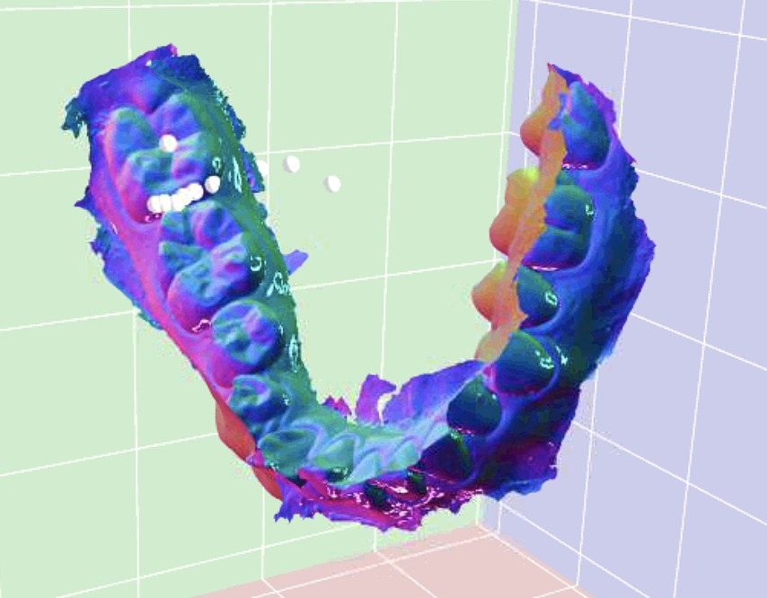

Back to [Projects List](../../README.md#ProjectsList)

# ALIIOS - Automatic Landmarks Identification for Intra OralScans

## Key Investigators
    Baptiste Baquero
    Maxime Gillot 
    Lucia Cevidanes
    Juan Carlos Prieto
    

# Project Description

<!-- Add a short paragraph describing the project. -->
The intraoral scanner is a new tool for clinicians that allows new perspectives of development in the dental field and more particularly in orthodontics. 
For clinicians, it is important to quantitatively evaluate and compare their results on a large number of data. They need information about distance and
angle from the 3D coordinates of the dental landmarks. 42 dental landmarks are digitized manually for each patient by orthodontists and clinicians, but manual 
processing is really problematic because it's time consuming and accuracy errors can regularly be found. Therefore, proposing a robust, fast and accurate method
to automatically find landmark can assist clinicians in those important but time consuming tasks. In this article, we will explore techniques to automate the
search for these landmarks from a 3D digital dental model and the 3D landmark coordinates. We are going to work on deep learning techniques to allows models to 
determine by itself image features to better capture the complex anatomical variation and find the perfect landmark position on the teeth. 

## Objective

<!-- Describe here WHAT you would like to achieve (what you will have as end result). -->
The goal is to have a model that automatically finds accurate landmarks on the digital dental model.

## Approach and Plan

<!-- Describe here HOW you would like to achieve the objectives stated above. -->

1. Develop a deep reinforcement learning (RL) framework using the dental models in an environment. 
2. Develop an algorithm that allows virtual agents to navigate the environment
3. The reward function for the agent consists on placing the landmark on the correct location

## Progress and Next Steps

<!-- Update this section as you make progress, describing of what you have ACTUALLY DONE. If there are specific steps that you could not complete then you can describe them here, too. -->
Previous work :
1. The camera is the agent. We had one agent for one landmark. For each camera, we initialized the focal point to the center of the tooth. The output of the
neural network returns the movement of the camera and movement of focal point. We tried this method for just one tooth, and for all the jaw.
2. We tried to create a sphere of cameras and the agent is the center of the sphere. The output of the neural network is just the movement of my agent. We tried with different parameters for exemple with random rotations of the 3D model or we randomly or not the initial point of my agent. 

Work to continue :
3. Develop an algorithm in the pytorch3D framework that uses as input the surfaces and moves the virtual agent in the environment using Reinforcement Learning. 

# Illustrations

<!-- Add pictures and links to videos that demonstrate what has been accomplished.-->

# Background and References

<!-- If you developed any software, include link to the source code repository. If possible, also add links to sample data, and to any relevant publications. -->

# Progress/Results
I began a new method for my project (automatic landmark identification on digital dental model)
The previous method was based on the movement of one agent in the 3D space to reach the perfect postion of the landmark on the tooth, 
but this method was not really efficient and precise.
We decided to work on an other method based on segmentation with PyTorch.
The objective is to have different 2D views of the jaw in input of the model and in output the same model of the jaw with a segmentated area in the region of the landmark.
With this segmentation we’ll be able to recover the coordinates of the points in this area and then the position of the landmark. 

# Illustrations

