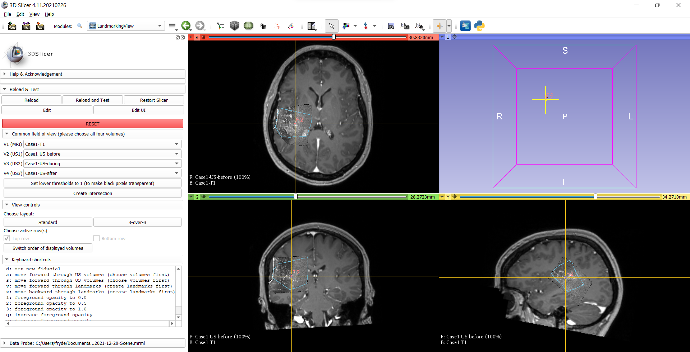

Back to [Projects List](../../README.md#ProjectsList)

# Annotation of Neurosurgical MR and Ultrasound Images with Corresponding Landmarks

## Key Investigators

- Fryderyk Kögl (BWH, TUM)
- Harneet Cheema (BWH, UOttawa)
- Tina Kapur (BWH)
- Simon Drouin (ETS)
- Andrey Titov (ETS)
- Steve Pieper (Isomics)
- Tamas Ungi (Queen's University)
- Sandy Wells (BWH)

# Project Description

<!-- Add a short paragraph describing the project. -->
Corresponding landmarks between MR and ultrasound images acquired during neurosurgery are valuable for **(a)**
validation of registration algorithms and **(b)** training supervised registration algorithms **(c)** initializing a
registration. In this project we aim to create a tool that makes the process of finding those landmarks easier.

## Objective

<!-- Describe here WHAT you would like to achieve (what you will have as end result). -->

1. Objective A. Create a UI that provides new functionality and gathers existing functionality in one place to
facilitate landmarking
2. Objective B. Investigate the rendering infrastructure that would facilitate the adjustment of landmark position in
the 3D view of Slicer

## Approach and Plan

<!-- Describe here HOW you would like to achieve the objectives stated above. -->

1. We use an iterative process for creating the UI - the user(s) give feedback to the developer(s) who then continuously
update(s) the UI

## Progress and Next Steps

<!-- Update this section as you make progress, describing of what you have ACTUALLY DONE. If there are specific steps
that you could not complete then you can describe them here, too. -->

**Progress**
1. A first working version of the extension is already functional. It can be found
[here](https://github.com/koeglfryderyk/mthesis-slicerLandmarkingView) on the main branch. A screenshot can be seen
below in **Illustrations**. For more details refer to the
[readme](https://github.com/koeglfryderyk/mthesis-slicerLandmarkingView#readme).

**Next Steps**
1. Explore 3D functionality for setting landmarks
2. Make the code more robust - a lot of things are hard coded now (e.g. amount of volumes)

# Illustrations
<!-- Add pictures and links to videos that demonstrate what has been accomplished.

-->
**Current state of the extension**

# Background and References

<!-- If you developed any software, include link to the source code repository. If possible, also add links to sample
data, and to any relevant publications. -->

1. [Current version of the extension](https://github.com/koeglfryderyk/mthesis-slicerLandmarkingView)
2. [Mini dataset based on RESECT[1] to use for testing the extension](https://www.dropbox.com/sh/gabm0rqdh8kttj6/AADJfwfJnduJG4GJ92tygPufa?dl=0)

[1] Xiao, Yiming, et al. "RE troSpective Evaluation of Cerebral Tumors (RESECT): A clinical database of pre‐operative
MRI and intra‐operative ultrasound in low‐grade glioma surgeries." Medical physics 44.7 (2017): 3875-3882.
