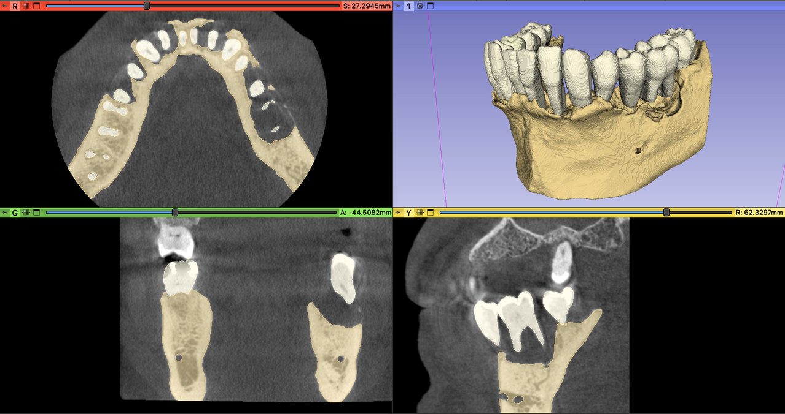

Back to [Projects List](../../README.md#ProjectsList)

# Automatic Segmentation of Teeth and Alveolar bone using MONAI Label

## Key Investigators

- Daniel Palkovics (Semmelweis University, Budapest Hungary)
- Csaba Pinter (EBATINCA, Las Palmas de Gran Canaria, Spain)

# Project Description

<!-- Add a short paragraph describing the project. -->

A three-dimensional visualization of dento-alveolar structures can enhance the surgical planning process, however currently there are no reliable fully automated segmentation methods available to acquire realistic 3D virtual models of teeth and alveolar bone. A time consuming semi-automatic method has previously been utilized for diagnostic purposes and surgical planning of regenerative-reconstructive surgical procedures in periodontology and oral surgery.

## Objective

<!-- Describe here WHAT you would like to achieve (what you will have as end result). -->

The aim of this project is to develop an automatic method utilizing MONAI Label to speed up segmentation process of dento-alveolar structures on cone-beam computed tomography datasets.

1. Objective A. To develop a fast and relible segmentation method that is capable of the separate 3D reconstuction of teeth and alveolar bone on CBCT datasets of periodontally involved patients

## Approach and Plan

<!-- Describe here HOW you would like to achieve the objectives stated above. -->

1. Try to create MONAILabel app for segmenting said structures
2. Consult with the experts
3. ...

## Progress and Next Steps

<!-- Update this section as you make progress, describing of what you have ACTUALLY DONE. If there are specific steps that you could not complete then you can describe them here, too. -->

1. Describe specific steps you **have actually done**.
1. ...
1. ...

# Illustrations

<!-- Add pictures and links to videos that demonstrate what has been accomplished.

-->

# Background and References

<!-- If you developed any software, include link to the source code repository. If possible, also add links to sample data, and to any relevant publications. -->

1.	Palkovics D, Mangano FG, Nagy K, Windisch P. (2020) Digital three-dimensional visualization of intrabony periodontal defects for regenerative surgical treatment planning. BMC Oral Health, 20: 351.
2.	Palkovics D, Pinter C, Bartha F, Molnar B, Windisch P. (2021) CBCT subtraction analysis of 3D changes following alveolar ridge preservation: a case series of 10 patients with a 6-month follow-up. Int J Comput Dent, 24: 241-251.
3.	Palkovics D, Solyom E, Molnar B, Pinter C, Windisch P. (2021) Digital Hybrid Model Preparation for Virtual Planning of Reconstructive Dentoalveolar Surgical Procedures. J Vis Exp, doi:10.3791/62743.
4.	Sólyom E, Palkovics D, Pintér C, Mangano FG, Windisch P. (2021) Virtuális tervezés és volumetrikus kiértékelés egy komplex parodontális defektus regeneratív-rekonstruktív sebészi ellátásában: Egy eset bemutatása. Fogorvosi Szemle, 114: 120-130
