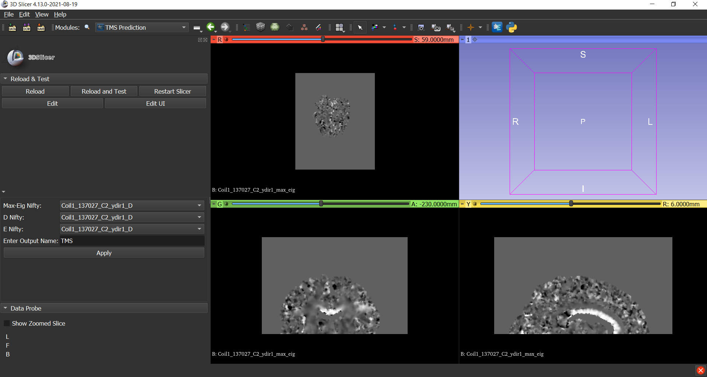

Back to [Projects List](../../README.md#ProjectsList)

# Brain Mask Prediction Based on MRI Skin Data

## Key Investigators

- Raymond Yang (University of Massachusetts Boston)
- Jax Luo (BWH & Harvard Medical School)
- Cathy Yang (Wellesley College)
- Lipeng Ning (BWH & Harvard Medical School)
- Steve Pieper (Isomics, Inc.)
- Daniel Haehn (University of Massachusetts Boston)

# Project Description

We postulate that there is a relationship between the shape of ones head and the shape of ones brain. This project aims test that by developing an AI solution for predicting a brain mask given surface data for a head. The eventual goal and application is to map the predicted brain mask to a scanned patient. This project is part of the TMS module project.

## Objective

<!-- Describe here WHAT you would like to achieve (what you will have as end result). -->

1. Objective A. Build and test a CNN model
1. Objective B. Migrate TMS model and implement on Slicer
1. Objective C. Build and test a geometric CNN model*

## Approach and Plan

<!-- Describe here HOW you would like to achieve the objectives stated above. -->

1. We have some MRI from the HCP Human Connectome Project
1. Skin masks and Brain Masks were obtained from these MRIs using HDBET and FieldTrip toolbox
1. Using these as ground truths, train a CNN model to see the feasibility 
1. Implement TMS model on Slicer as a module
1. Convert ground truth data into surface meshes
1. Using the new mesh data, train a geometric CNN model and compare results

## Progress and Next Steps

Not a lot of progress was made.
1. Some issues with the MRI Masks, data misaligned.
    - Has been resolved, will start training next week
1. Started a TMS Prediction Module, Source below
    - Prediction is working
    - Need to create post-processing script to return niftii 

# Illustrations

<!-- Add pictures and links to videos that demonstrate what has been accomplished.

-->

# Background and References

<!-- If you developed any software, include link to the source code repository. If possible, also add links to sample data, and to any relevant publications. -->
- **TMS Prediction** GitHub repository: [TMS Prediction](https://github.com/YangRyRay/TMS_Prediction)
